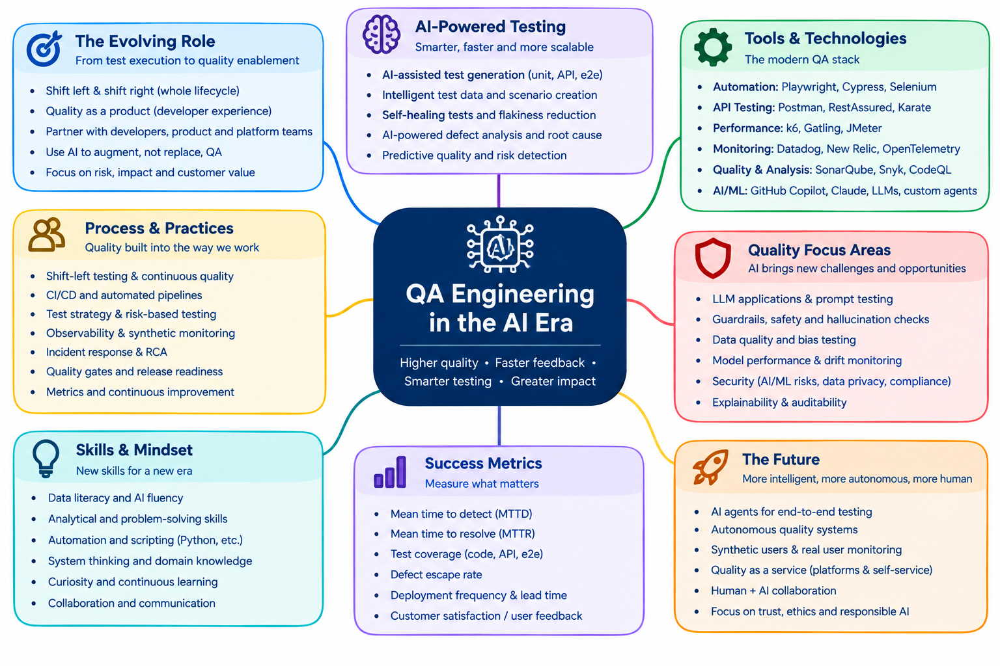

# QA Engineering in the AI Era — Workshop

**Higher quality · Faster feedback · Smarter testing · Greater impact**

A hands-on workshop for QA engineers, SDETs, developers and engineering leaders. It has eight modules, eight runnable labs and a demo app with an AI assistant you can break on purpose.

📖 **Workshop site:** <https://moatazeldebsy.github.io/qa-ai-era-workshop/>



## Quick start

```bash
git clone https://github.com/moatazeldebsy/qa-ai-era-workshop.git
cd qa-ai-era-workshop
nvm use                                  # Node 24 (22.22+ works)
npm install
npx playwright install --with-deps chromium
npm test                                 # 33 E2E + API tests against the demo app
npm start                                # http://localhost:3210
```

Full setup, including k6 and Python: [Setup](docs/getting-started.md).

## What's inside

| | |
|---|---|
| **8 modules** (`docs/modules/`) | The evolving role · AI-powered testing · Tools & technologies · Process & practices · Quality focus areas for AI · Skills & mindset · Success metrics · The future |
| **8 labs** (`docs/labs/`, `labs/`) | Playwright E2E · API testing · AI-assisted test generation · Flaky tests · k6 performance · LLM evaluation with promptfoo · Quality gates in CI · Quality and delivery metrics |
| **Demo app** (`app/`) | *Quality Books*: catalogue, cart, a slow widget, and an AI support assistant with `mock`, `buggy` and `claude` modes |
| **CI** (`.github/workflows/ci.yml`) | Runs every lab and a quality gate on each push |

No API key is needed. The assistant and the test generator can optionally use a real Claude model.

## Formats

Half day (AI in the QA toolbox), full day, or two days. See [Agendas & Tracks](docs/agendas.md). There is also a [Facilitator Guide](docs/facilitator-guide.md).

## Repository layout

```text
app/                 demo app (Express) + unit tests + OpenAPI spec
labs/
  playwright/        Lab 1 — E2E tests and page object
  api/               Lab 2 — API tests
  ai-testgen/        Lab 3 — prompts, generator, review checklist
  flaky/             Lab 4 — a flaky test and its fixes
  k6/                Lab 5 — smoke and stress scripts
  llm-eval/          Lab 6 — promptfoo eval suite
  quality-gate/      Lab 7 — gate script and thresholds
  metrics/           Lab 8 — metrics script and sample data
docs/                workshop site (MkDocs Material)
```

## License

[MIT](LICENSE).
