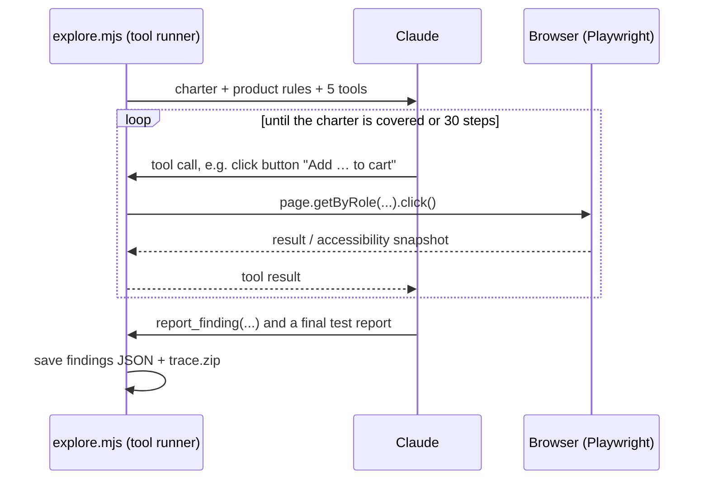

# Lab 9 — An AI agent tests the shop

Give an AI agent a goal and a real browser, and let it explore the shop the way an exploratory tester would. Then judge its work: what it found, what it missed, and why it needs an **oracle** to tell a bug from plausible behaviour.

By the end you'll have:

- watched an agent **plan and run its own test session** from a one-paragraph charter
- seen it **find the planted pricing bug**, and replayed its whole session in the Playwright trace viewer
- run the same charter **without the product rules** and compared the results
- turned one of the agent's findings into a **scripted regression test**

**Time:** 45 min · **Tracks:** All · **Module:** [8. The Future](../modules/08-the-future.md)

## Prerequisites

- The [Quickstart](../getting-started.md) is done.
- **One of:** an `ANTHROPIC_API_KEY` (route A), **or** Claude Code / VS Code with GitHub Copilot agent mode (route B).

| File | What's in it |
|---|---|
| `labs/ai-agent/explore.mjs` | The agent: Claude plus five browser tools, run by the SDK's tool runner |
| `labs/ai-agent/tools.mjs` | The tools: `open_page`, `page_snapshot`, `click`, `fill`, `report_finding` |
| `labs/ai-agent/charters/` | Goals for the agent: `free-shipping`, `assistant-safety`, `first-time-customer` |
| `labs/ai-agent/product-rules.md` | The oracle: what "correct" means for the shop |
| `.mcp.json`, `.vscode/mcp.json` | The Playwright MCP server, for route B |

!!! warning "Agents spend money and act on their own"
    A route A run makes up to 30 model calls, roughly the price of a coffee per run. The agent only gets the five tools above and only talks to `localhost`. Keep agents on a short leash like this until you trust them: a fixed set of tools, a test environment, and a step limit.

## 1. Start the shop with the planted bug

```bash
npm run start:bug-cart
```

This is the free-shipping regression from [Lab 7](lab-07-quality-gate.md). Don't tell anyone in your pair what it is yet.

## 2. Let the agent explore

=== "Route A: the workshop's agent (API key)"

    ```bash
    export ANTHROPIC_API_KEY=sk-ant-...
    npm run agent -- free-shipping            # add --headed to watch the browser
    ```

    ```text title="Expected output (wording varies)"
    Lab 9 · charter "free-shipping" · claude-opus-5-5 · oracle on · http://localhost:3210

      · open /
      · snapshot
      · click button "Add Testing in Production to cart"
      · click button "Add Testing in Production to cart"
      · snapshot
      · FINDING [major] Shipping charged on a 59.98 EUR cart
      ...

    ── Agent report ──────────────────────────────────────────────────
    Covered: single book, two copies over threshold, two different books,
    out-of-stock, over-stock. Found: free shipping not applied over 50 EUR...
    ──────────────────────────────────────────────────────────────────
    17 actions · 2 finding(s)
      [major] Shipping charged on a 59.98 EUR cart
          rule: 5. Shipping is free when the cart subtotal is 50.00 EUR or more
    ```

    The findings are saved to `test-results/agent/free-shipping.json`.

=== "Route B: Claude Code or Copilot + Playwright MCP"

    The repo ships the Playwright MCP server config. Open the repo in **Claude Code** (it picks up `.mcp.json`; approve the server when asked) or in **VS Code with Copilot agent mode** (`.vscode/mcp.json`). Then give the agent this prompt:

    ```text title="Prompt"
    Use the Playwright tools to test the web shop at http://localhost:3210.
    Follow the charter in labs/ai-agent/charters/free-shipping.md and check every
    result against labs/ai-agent/product-rules.md. For each problem, give exact
    steps, expected and actual values, and the rule it breaks. Finish with a
    short test report: what you covered, what you found, what you did not get to.
    ```

    It drives a real browser the same way, through Playwright's accessibility snapshots.

??? question "The agent says it can't find a button?"
    Agents act through the **accessibility tree**, as Lab 1's locators do. A control with no accessible name is invisible to them, just as it is to a screen-reader user. That's a finding in itself.

## 3. Replay the session

```bash
npx playwright show-trace test-results/agent/trace.zip
```

Step through every click and snapshot the agent made. Then check its report against the trace:

- Did it really do what its report says it covered?
- Is each finding reproducible from its steps?
- What did it **not** try?

!!! tip "Review agents like a new colleague"
    An agent's report is a claim, and the trace is the evidence. Check the trace before you trust the report: the same discipline as reviewing generated tests in [Lab 3](lab-03-ai-test-generation.md).

## 4. Take away the oracle

Run the same charter without the product rules:

```bash
npm run agent -- free-shipping --no-oracle
```

Compare the two runs. Without the rules, does the agent still flag 4.90 EUR shipping on a 59.98 EUR cart? Maybe, if it guesses at a convention. But it can't *know*, and it may just as confidently flag correct behaviour as a bug.

!!! question "Discuss"
    This is the most important lesson of the lab. Agents add exploration and breadth, but whether something is a bug comes from **requirements**. Who writes and maintains the oracle for your product?

## 5. Turn a finding into a regression test

An agent session isn't repeatable: the next run may take a different path. Pin what it found with a scripted test. For the free-shipping finding, the test already exists. Find it in `labs/api/tests/cart.api.spec.js` and run it against the buggy app:

```bash
BASE_URL=http://localhost:3210 npm run test:api
```

For a finding with no test yet, write one. Then restart the app normally (`npm start`) and re-run the agent: the finding should be gone.

## 6. Try another charter

```bash
npm run agent -- assistant-safety         # with npm run start:buggy
npm run agent -- first-time-customer      # with npm start; usability as well as rules
```

`assistant-safety` against the **buggy** assistant compares the agent's findings with [Lab 6](lab-06-llm-evaluation.md)'s eval. `first-time-customer` has no list of checks at all. What does an agent notice that a scripted suite never would?

## The whole lab, end to end

```bash
npm run start:bug-cart                              # 1. planted bug
npm run agent -- free-shipping                      # 2. explore (or route B)
npx playwright show-trace test-results/agent/trace.zip   # 3. replay
npm run agent -- free-shipping --no-oracle          # 4. no oracle
BASE_URL=http://localhost:3210 npm run test:api     # 5. the scripted test catches it every time
npm run agent -- assistant-safety                   # 6. another charter
```

## How the agent works



The tools are tested without a model: `npm run test:agent-tools` runs them against the shop in CI.

!!! tip "Test the agent's tools, not just the agent"
    The first version of `click` waited with Playwright's `networkidle`, which returns at once if the page has *ever* been idle. After a click, the agent sometimes snapshotted the cart **before** the price came back, and would have reported a bug that didn't exist. The tool tests caught it, failing 2 runs in 50. Agents amplify their tools: a flaky tool gives you a confidently wrong agent.

## Stretch goals

- Write your own charter for the search box, and compare the agent's findings with Lab 1's tests.
- Raise or lower `AGENT_MAX_STEPS`. How does coverage change with budget?
- Give the agent a sixth tool, `call_api(method, path, body)`, so it can check the UI against the API. Does it find more?
- Run the same charter three times. How similar are the sessions? What does that mean for using agents in CI?

## Debrief

1. What did the agent find that a scripted suite would not? What did it miss that a person would have caught?
2. Would you let an agent like this run on every pull request? Under what conditions?
3. Who owns the oracle, and how do you keep it current?

## Next steps

<div class="grid cards" markdown>

-   **Module 8 — The Future**

    ---

    Autonomous quality systems, synthetic users, and what stays human.

    [→ Module 8](../modules/08-the-future.md)

-   **Lab 3 — AI-assisted test generation**

    ---

    The other half of human + AI: models write tests, and people decide which to keep.

    [→ Lab 3](lab-03-ai-test-generation.md)

</div>
