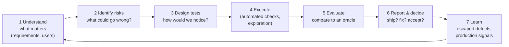
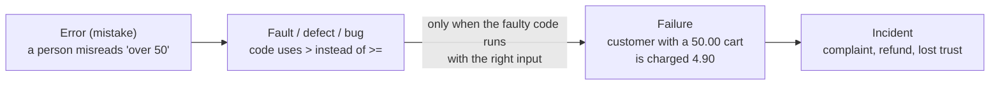
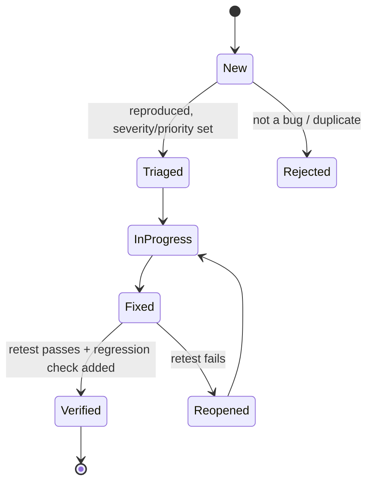
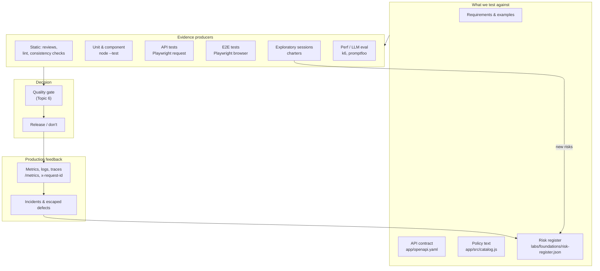

# Topic 1 — QA Engineering Foundations

*What quality is, how we gain evidence about it, and how a QA engineer turns that evidence into decisions.*

**Time:** about 3 hours of reading, plus a 90-minute lab · **Needs:** Node.js and `npm install` · **Lab files:** `labs/foundations/`

Every later topic builds on the ideas here. Unit tests, contract tests, load tests and LLM evals are all different ways to do the same few things: **find out what could go wrong, decide how we'd notice, and produce evidence someone can act on.** This topic covers those few things.

We'll use one running example the whole way through: **the free-shipping rule in the Quality Books shop.** Orders pay 4.90 EUR shipping, and shipping is free once the order reaches 50 EUR. It sounds trivial. By the end of the lab you'll have found a real inconsistency in this repo, a boundary the test suite couldn't reach, and a planted bug that most of the tests can't see.

---

## 1. What is it?

**Quality** is *value to some person who matters* (Jerry Weinberg's definition, extended by James Bach and Michael Bolton). That definition is deliberately relative:

- The **customer** values a correct price and fast delivery.
- The **business** values revenue, low support cost and legal compliance.
- The **developer** values code they can change without fear.
- The **support agent** values the assistant giving the same answer the checkout gives.

All four are "quality". They sometimes conflict, and someone has to weigh them.

**QA engineering** is the discipline of making quality *visible and achievable* across the whole lifecycle of a product. It has three parts that people often blur together:

| Term | Meaning | Example on Quality Books |
|---|---|---|
| **Quality Assurance (QA)** | Improving the *process* so defects are less likely to be made. Preventive. | Agreeing that every pricing rule has a written boundary example before coding starts. |
| **Quality Control (QC)** | Checking the *product* to find defects that were made. Detective. | Running the cart tests on every commit. |
| **Testing** | The activity of questioning a product to gather information about it, including experimenting, observing and comparing it against expectations. Testing serves both QA and QC. | Exploring the cart around 50 EUR and noticing the assistant says something different. |

A **QA engineer** (or *quality engineer*, *SDET* = software development engineer in test) designs and builds the systems that produce this information: test strategies, automated checks, test infrastructure, risk analyses, and the feedback loops that put the results in front of the people who decide.

!!! note "Testing vs checking"
    Bach and Bolton distinguish **checking** (a machine-decidable confirmation: "is shipping 0 for 59.98?") from **testing** (the broader human activity of learning about a product, which includes designing checks, exploring, and interpreting results). Automation runs checks. People do testing. You need both, and this distinction stops you from thinking a green CI run means "tested".

## 2. Why do we need it?

Because **software fails in ways its authors didn't imagine**, and the people who pay for those failures are usually not the people who wrote the code.

Without deliberate quality engineering, teams typically see:

- **Late discovery.** Defects are found by customers. In 2012, Knight Capital deployed code that reactivated a dormant feature on one of eight servers. It lost about 440 million USD in 45 minutes. The bug itself was small. What was missing was a deployment check and a way to detect and stop the failure quickly.
- **Fear of change.** No safety net means every release is risky, so releases get bigger and rarer, which makes each one riskier still.
- **Arguments without evidence.** "Is it ready?" gets answered by whoever is loudest, not by data.
- **Invisible risk.** In the CrowdStrike incident of July 2024, a content update with a malformed input crashed about 8.5 million Windows machines. The post-incident report pointed to a validator that didn't catch a mismatch between the expected and supplied number of input fields, plus the lack of a staged rollout. Both are quality-engineering controls.

You can't test quality *into* a product at the end. You can only find out how much is there. That's why modern QA is about **fast, trustworthy feedback at every stage**, not about a phase at the end.

## 3. How does it work internally?

Under every QA practice there is the same loop. Learn it once and you'll recognise it in every later topic.



Step by step, using free shipping:

1. **Understand.** The rule: shipping 4.90 EUR, free from 50 EUR. Who cares? Customers (money), support (complaints), finance (margin).
2. **Identify risks.** A *risk* is something bad that might happen, scored by **likelihood** (how probable) × **impact** (how bad). "A customer is charged shipping on a free order": likelihood 3, impact 4, score 12.
3. **Design tests.** Choose inputs and expected results that would expose the risk: 49.99, 50.00 and 50.01, a multi-item cart, a cart with quantity 2. (Topic 2 turns this into systematic techniques.)
4. **Execute.** Run the checks: by hand, in a unit test, through the API, through the browser.
5. **Evaluate.** Compare what happened with what *should* have happened. The thing that tells you what should have happened is called an **oracle** (see section 4). This is the hardest step, and the one most often skipped.
6. **Report and decide.** Turn results into information for a decision-maker: "free shipping works for every sellable cart; the customer-facing policy text disagrees at exactly 50 EUR".
7. **Learn.** When a defect escapes to production, ask *why our loop missed it* and change the loop, not just the code.

The **error → fault → failure** chain explains what testing is actually observing:



Testing observes **failures** and infers **faults**. A fault that is never executed with a triggering input never causes a failure. That's why a test suite can pass on buggy code, and why *choosing inputs* matters so much.

## 4. Main components and concepts

### Quality attributes (ISO/IEC 25010)

"Does it work?" is only one kind of quality. The ISO/IEC 25010:2023 product quality model lists nine characteristics. Each later topic focuses on some of them:

| Characteristic | Plain question | Quality Books example | Topic |
|---|---|---|---|
| Functional suitability | Does it do the right thing, correctly? | Shipping is free at 50 EUR | 2–5 |
| Performance efficiency | Is it fast and frugal enough? | Pricing answers in < 300 ms under load | 8 |
| Compatibility | Does it work alongside other systems and environments? | The API keeps its contract for the mobile app | 4, 9 |
| Interaction capability (usability) | Can people use it, including people with disabilities? | Keyboard users can add to cart | 9 |
| Reliability | Does it keep working, and recover? | The shop survives a slow recommendations service | 8, 10 |
| Security | Is it protected from misuse? | The assistant won't leak its instructions | 9, 12 |
| Maintainability | Can we change it safely? | The pricing rule can be tested in isolation | 3, 13 |
| Flexibility (portability) | Can it move or adapt? | Runs locally, in CI and in Codespaces | 7 |
| Safety | Does it avoid harm? | The assistant refuses medical advice | 12 |

### Verification and validation

- **Verification:** *are we building the product right?* Does it match its specification? ("Code applies free shipping at ≥ 50, as the API contract says.")
- **Validation:** *are we building the right product?* Does it meet the real need? ("Do customers actually understand when shipping is free?")

A product can pass verification and fail validation. That happens whenever the spec itself is wrong.

### Test oracles

An **oracle** is the way you decide whether a result is right. Without one you have run something, but you haven't tested it. The common kinds, all used in this topic's lab:

| Oracle | How it decides | Strength | Weakness |
|---|---|---|---|
| **Specified** | An expected value from a requirement: `shippingFor(50) === 0` | Precise | Only covers the examples you thought of |
| **Invariant / property** | A rule that must hold for *every* input: `total = subtotal + shipping` | Covers huge input spaces | Can't catch a bug that keeps the rule true |
| **Consistency** | The product should agree with itself and its sources: code, API contract, policy text, UI | Finds spec bugs | Tells you *that* they disagree, not *which* is right |
| **Comparison / reference** | Compare with another implementation (the old version, a competitor, a spreadsheet) | Good for refactors | Both can be wrong in the same way |
| **Human judgement** | A person decides | Catches "technically right, actually wrong" | Slow and inconsistent |

The **oracle problem** is the fact that, for many outputs, knowing the right answer is as hard as producing it. Think of the AI assistant's free-text answers. Topic 12 comes back to this.

Michael Bolton's **FEW HICCUPPS** mnemonic lists consistency oracles a tester applies almost subconsciously. A product should be consistent with its **H**istory, **I**mage, **C**omparable products, **C**laims, **U**ser expectations, the **P**roduct itself, its **P**urpose and **S**tatutes, and it should be **F**amiliar (no known bug patterns), **E**xplainable and **W**orld-consistent. In the lab, the assistant's policy text breaks *Claims* (what we told customers) and *Product* (the checkout disagrees).

### Risk-based testing

You can never test everything. Free shipping alone has about 19,000 sellable carts, and the assistant accepts any text. **Risk-based testing** spends effort in proportion to *likelihood × impact*:

```text
             impact →
             1   2   3   4   5
likelihood 5 ·   R7  ·   ·   ·
         4   ·   ·   R3  R2  ·
         3   ·   ·   ·   R1  ·      R1 = charged shipping wrongly
         2   ·   ·   R6  R4  ·      R2 = assistant invents a price
         1   ·   ·   ·   ·   ·      R7 = assistant and checkout disagree
```

A **risk register** is the written list: risk, score, and the checks that cover it. Its job is to make the decision *"what are we not testing, and do we accept that?"* explicit. In the lab you'll run a script that proves each risk traces to a check that really exists.

### The seven testing principles

The ISTQB (International Software Testing Qualifications Board) summarises decades of experience in seven principles. Each one shows up in the lab:

1. **Testing shows the presence of defects, not their absence.** A green suite means "we didn't see a failure", not "there is no bug". (The bug hunt in step 5 shows five green tests on buggy code.)
2. **Exhaustive testing is impossible**, so you prioritise by risk. (There are 19,000 carts; you pick boundaries, and then let an invariant sweep the rest.)
3. **Early testing saves time and money.** The spec inconsistency costs a one-line edit now, and a support queue later.
4. **Defects cluster.** A few modules hold most of the bugs. In this shop it's pricing and the assistant.
5. **Tests wear out (the pesticide paradox).** The same tests stop finding new bugs, so you vary and extend them.
6. **Testing is context-dependent.** A bookshop and a pacemaker need very different rigour.
7. **Absence-of-errors is a fallacy.** A bug-free product that doesn't meet the need is still a failure (validation).

### Testability

**Testability** is how easy it is to find out whether something works. It has three parts:

- **Controllability:** can you put the system into the state you need? (Can you make a cart that costs exactly 50.00?)
- **Observability:** can you see what it did? (Logs, request ids, `/metrics`, a returned `shipping` field.)
- **Isolation (decomposability):** can you test a part without the whole? (Can you test the shipping rule without the catalogue?)

Poor testability is a *design defect*. QA engineers who raise it early save more time than any amount of automation does.

### Static and dynamic testing

- **Static testing** examines artefacts *without running them*: reviewing a requirement, reading code, linting, type-checking, scanning for vulnerabilities. Finding "over 50 vs ≥ 50" by reading is static testing.
- **Dynamic testing** runs the software and observes behaviour: unit tests, API calls, a browser session.

Static testing is cheap and finds defects before they become failures. Dynamic testing finds things nobody thought to read for.

### Test levels and the test portfolio

Tests are grouped by **how much of the system they exercise**:

| Level | Exercises | Speed | Quality Books file |
|---|---|---|---|
| Unit | One function or class | Milliseconds | `app/test/cart.test.js` |
| Component / integration | Several units, or a unit plus a real dependency | Milliseconds to seconds | `labs/foundations/tests/oracles.test.js` (pricing + catalogue) |
| API / service | One deployed service through its interface | Tens of ms | `labs/api/tests/cart.api.spec.js` |
| End-to-end (E2E) | The whole system through the UI | Seconds | `labs/playwright/tests/shop.spec.js` |
| Production checks | The live system | Continuous | `/metrics`, synthetic monitors (Topic 10) |

The **test pyramid** (Mike Cohn) recommends many fast low-level tests and a few slow high-level ones. Its reasoning is that **the higher the level, the slower, flakier and more expensive a test is, and the less precisely a failure points at its cause.** Section 13 compares it with the alternatives.

### Exploratory and scripted testing

- **Scripted testing:** steps and expected results are written down first, then executed. Good for regression: "did what used to work still work?"
- **Exploratory testing:** simultaneous learning, test design and execution, guided by a **charter** (a mission: *explore X with Y to discover Z*) inside a **timebox**. Good for discovering what nobody wrote down.

They aren't rivals. Exploration finds the risks; scripts guard them afterwards.

### Defect lifecycle

A **defect report** turns an observation into something actionable. A good one has a title that states the impact, steps to reproduce, expected and actual results, the environment, evidence (request id, screenshot, log line), and severity and priority:

- **Severity:** how bad the effect is (technical impact).
- **Priority:** how soon to fix it (business decision).

The two differ. A typo in the company name on the home page is low severity and high priority.



The step people skip is *"regression check added"*. A defect fixed without a check that would catch it again is a defect you'll meet a second time.

## 5. Architecture: quality engineering as a system

Here is the full picture for Quality Books. Later topics zoom into each box.



The feedback arrows are the point. Production incidents and exploratory findings feed the **risk register**, which steers what gets tested next. A QA system with no arrows back into it stops learning.

## 6. How it connects with other practices

| Practice | Connection to QA foundations |
|---|---|
| **Requirements / product discovery** | Acceptance criteria written as examples ("a 50.00 EUR cart ships free") are test cases, written early. This is *shift left*. |
| **Design and architecture** | Testability is a design property. Seams like `shippingFor()` exist because someone asked "how would we test this?" |
| **Code review** | Static testing. Reviewers check the tests as well as the code. |
| **TDD / BDD** | Test-driven development uses tests to drive design. Behaviour-driven development uses shared examples to drive understanding. Both are QA practices that developers carry out (Topic 3). |
| **CI/CD** | Automates the execute-and-evaluate steps on every change, and turns evidence into a gate (Topic 6). |
| **Observability and SRE** | *Shift right*: production metrics and incidents are the final oracle (Topic 10). SLOs (service level objectives) define "good enough" in numbers. |
| **Security engineering** | Security is a quality attribute. Threat modelling is risk analysis for attackers (Topic 9). |
| **Platform engineering** | Makes the good path the easy path: test environments, pipelines and quality gates as self-service (Topic 13). |
| **Product management** | Owns priority, and the validation question "is this the right thing?". QA brings the risk information it needs. |

## 7. Real-world examples

**1. An ambiguous boundary (this repo).** The policy that the AI assistant quotes says *"free for orders over 50 EUR"*. The API contract says *"free when the subtotal is 50 EUR or more"*, and the code agrees with the contract. A customer with a 50.00 EUR basket who asks the assistant gets told they'll pay shipping, then checks out and doesn't. This is a small, realistic, *real* inconsistency. You'll find and fix it in the lab.

**2. The test that couldn't reach the bug (this repo).** No combination of in-stock books costs exactly 50.00 EUR. The closest are 39.90 and 54.00. So no API or E2E test can ever check the boundary. That's a **controllability** problem. The fix is a design change (a seam), not more tests.

**3. Mars Climate Orbiter (1999).** One team's software produced thrust data in pound-force seconds; the receiving software expected newton-seconds. The spacecraft was lost. Each component was fine on its own; the *interface* between them was wrong. That is the case for consistency oracles and contract testing (Topic 4).

**4. Knight Capital (2012).** Covered in section 2. The lessons there: deployment verification, feature-flag hygiene and detection speed are all quality concerns, not just the code.

**5. Boeing 737 MAX MCAS (2018–2019).** Investigations found, among many organisational factors, that a safety-critical function relied on a single sensor, and that assumptions about pilot response weren't validated. It shows the difference between verification ("it meets the spec") and validation ("the spec is safe in the real world").

**6. An everyday version.** A team ships a discount feature. Every unit test passes. In production, discounts stack with a loyalty code nobody tested together with it. The loop that missed it: there was no risk analysis of *feature interactions*. Topic 2's combinatorial techniques address exactly this.

## 8. Scaling across applications and teams

On one product with one team, a QA engineer can keep the risk picture in their head. With 50 services and 15 teams, that stops working, and the job changes shape:

| Scale | What QA looks like | What breaks if you don't adapt |
|---|---|---|
| **1 team, 1 app** | Embedded tester; shared understanding; a few hundred tests | Not much, as long as the tests are fast |
| **Several teams, shared product** | QA *coaches* inside teams; developers own unit, API and contract tests; a shared E2E smoke suite | E2E suites that nobody owns grow slow and flaky; teams break each other's interfaces |
| **Many teams, many services** | A quality **platform**: templates, pipelines, test environments, dashboards (Topic 13); a quality guild sets standards | Every team reinvents test infrastructure; quality varies wildly; nobody can answer "how good is our release?" |

The principles that scale:

- **Ownership follows the code.** The team that changes a service owns its tests. A central QA team can't keep up with 15 teams' changes.
- **Standardise the evidence, not the tools.** Every pipeline emits JUnit XML and coverage in known places, so one gate and one dashboard work for every team (Topics 6 and 11).
- **Risk registers per product area**, rolled up to a portfolio view for leadership (Topic 14).
- **Contracts between teams** replace end-to-end tests across team boundaries (Topic 4).

## 9. Security and data privacy

Quality work handles sensitive things more often than people realise:

- **Test data.** Copying production data into test environments copies customers' personal data with it. Under GDPR and similar laws that is still processing personal data, and test environments are usually less protected. Prefer synthetic data, or masked and minimised extracts (Topic 7).
- **Evidence leaks.** Screenshots, Playwright traces, HAR files and logs can contain session tokens, emails and API keys. This repo keeps CI reports for 14 days and runs without secrets. In real projects, scrub traces and restrict who can download artefacts.
- **Defect reports.** A bug report pasted into a public tracker with a customer's order details is a data breach. Use identifiers (request ids) instead of the data itself.
- **AI tools.** Pasting code, logs or customer data into an AI assistant sends it to a third party. Know your organisation's policy (Topic 12).
- **Testing in production.** Synthetic transactions must not charge real cards, email real customers or pollute analytics. Tag and isolate them (Topic 10).
- **Security as quality.** Abuse cases ("what if someone tries to…?") belong in the risk register next to functional risks. R3 in this lab's register is one.

## 10. Performance, maintenance, and cost

Tests are code. They cost money to write, run and maintain, and the costs grow with the suite:

- **Execution cost** grows with level: a unit test costs microseconds of CPU, an E2E test seconds of a browser. In this repo, the invariant test prices about 19,000 carts in under 100 ms, while one E2E test takes about a second. Push checks down to the lowest level that can see the risk.
- **Maintenance cost** comes from coupling. Tests coupled to implementation details (CSS classes, private functions, exact log text) break on every refactor. Test behaviour, through stable interfaces.
- **Flakiness cost** is the most expensive cost of all. A suite that fails randomly teaches people to ignore red builds, and then a real failure gets ignored too (workshop [Lab 4](../labs/lab-04-flaky-tests.md)).
- **The cost of *not* testing** isn't zero. It shows up later as incidents, support load, refunds and lost trust. The often-quoted "a defect costs 10× more in each later phase" figure has weak original evidence (see Laurent Bossavit, *The Leprechauns of Software Engineering*). The direction is real, though: feedback that comes later is more expensive, because more work has been built on the mistake.

A useful habit is to ask of every test: *what risk does this reduce, and is that worth its run time and upkeep?* A test that can't answer the first half is a candidate for deletion.

## 11. Common problems and failure scenarios

| Problem | What it looks like | Root cause |
|---|---|---|
| **Coverage theatre** | 90% line coverage, bugs still escape | Coverage measures what *ran*, not what was *checked*. A test without a good assertion covers code and catches nothing. |
| **Weak oracles** | Tests assert `status === 200` and nothing else | Nobody decided what "correct" means |
| **Ice-cream cone** | Hundreds of slow UI tests, few unit tests | Tests written after the fact, from the UI, by a separate team |
| **QA as a phase / bottleneck** | "Throw it over the wall to QA" | Quality treated as a gate at the end instead of a property built in |
| **Flaky suite** | "Just re-run it" | Timing, shared state, uncontrolled dependencies |
| **Spec drift** | Docs, contract, code and UI disagree | No consistency checks; each source edited alone (lab step 3) |
| **Untestable design** | "We can't test that without production" | Testability not considered in design (lab step 4) |
| **Bug count as a KPI** | Testers rewarded for bugs found | Optimises for finding bugs late instead of preventing them |
| **Pesticide paradox** | Suite stays green while incidents rise | Tests never updated as the product and the risks change |

## 12. Important trade-offs

- **Speed vs confidence.** More and higher-level tests give more confidence and slower feedback. Fast feedback on every commit, plus deeper checks before release, is the usual compromise.
- **Breadth vs depth.** Testing many features shallowly or a few deeply. Risk decides.
- **Isolation vs realism.** Mocks make tests fast and deterministic, and can hide integration bugs. Real dependencies catch those bugs, and are slow and flaky.
- **Automated vs exploratory.** Automation is repeatable and cheap per run, but blind to anything it wasn't told to look for. Exploration finds the unknown, and doesn't repeat.
- **Prevention vs detection.** Reviews and design work prevent defects but are hard to measure. Tests detect defects and produce visible numbers. Organisations over-invest in what they can count.
- **Central QA vs embedded QA.** Central teams give consistency; embedded QA engineers give context and speed. Most mature organisations embed QA engineers in teams and build a small platform team (Topic 13).
- **Strict gates vs flow.** A gate that blocks on every minor finding slows delivery and gets bypassed. One that never blocks is decoration. Topic 6 shows how to tune one.

## 13. Comparisons

### Ways to shape a test portfolio

| Model | Shape | Best fit | Watch out for |
|---|---|---|---|
| **Test pyramid** (Cohn) | Many unit, some service, few UI | Logic-heavy back ends | Teams over-mocking to stay at the bottom |
| **Testing trophy** (Kent C. Dodds) | Static analysis base, *most* tests at integration level | Front-end apps, where units are thin | Slower suites if "integration" gets too wide |
| **Testing honeycomb** (Spotify) | Mostly integration tests per microservice, few implementation-detail tests | Microservices with little internal logic | Needs good contract testing between services |
| **Ice-cream cone** (anti-pattern) | Mostly manual and UI tests | Nowhere, on purpose | Slow, flaky, expensive feedback |

They agree on what matters: **write each check at the lowest level that can see the risk.**

### Schools of thought

| Approach | Core belief | Strength |
|---|---|---|
| **Standards-based (ISTQB, IEEE 29119)** | Shared vocabulary, defined processes and documentation | Common language; useful in regulated domains |
| **Context-driven (Bach, Bolton, Kaner)** | No best practices, only good practices in context; testing is skilled human inquiry | Adaptability; strong on exploration and critical thinking |
| **Agile testing (Crispin & Gregory)** | The whole team owns quality; the Agile Testing Quadrants map what to test and who tests it | Collaboration; fits iterative delivery |
| **Quality engineering / SDET** | Quality is engineered with code, platforms and data | Scale and speed |

A strong QA engineer borrows from all four.

### QA, QC and testing (again, side by side)

| | QA | QC | Testing |
|---|---|---|---|
| Focus | Process | Product | Information |
| When | Throughout | After building something | Throughout |
| Goal | Prevent defects | Detect defects | Reveal risks and facts |
| Example | "Every rule gets a boundary example in refinement" | "CI runs the cart tests" | "What happens at exactly 50 EUR?" |

## 14. Hands-on lab: from a requirement to evidence

You'll take one requirement, free shipping, through the whole quality loop: map quality attributes, explore, resolve a spec inconsistency, build a risk register with a working trace, and prove your tests would catch a planted bug.

**Time:** 90 min · **Files:**

| File | What's in it |
|---|---|
| `labs/foundations/tests/oracles.test.js` | The same feature checked with three kinds of oracle |
| `labs/foundations/risk-register.json` | Seven Quality Books risks, scored, with their checks |
| `labs/foundations/risks.mjs` | Ranks the risks and proves each check really exists |
| `labs/foundations/bug-hunt.mjs` | Runs the oracles on correct and on buggy code, and lists which tests caught the bug |
| `labs/foundations/charter.md` | A template for the exploratory session |
| `app/src/cart.js` | The code under test, including the `shippingFor()` seam |

### Step 0 — Set up and get a baseline

```bash
npm install                 # once; Topic 1 needs no browser
npm run foundations:test
```

```text title="Expected output (end)"
# tests 8
# suites 3
# pass 7
# fail 0
# todo 1
```

The **todo** is a known finding recorded as a test. Note it; you'll resolve it in step 3. Open `labs/foundations/tests/oracles.test.js` and read the three `describe` blocks. Each one checks the same feature with a different kind of oracle from section 4.

### Step 1 — Map the quality attributes (15 min, paper)

For each ISO 25010 characteristic in section 4, write one sentence about what it means *for Quality Books*, and one way you'd get evidence for it. Then pick the three that matter most for a small online bookshop with an AI assistant, and justify the choice in one line each.

There's no single right answer. The goal is to see that "does the cart work?" is a small part of the quality question. Keep the sheet: Topic 14 comes back to it.

### Step 2 — Explore with a charter (20 min)

Copy the charter and start the shop:

```bash
cp labs/foundations/charter.md my-charter.md
npm start                                   # http://localhost:3210
```

Follow the charter. Some probes to start with (in a second terminal):

```bash
# A 2 x 29.99 cart: 59.98 EUR, should ship free
curl -s localhost:3210/api/cart/price -H 'content-type: application/json' \
  -d '{"items":[{"bookId":1,"quantity":2}]}'

# Closest you can get just under 50: one copy of "Responsible AI Testing"
curl -s localhost:3210/api/cart/price -H 'content-type: application/json' \
  -d '{"items":[{"bookId":6,"quantity":1}]}'

# What does the assistant tell a customer?
curl -s localhost:3210/api/assistant -H 'content-type: application/json' \
  -d '{"question":"Is shipping free on a 50 EUR order?"}'

grep -n "subtotal is" app/openapi.yaml
```

```text title="Expected output"
{"lines":[...],"subtotal":59.98,"shipping":0,"total":59.98}
{"lines":[...],"subtotal":39.9,"shipping":4.9,"total":44.8}
{"answer":"Standard shipping takes 3-5 business days and is free for orders over 50 EUR.","mode":"mock"}
42:        Shipping is 4.90 EUR, free when the subtotal is 50 EUR or more.
```

Write down what you find. You should end up with at least these findings:

| # | Type | Finding |
|---|---|---|
| 1 | Question / spec bug | The assistant says "over 50 EUR"; the contract and code say "50 EUR or more". At exactly 50.00 they disagree. |
| 2 | Testability | You can't build a cart that costs exactly 50.00 EUR, so the boundary can't be tested through the API or the UI. |
| 3 | (Anything else you noticed) | e.g. how out-of-stock books behave, or the error for 11 copies |

Then stop the app (`Ctrl+C`), start it with the planted bug (`npm run start:bug-cart`), and repeat the first `curl`. Shipping is now `4.9` on a 59.98 EUR cart. Write a defect report for it in the charter using the format from section 4: title stating the impact, steps, expected, actual, evidence (the `x-request-id` header from `curl -i`), severity and priority. Stop the app when you're done.

### Step 3 — Resolve the inconsistency (15 min)

A consistency oracle tells you *that* sources disagree, not *which* one is right. That's a product decision. In a real team you'd ask the product owner. For this lab, the decision is: **50.00 EUR ships free**, because the contract, the code and the existing UI test (*"ships free once the subtotal reaches 50 EUR"*) already agree on it, and changing the policy text is the cheapest, least surprising fix.

1. In `app/src/catalog.js`, change the shipping policy to:

    ```js
    shipping: 'Standard shipping takes 3-5 business days and is free for orders of 50 EUR or more.',
    ```

2. In `labs/foundations/tests/oracles.test.js`, turn the TODO into a real test. Remove the options object, so the test reads:

    ```js
    test('the customer-facing policy states the same threshold as the code', () => {
      assert.match(policies.shipping, new RegExp(`${FREE_SHIPPING_THRESHOLD} EUR or more`));
    });
    ```

3. Run it:

    ```bash
    npm run foundations:test
    ```

    ```text title="Expected output (end)"
    # pass 8
    # fail 0
    # todo 0
    ```

The finding is now a **regression check**. If anyone edits the policy or the threshold on its own again, this test fails. That's the "regression check added" step of the defect lifecycle.

!!! tip "Why not just change the code to `>`?"
    That would also make the sources agree. It would also change what every existing customer gets at 50.00, break the API contract (a *breaking change* for any client relying on it, Topic 4), and contradict an existing E2E test. Consistency fixes should move the *least authoritative* source towards the *most authoritative* one.

### Step 4 — Build and prove the risk register (20 min)

```bash
npm run foundations:risks
```

```text title="Expected output"
Risk register — 7 risks, must-cover threshold 12

ID  L×I    Score  Checks  Status     Risk
R2  4×4    16     2       covered    The assistant tells a customer a price or book that does not exist
R1  3×4    12     3       covered    A customer is charged shipping on an order that should ship free
R3  4×3    12     2       covered    Someone makes the assistant reveal its instructions or act outside its role
R5  3×4    12     2       covered    A keyboard or screen-reader user cannot complete a purchase
R7  5×2    10     0       gap        The assistant and the checkout disagree about when shipping is free
R4  2×4    8      1       covered    A customer can order more copies than are in stock
R6  2×3    6      1       covered    Pricing slows down under normal traffic and customers abandon the cart

Gaps below the threshold (decide: accept, or add a check): R7

✔ Every risk at or above the threshold traces to a check that exists.
```

The script does more than sort. For every check it opens the named file and confirms the test title is really there. A risk register that points at tests that were renamed or deleted claims coverage that doesn't exist. That's worse than no register at all.

Now do three things in `labs/foundations/risk-register.json`:

1. **Close the gap.** R7 is exactly the inconsistency you fixed in step 3. Add your new test to its checks:

    ```json
    "checks": [
      { "file": "labs/foundations/tests/oracles.test.js", "title": "the customer-facing policy states the same threshold as the code" }
    ]
    ```

    Re-run. R7 is now `covered` and the gap line is gone.

2. **Break the trace on purpose.** Change R4's title to `"shows a clear error when asking for more than in stock"` (one word missing). Re-run. The script exits with code 1 and prints `R4: check not found`. Undo the change.

3. **Add a risk of your own** from your exploration in step 2: for example, *"The cart shows a stale total after an item goes out of stock"*. Score it honestly. If it scores 12 or more and has no checks, the script fails. Either add a check that exists, or argue the score down with your team. Both are legitimate outcomes; an undocumented decision isn't.

### Step 5 — Hunt the planted bug (20 min)

Does the suite actually catch bugs, or does it just run? Plant one and see.

```bash
npm run foundations:bug-hunt
```

```text title="Expected output"
Clean code:       8 passed, 0 failed
BUG_MODE=cart:    6 passed, 2 failed

Caught the bug (red on buggy code):
  ✔ a 2 x 29.99 cart (59.98 EUR) ships free
  ✔ every sellable cart obeys the pricing invariants

Blind to the bug (still green):
  · 49.99 EUR pays shipping
  · 50.00 EUR ships free (the agreed boundary)
  · 50.01 EUR ships free
  · no sellable cart prices at exactly 50.00 EUR (why shippingFor exists)
  · the API contract states the same threshold as the code
  · the customer-facing policy states the same threshold as the code

✔ Bug caught by 2 of 8 tests.
```

(If you skipped step 3 you'll see 7 tests instead of 8; the TODO isn't counted.)

Read the bug in `app/src/cart.js`: under `BUG_MODE=cart` the code passes *the most expensive single copy's price* to `shippingFor()` instead of the subtotal. Now explain each result:

- The **boundary tests** are blind because they call `shippingFor()` directly, and `shippingFor()` is still correct. The bug is in *what gets passed to it*. Unit tests on a seam don't test the wiring around the seam.
- The **2 × 29.99 cart** catches it, because quantity 2 makes the subtotal (59.98) and the single-copy price (29.99) land on opposite sides of 50.
- The **invariant sweep** catches it because it checks the rule on about 19,000 carts, so it doesn't depend on anyone guessing the triggering input.
- The **consistency checks** are blind: the documents still agree with each other. This bug is in the behaviour, not in the spec.

This is the core idea of **mutation testing** (Topic 3): deliberately introduce bugs and measure how many your tests catch. Coverage can't tell you this. Run `node --test --experimental-test-coverage "labs/foundations/tests/*.test.js"` and `cart.js` shows about 88% line coverage, yet six of those eight tests can't see the bug.

**Then see the same bug at other levels** (optional, needs `npx playwright install chromium` for the E2E part):

```bash
PORT=3300 BUG_MODE=cart npm start                    # terminal 1
BASE_URL=http://localhost:3300 npm run test:api      # terminal 2: some cart rows fail
BASE_URL=http://localhost:3300 npm run test:e2e      # terminal 2: the free-shipping UI test fails
```

Same bug, three levels, very different feedback times. Note the run time of each and compare with the unit-level bug hunt.

## 15. Verify and troubleshoot

### Definition of done

- [ ] `npm run foundations:test` → **8 pass, 0 fail, 0 todo**
- [ ] `npm run foundations:risks` → exit code 0, **R7 covered**, no gaps line (unless you added a low-scored risk on purpose)
- [ ] `npm run foundations:bug-hunt` → **"Bug caught by 2 of 8 tests"**, exit code 0
- [ ] Your charter has at least two findings and one defect report
- [ ] `npm run test:unit` still passes (you didn't break the app's own tests)

Check exit codes with `echo $?` straight after a command (`0` = success).

### Troubleshooting

| Symptom | Likely cause | Fix |
|---|---|---|
| `Cannot find module '.../labs/foundations/tests'` | Running `node --test` on a directory instead of a glob | Use `npm run foundations:test`, which passes `"labs/foundations/tests/*.test.js"` |
| `Cannot find module` for `cart.js` or `catalog.js` | Running from a subfolder | Run every command from the repo root |
| Step 0 shows `todo 0` and 8 passed | Step 3 is already done (fine), or `policies.shipping` was edited earlier | Check `git diff app/src/catalog.js` |
| Step 3 test fails with `The input did not match the regular expression` | Policy text not exactly `50 EUR or more` | Compare the string character by character; watch for "50EUR" or a non-breaking space |
| `foundations:risks`: `check not found` you didn't expect | A title in the register differs from the test title, or the file moved | Copy the title straight from the test file; it must appear in the file exactly as written, case and all |
| `foundations:risks`: `likelihood must be an integer from 1 to 5` | A score like `3.5` or `"3"` (a string) | Use whole numbers without quotes |
| JSON parse error from `risks.mjs` | Trailing comma or comment in `risk-register.json` | JSON allows neither; the `$comment` field is the workaround |
| Bug hunt: `The suite must pass on correct code first` | `BUG_MODE` is exported in your shell, or a test is broken | `unset BUG_MODE`, then fix the failing test the script names |
| Bug hunt: `The bug escaped` | You removed or weakened the two tests that catch it | Restore them from git (`git checkout labs/foundations/tests`) |
| `curl` → `Connection refused` | App not running, or on another port | `npm start`; check that the terminal says port 3210 |
| `EADDRINUSE` on `npm start` | Something is already on 3210 | Stop the other process, or `PORT=4000 npm start` and adjust the URLs |
| Assistant `curl` answer differs from the docs | You started with `ASSISTANT_MODE=buggy` or `claude` | Restart with plain `npm start` (mock mode) |
| Optional API/E2E step passes on buggy code | Playwright reused another app on port 3210 instead of the one on 3300 | Make sure `BASE_URL` is set in the same command |

---

## Wrap-up

### Mental model

> **Quality engineering is a feedback system for decisions under uncertainty.**
>
> Risks tell you **where to look**. Oracles tell you **what "right" means**. Tests are **instruments** that turn behaviour into evidence. People turn evidence into **decisions**. Production and escaped defects tell you **where your instruments were blind**, and you feed that back into the risks.

If you remember one picture, make it the loop in section 3. Every later topic is a better instrument for one part of it.

### 10 key things to remember

1. **Quality is value to someone who matters.** Always ask *"to whom?"*
2. **A test without an oracle is just execution.** Decide what "correct" means before you automate.
3. **Testing shows the presence of bugs, never their absence.** Green means "we didn't see a failure".
4. **Prioritise by risk (likelihood × impact)**, in customer terms, and write the decision down.
5. **Faults only fail with the right input.** Choosing inputs (Topic 2) is most of the skill.
6. **Verification ≠ validation.** A product can match a wrong spec perfectly.
7. **Testability is a design property.** Raise it in design review, not after the fact.
8. **Put each check at the lowest level that can see the risk.** Use higher levels only for what lower ones can't see.
9. **Every fixed defect gets a regression check**, or you'll fix it again.
10. **Measure whether tests catch bugs, not just whether they run.** Plant bugs; don't trust coverage alone.

### Common mistakes

- Treating QA as a **phase** or a **team** rather than a property everyone builds.
- Equating **test count or coverage** with quality.
- Writing tests that **assert nothing meaningful** (`status === 200`).
- Fixing an inconsistency by changing the **most** authoritative source (the contract) instead of the least.
- Keeping a risk register nobody updates, or one that traces to **tests that no longer exist**.
- Exploring without a **charter** or a **timebox**, and then not being able to say what was covered.
- Filing defects that describe the **symptom** without the **impact** ("button broken" instead of "customers can't check out on Safari").
- Using **retries** to make a suite green.
- Copying **production data** into test environments "just for now".

### Hands-on challenge

**The "buy 2, get 10% off" feature.** Product wants a new rule: *"Buy 2 or more copies of the same book and get 10% off that line."*

1. **Before writing code**, list at least five questions this requirement leaves open. (Hints: does the discount apply before the free-shipping check? How is 10% rounded? Does it combine with other lines? What about exactly 2?)
2. Add two risks for the feature to the register, scored, and make `npm run foundations:risks` fail because they're uncovered.
3. Implement the rule in `priceCart` (agree your answers to step 1 first, in writing).
4. Add tests with **all three oracle types**: a specified example, an invariant that holds for every sellable cart (for example, *a discounted line is never more than the undiscounted one*), and a consistency check against a sentence you add to `policies`.
5. Make the risk register pass again.
6. Plant your own bug (for example, apply the discount at quantity ≥ 3) and show that at least one of your tests catches it.

Compare your step 1 list with someone else's. Most teams find that the questions are worth more than the code.

### What to learn next

**Topic 2 — Test Design Techniques.** In this topic you chose 49.99, 50.00 and 50.01 by instinct. Topic 2 makes that systematic: equivalence partitioning, boundary value analysis, decision tables, state transitions, pairwise and combinatorial testing, and property-based testing. They answer the question this topic left open: out of 19,000 carts (and infinitely many assistant questions), which few tests are worth writing?

Read before Topic 2 (optional):

- Michael Bolton, [*Testing Without a Map*](https://developsense.com/articles/2005-01-TestingWithoutAMap.pdf) (FEW HICCUPPS oracles)
- ISTQB, [*Certified Tester Foundation Level Syllabus v4.0*](https://www.istqb.org/certifications/certified-tester-foundation-level-ctfl-v4-0/), chapter 1
- Martin Fowler, [*The Practical Test Pyramid*](https://martinfowler.com/articles/practical-test-pyramid.html)

When you've finished the lab and the challenge, say **"continue"** to start Topic 2.
