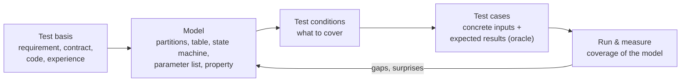
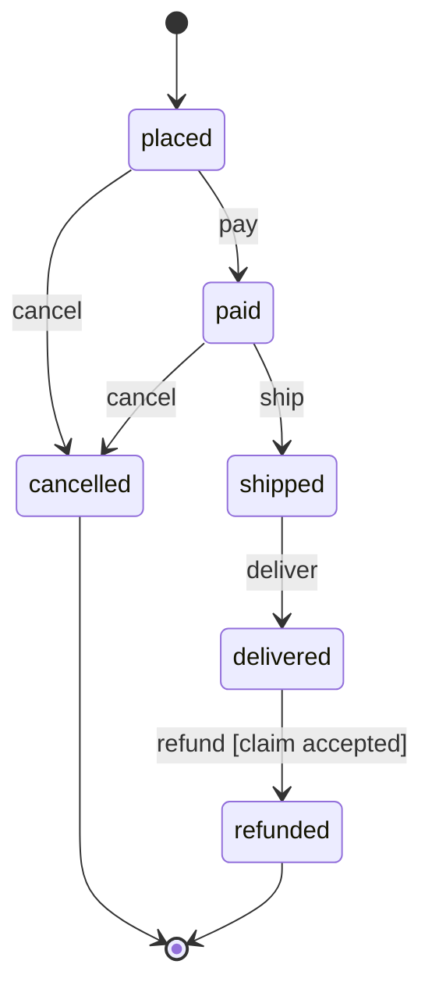
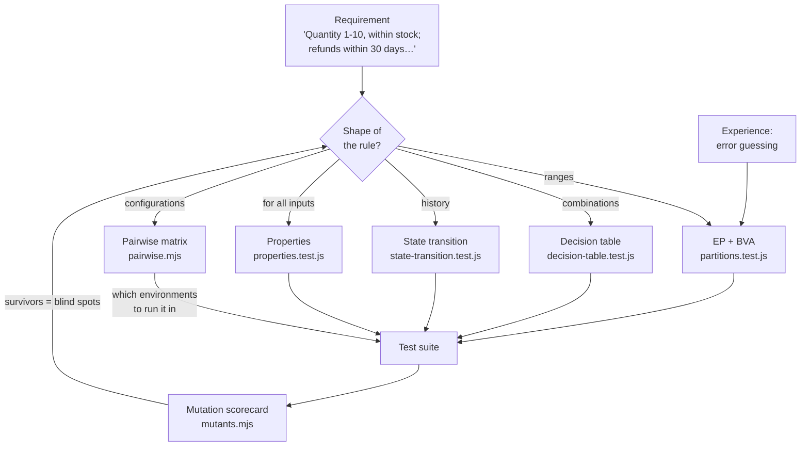

# Topic 2 — Test Design Techniques

*Out of infinitely many possible tests, how to choose the few that are worth writing, and how to prove you chose well.*

**Time:** about 3 hours of reading, plus a 2-hour lab · **Needs:** Node.js and `npm install` · **Lab files:** `labs/test-design/`

In Topic 1 you picked 49.99, 50.00 and 50.01 by instinct, and the bug hunt showed that instinct isn't enough: six of eight tests were blind to a real bug. This topic replaces instinct with **techniques**: repeatable ways to turn a requirement into a small set of tests that catch a large share of the bugs.

The running examples are all in Quality Books:

- **The cart:** quantities, stock and shipping (`app/src/cart.js`)
- **Orders and refunds:** a new module for this topic with a lifecycle and a returns policy (`app/src/orders.js`)
- **The assistant's routing rules:** which answer wins when a question matches several rules (`app/src/assistant.js`)
- **The configurations the shop runs on:** browsers, screen sizes, languages and networks

The lab finds a **real bug** in this repo that every single-input technique misses, and ends with a mutation scorecard. It shows, in numbers, that **no single technique catches every bug.**

---

## 1. What is it?

A **test design technique** is a systematic method for deriving tests from some source of information. That source is called the **test basis**: a requirement, a contract, a model, the code, or experience.

Every technique answers two questions:

1. **Which inputs and situations should I test?** (selection)
2. **When have I tested enough?** (a **coverage criterion**: a measurable rule such as "every partition once" or "every transition once")

Two terms you'll meet constantly:

- A **test condition** is *something worth testing*: "quantity above the maximum".
- A **test case** is *a concrete way to test it*: "add 11 copies of book 1; expect a 400 error *quantity must be an integer from 1 to 10*".

Techniques come in four families:

| Family | Derives tests from | Examples |
|---|---|---|
| **Black-box (specification-based)** | What the system should do, without looking at the code | Equivalence partitioning, boundary values, decision tables, state transitions, pairwise, use cases |
| **White-box (structure-based)** | The code's structure | Statement, branch, condition and MC/DC coverage |
| **Experience-based** | The tester's knowledge of how software fails | Error guessing, checklists, exploratory heuristics |
| **Generative** | Rules that must hold for many inputs | Property-based, metamorphic, model-based testing |

## 2. Why do we need it?

Because **exhaustive testing is impossible** (Topic 1, principle 2), and choosing tests by gut feeling has predictable gaps:

- People test the **happy path** and the error they've seen before, and miss the combinations.
- Different testers write very different suites for the same feature. That makes coverage a matter of luck.
- Without a coverage criterion, nobody can say **when** testing is done or **what** was left out.
- Without a technique, you can't **explain** your test selection to a reviewer, an auditor or your future self.

The numbers in this repo make the point. The cart alone accepts around 19,000 valid single-line-per-book carts, plus infinitely many invalid ones. The order lifecycle has 30 state/event pairs. The shop's configuration matrix has 108 combinations. Techniques reduce each of these to a few dozen tests, and they tell you exactly what you gave up in the process.

## 3. How does it work internally?

Every technique follows the same pipeline. Only the **model** in the middle changes:



1. **Read the basis** and pick a technique whose model fits its shape:
    - ranges of values → partitions and boundaries
    - combinations of conditions → decision table
    - behaviour that depends on history → state machine
    - many independent settings → pairwise
    - a rule for all inputs → property
2. **Build the model.** This step alone finds bugs, because building it forces questions the requirement never answered. ("What happens on day 30 exactly?" "Can a shipped order be cancelled?")
3. **Derive test conditions** from the model using a coverage criterion.
4. **Write test cases**: concrete inputs plus an **oracle** (Topic 1) that says what the right answer is.
5. **Run them and measure** how much of the *model* you covered. That's a different number from code coverage.
6. **Feed back.** Surprises update the model and often the requirement.

The lab's mutation scorecard adds a final step: **evaluate the design** by planting bugs and checking which techniques notice them.

## 4. Main components and concepts

### 4.1 Equivalence partitioning (EP)

**Idea:** split each input's possible values into **partitions** (also called *equivalence classes*). A partition is a group of values the system should handle the same way. If one value from a partition works, the others probably do too, so test **one value per partition**.

The cart's `quantity` field:

| Partition | Values | Expected | Test value |
|---|---|---|---|
| Below range | …, -1, 0 | Rejected | 0 |
| Valid | 1 … 10 | Accepted (if in stock) | 5 |
| Above range | 11, 12, … | Rejected | 11 |
| Not an integer | 1.5, `"2"`, `null` | Rejected | 1.5, `"2"`, `null` |

Rules that make EP work:

- **Invalid partitions get one test each.** If you combine two invalid values in one test, the first error hides the second (*error masking*).
- **Partitions come from the spec, then get refined by the code.** If the code treats 1–3 differently from 4–10 (say, a bulk discount), that's a partition boundary, even if the spec never mentions it.
- **Output partitions count too.** "Shipping charged" and "shipping free" are output partitions. You need inputs that land in each.

### 4.2 Boundary value analysis (BVA)

**Idea:** bugs cluster at the **edges** of partitions, because that's where programmers write `<` instead of `<=`, or count from 0 instead of 1. So test the values on and next to each boundary.

- **Two-value BVA:** the boundary and its closest neighbour in the next partition: 10 and 11.
- **Three-value BVA:** the boundary and the values either side of it: 9, 10 and 11. It's stronger: it catches a `==` that should be `<=`.

The boundaries in Quality Books:

| Rule | Boundary | Tests |
|---|---|---|
| Quantity minimum | 1 | 0 · 1 |
| Quantity maximum | 10 | 10 · 11 |
| Stock (book 5 has 3) | 3 | 3 · 4 |
| Free shipping | 50.00 EUR | 49.99 · 50.00 · 50.01 |
| Refund window | day 30 | 30 · 31 (and 0, and −1 as invalid) |

!!! tip "The boundary is a requirement question first"
    "Within 30 days": is day 30 in or out? "Over 50 EUR": is 50.00 over? BVA forces you to ask. Topic 1's inconsistency was exactly this kind of question, left unanswered.

**Domain testing** extends BVA to several inputs that interact. Example: a rule like `quantity × price ≤ credit limit` has a *diagonal* boundary, so you test points on, just inside and just outside that line.

### 4.3 Decision tables

**Idea:** when the outcome depends on a **combination** of conditions, list every combination as a column (a **rule**) and decide the outcome for each. With *n* yes/no conditions there are 2ⁿ columns. **Collapsing** merges columns where a condition doesn't matter, marked `-`.

The refund policy as a decision table (`app/src/orders.js`):

| Conditions | R1 | R2 | R3 | R4 | R5 |
|---|:-:|:-:|:-:|:-:|:-:|
| Within 30 days? | Y | Y | Y | Y | N |
| Arrived damaged? | Y | Y | N | N | – |
| Original condition? | Y | N | Y | N | – |
| **Refund?** | **yes** | **yes** | **yes** | **no** | **no** |

Two things happen when you build a table like this:

1. **Gaps appear.** If the policy only said *"returned within 30 days in original condition"*, column R2 (damaged, *not* original condition) would have no defined answer. Someone must decide, and that decision is a requirement.
2. **Contradictions appear.** If two rules claim the same column with different outcomes, the requirement is inconsistent.

Collapsed columns are **claims**. "If late, nothing else matters" is a claim worth testing, so the lab tests all four combinations behind R5.

*Cause-effect graphing* is a formal way to derive decision tables from logical relationships (AND, OR, NOT, and constraints between causes). It's useful for complex rule sets, but rarely worth the ceremony for small ones.

### 4.4 State-transition testing

**Idea:** when behaviour depends on **history** (what happened before), model the system as a **state machine** and derive tests from it:

- **State:** a condition the system is in (`paid`).
- **Event:** something that happens (`ship`).
- **Transition:** a move from one state to another caused by an event (`paid --ship--> shipped`).
- **Guard:** a condition that must be true for the transition (`refund` only if the claim is accepted).



Coverage criteria, from weakest to strongest:

| Criterion | Meaning | Tests for orders |
|---|---|---|
| All states | Visit every state | 3 paths |
| **All transitions (0-switch)** | Take every valid arrow once | 6 |
| **All invalid transitions** | Try every state/event pair that has no arrow | 24 |
| 1-switch (transition pairs) | Take every *sequence* of two arrows | ~8 |

The **state/event table** is the most valuable artefact here. It has one row per state and one column per event, and every cell is either a target state or "invalid". Most suites test the arrows and forget the empty cells. Yet "a shipped order can still be cancelled" is exactly the kind of bug that costs money.

### 4.5 Pairwise and combinatorial testing

**Idea:** when there are many **independent settings** (factors), testing every combination explodes multiplicatively. Most interaction bugs involve only **two** factors ("RTL text breaks on mobile"). So cover every *pair* of values at least once.

Quality Books runs on:

| Factor | Values |
|---|---|
| browser | chromium, firefox, webkit |
| viewport | mobile, tablet, desktop |
| locale | en-GB, de-DE, ar-EG (right-to-left) |
| assistant | mock, claude |
| network | fast, slow-3g |

That is 3 × 3 × 3 × 2 × 2 = **108** combinations. Covering every pair takes **11** (the theoretical minimum is 9 = 3 × 3).

Concepts you'll meet:

- **Strength (t-way):** pairwise is t = 2. Three-way covers every triple. NIST research on real failures found most involve one or two factors, almost all involve six or fewer, so strength 3–4 is used for critical systems.
- **Constraints:** some combinations are impossible ("webkit on Windows"). Tools let you exclude them.
- **Orthogonal arrays** are a mathematical way to build balanced pairwise sets. Greedy tools such as Microsoft PICT, NIST ACTS and AllPairs are the practical way.
- **Seeding:** forcing in combinations you know are important, such as your most common real-user configuration.

!!! warning "Pairwise is a selection technique, not an oracle"
    It tells you *which configurations* to run. You still need tests with good oracles to run in each one.

### 4.6 Use-case and scenario testing

**Idea:** derive tests from **user journeys**: a main success scenario plus its alternative and exception flows. For example: *"A customer searches, adds two books, sees free shipping, checks out."* Then: *"…but one book goes out of stock between adding and checkout."*

Scenarios catch integration and workflow bugs that input-level techniques miss. They're the natural basis for E2E tests (Topic 5) and BDD scenarios. **Example mapping** (Matt Wynne) is a collaborative version: in a 25-minute session, product, development and QA write rules, examples for each rule, and open questions on cards. Those examples become the tests.

### 4.7 Classification tree method

**Idea:** draw the input domain as a tree. Classifications (such as *cart size* or *book availability*) branch into classes (*1 line, 2–3 lines, many*; *in stock, low stock, out of stock*). Then pick combinations of classes as test cases. It's EP made visual and multi-dimensional, and it pairs well with pairwise for selecting the combinations.

### 4.8 White-box coverage criteria

When you *can* see the code, coverage criteria measure how much of its structure your tests exercise:

| Criterion | Requires | For `if (a \|\| b)` |
|---|---|---|
| **Statement** | Every line runs | One test that enters the `if` |
| **Branch (decision)** | Every `if` goes both ways | One true, one false |
| **Condition** | Every boolean sub-expression is both true and false | `a` and `b` each true and false |
| **MC/DC** (modified condition/decision coverage) | Each condition is shown to *independently* change the outcome | n + 1 tests for n conditions |

MC/DC is required for the most critical avionics software under DO-178C. Most product teams use branch coverage as a *floor*, never as a *target* (Topic 1: coverage measures what ran, not what was checked).

### 4.9 Experience-based techniques

- **Error guessing:** use knowledge of typical mistakes to target likely bugs: empty inputs, duplicates, zero, one, many, very large values, special characters, time zones, concurrency, and repeating an action twice. The lab's *"same book on two lines"* came from here.
- **Checklists:** codified experience, for example an API checklist (auth, pagination, idempotency, error format) or an accessibility checklist.
- **Heuristics for exploration:** the Heuristic Test Strategy Model's **SFDIPOT** (Structure, Function, Data, Interfaces, Platform, Operations, Time) gives you directions to explore in. **Zero-one-many** and **Goldilocks** (too small, too big, just right) are quick input heuristics.
- **Attacks:** James Whittaker's *How to Break Software* lists systematic attacks, such as forcing every error message or overflowing input buffers.

### 4.10 Property-based and metamorphic testing

**Property-based testing (PBT):** instead of choosing inputs, describe the *shape* of valid inputs (a **generator**, which fast-check calls an *arbitrary*) and a **property** that must hold for all of them. The tool generates many inputs (100 by default). When one fails, the tool **shrinks** it: it simplifies the failing input step by step until it finds a minimal case that still fails. It also prints a **seed** so you can replay exactly that run.

```js
fc.assert(fc.property(sellableCart, (items) => {
  const c = priceCart(items);
  assert.equal(c.total, cents(c.subtotal + c.shipping));
}));
```

Common kinds of property:

| Kind | Example |
|---|---|
| Invariant | `total = subtotal + shipping` |
| Round trip | `parse(format(x)) === x` |
| **Metamorphic** | Reordering lines doesn't change the total; adding a line never lowers the subtotal |
| Model / oracle comparison | The fast implementation agrees with a slow, obviously correct one |
| Model-based (stateful) | Random event sequences keep the order in a known state |

**Metamorphic testing** is the answer to the oracle problem. You may not know the right output for an input, but you know how the outputs of *two related inputs* must relate. It's widely used for search engines, compilers, ML models and LLM features (Topic 12).

The catch: **generators encode assumptions.** In the lab the "sellable cart" generator picks *different* books, so it can never generate the duplicate-line bug. When you drop that assumption, the bug appears within a few dozen inputs.

### 4.11 Model-based testing (MBT)

**Idea:** build an explicit, executable model of the behaviour (usually a state machine) and let a tool generate test sequences from it, sometimes also checking the real system against the model as it runs. The lab's random event sequences are a lightweight version. Heavyweight tools such as GraphWalker generate paths through large models. MBT pays off when behaviour is complex and stateful, such as protocols, workflows or devices.

### 4.12 Choosing techniques by the shape of the problem

| If the requirement looks like… | Use |
|---|---|
| "Between X and Y", "at least", "up to" | EP + BVA |
| "If A and B, unless C…" | Decision table |
| "After…", "only when…", statuses, workflows | State transition |
| "Must work on all browsers, locales, plans…" | Pairwise, plus seeded real configurations |
| A user goal with steps | Use case / scenario, example mapping |
| "Always", "never", "for any…" | Property-based / metamorphic |
| Free text, no clear structure | Exploratory, guided by heuristics |
| Safety-critical code | Add MC/DC and formal reviews |

## 5. Architecture: from requirement to a balanced suite



The mutation scorecard closes the loop. It measures the suite's ability to catch bugs, and a surviving mutant tells you which technique to add.

## 6. How it connects with other practices

| Practice | Connection |
|---|---|
| **Requirements and BDD** | Building partitions and tables finds requirement gaps, so test design is also requirements review. Example mapping produces test cases directly. |
| **Unit testing (Topic 3)** | Techniques decide *what* to test; unit tests are the cheapest *where*. Most EP/BVA and decision-table tests belong at unit level. |
| **API and contract testing (Topic 4)** | A contract's schema *is* a partition definition (`minimum: 1, maximum: 10`). Schema-based fuzzers derive boundary tests from it. |
| **E2E testing (Topic 5)** | Use-case scenarios and pairwise configuration matrices drive what E2E runs and where. |
| **CI (Topic 6)** | Pairwise matrices become CI job matrices. Property tests need pinned seeds in CI for reproducibility. |
| **Performance (Topic 8)** | Load profiles are partitions of traffic: normal, peak, spike, soak. |
| **Security (Topic 9)** | Fuzzing is generative testing aimed at crashes and vulnerabilities. Boundary and invalid partitions are where injection lives. |
| **AI in QA (Topic 12)** | Metamorphic testing is the main oracle for LLM features. AI can draft partitions and tables, and humans must review the boundaries. |

## 7. Real-world examples

**1. The duplicate-line bug (this repo).** Every rule in `priceCart` is checked one line at a time: quantity 1–10, quantity within stock. Send the same book on two lines and each line passes on its own, so the shop sells 4 copies of a book it has 3 of, or 13 copies of a book capped at 10 per line. EP, BVA and the "sellable cart" property all miss it. Error guessing and a property with a less restrictive generator find it. It's a classic **combination** bug, and you'll fix it in the lab.

**2. A decision-table gap (this repo).** The assistant checks "off-topic" words before "shipping" words. So *"Will bad weather delay my delivery?"* (a genuine shop question) gets *"I can only help with questions about Quality Books"*. Nobody wrote that behaviour on purpose. It's what happens when rule *order* decides overlapping cases, and nobody drew the table.

**3. The Zune freeze (2008).** On 31 December 2008, Microsoft's 30 GB Zune players froze worldwide. The clock driver's leap-year logic looped forever on the 366th day of a leap year. That's a boundary value (the last day of a leap year) nobody tested.

**4. Ariane 5 flight 501 (1996).** A 64-bit floating-point horizontal velocity was converted to a 16-bit signed integer. On Ariane 4's flight profile the value never exceeded the range; Ariane 5 accelerated faster. It overflowed 37 seconds after launch and the rocket was destroyed. The input partition "values above 32,767" existed in the new context and was never tested, because the code was reused without re-analysing its domain.

**5. Interaction bugs in configuration.** NIST studies of real-world failures (medical devices, browsers, servers, databases) found that most were triggered by one or two interacting parameters, and nearly all by six or fewer. This evidence is why pairwise testing is used for configuration-heavy products such as browsers, SDKs and multi-tenant SaaS settings.

**6. Property-based testing in industry.** QuickCheck, the original PBT tool for Haskell, was later commercialised for Erlang. A well-known engagement modelled AUTOSAR automotive software and found many defects in components that had been tested conventionally. Teams using Hypothesis (Python) commonly report it finding bugs in date handling, unicode and serialisation that example tests had missed for years.

## 8. Scaling across applications and teams

| Challenge at scale | What works |
|---|---|
| Every team designs tests differently | A short **test design checklist** in the PR template: "boundaries tested? invalid partitions one per test? state table complete?" |
| Requirements arrive without boundaries | Make **examples part of the definition of ready**: no story enters a sprint without its boundary examples (example mapping). |
| Configuration matrices explode across products | Maintain **one shared factor model** (browsers, locales, plans) and generate pairwise CI matrices from it, seeded with the top real-user configurations from analytics. |
| Property tests are hard to adopt | Provide **shared generators** for domain types (money, carts, users) in a test library, so teams write properties instead of generators. |
| "How good are our tests?" can't be answered | Run **mutation testing** nightly on critical modules (Stryker, PIT, mutmut) and trend the mutation score per team. Don't make it a hard gate. |
| Knowledge stays in individuals' heads | Keep **decision tables and state diagrams in the repo** next to the tests (as here), so they're reviewed and versioned like code. |

## 9. Security and data privacy

- **Invalid partitions are attack surface.** Over-long strings, negative quantities, wrong types and duplicates are what attackers send. The duplicate-line bug would let someone order stock that doesn't exist, which is a business-logic vulnerability. Security testing (Topic 9) is largely EP and BVA aimed at hostile inputs.
- **State machines encode authorisation.** "Can a cancelled order be refunded?" is a security question as well as a functional one. Testing the invalid cells of the state table is how you find privilege and workflow bypasses.
- **Generated data must be synthetic.** Property tests and pairwise matrices should never pull values from production data. Generators produce realistic shapes without real people.
- **Fuzzing finds crashes, but its output can include sensitive inputs.** Store corpora carefully and don't attach them to public bug reports.
- **Seeds and counterexamples are safe to share.** That's one more reason to prefer generators to production samples.

## 10. Performance, maintenance, and cost

| Technique | Cost to design | Cost to run | Maintenance |
|---|---|---|---|
| EP/BVA | Low | Very low (unit) | Low; tables update when rules change |
| Decision table | Medium; needs requirement answers | Low | Grows 2ⁿ with conditions, so collapse aggressively |
| State transition | Medium; needs a model | Low | The model must track the code; a test comparing them (as in the lab) keeps them honest |
| Pairwise | Low with a tool | Proportional to rows × suite time | Regenerate when factors change; pin output for stable CI |
| Property-based | Higher; generators take skill | Higher (100 runs per property) | Low per property, and properties survive refactors well |
| Mutation testing | Low with a tool | **High**: one suite run per mutant | Run nightly or on changed files only |

Cost tips:

- Keep technique-driven tests at **unit level** where possible. The lab's 85 tests run in about 100 ms.
- Use **data-driven tests** (one test body, a table of rows), as in `partitions.test.js`, so a new boundary is one line.
- Pin property-test **seeds in CI** (`FC_SEED`) for reproducibility, and let local runs stay random to keep exploring.
- Run full mutation testing **incrementally**, only on changed code, as Stryker and PIT support.

## 11. Common problems and failure scenarios

| Problem | Symptom | Fix |
|---|---|---|
| **Partitions from the code, not the spec** | Tests confirm what the code does, including its bugs | Derive partitions from requirements first, then refine with code |
| **Combining invalid values** | A test passes because the first error masks the second | One invalid partition per test |
| **Only on-boundary values** | `<=` vs `<` mistakes slip through | Use values on both sides (two- or three-value BVA) |
| **Happy-path state tests only** | Workflow bypass bugs in production | Test every invalid cell of the state table |
| **Decision tables never collapsed** | 64-column tables nobody maintains | Collapse with `-`, but test the collapsed claims |
| **Pairwise treated as complete** | A three-factor bug escapes | Seed known-risky triples; raise strength for critical areas |
| **Generators too narrow** | Properties pass, bugs remain | Review generators like code: what can they *never* produce? |
| **Weak properties** | `result !== undefined` "passes" | Properties need real oracles: invariants, metamorphic relations, models |
| **Unreproducible PBT failures in CI** | "It failed once, can't reproduce" | Log and pin seeds; replay with `FC_SEED` |
| **Technique monoculture** | High scores on one kind of bug, blind to others | Mix techniques; let a mutation scorecard show the gaps |

## 12. Important trade-offs

- **Rigour vs speed.** A full decision table for a five-condition rule is 32 columns. Sometimes three examples and a conversation are enough. Let risk decide (Topic 1).
- **Two-value vs three-value BVA.** Three-value catches more mutations and costs one more test per boundary. Use it on money, time and limits.
- **Pairwise vs exhaustive.** Pairwise is about 10% of the cost for most of the interaction bugs, and blind to rare higher-order ones. Exhaustive is affordable when factors are few or tests are very fast.
- **Examples vs properties.** Examples are readable and document intent. Properties explore further, and are harder to read and write. Use both: examples for the spec, properties for the space.
- **Model fidelity vs maintenance.** A detailed state model finds more, and must change with every feature. Model what's risky, not everything.
- **Mutation testing value vs cost.** It's the best measure of test strength, and the most expensive to run. Run it selectively.

## 13. Comparisons

### Techniques side by side

| Technique | Best at finding | Blind to | Coverage criterion |
|---|---|---|---|
| EP | Wrong handling of whole classes of input | Edges, combinations | Every partition once |
| BVA | Off-by-one, `<` vs `<=` | Combinations, sequences | Every boundary ± neighbour |
| Decision table | Missing or contradictory business rules | Ranges inside conditions | Every (collapsed) rule |
| State transition | Illegal sequences, workflow bypasses | Data values inside states | All transitions; all invalid pairs; n-switch |
| Pairwise | Two-factor configuration bugs | Single-value logic, 3+ way bugs | Every value pair |
| Use case / scenario | Workflow and integration gaps | Detailed input rules | Every main and alternative flow |
| Error guessing | Known failure patterns | Anything the tester hasn't seen before | None (that's its weakness) |
| Property-based | Unexpected inputs, edge cases nobody listed | What the generator can't produce | Number of generated cases (statistical) |
| Mutation testing | *Weak tests* (evaluates the suite) | — | Mutation score |

### Property-based testing tools

| Language | Tool | Notes |
|---|---|---|
| JavaScript / TypeScript | **fast-check** (used here) | Integrates with any runner; model-based testing support |
| Python | Hypothesis | Very mature shrinking; stateful testing; database of past failures |
| Java / Kotlin | jqwik, Kotest | JUnit 5 engine |
| Haskell / Erlang | QuickCheck | The original (2000) |
| Rust | proptest, quickcheck | |
| Go | `testing/quick`, rapid | |

### Combinatorial tools

| Tool | Notes |
|---|---|
| **Microsoft PICT** | CLI; constraints, seeding, mixed strength; the de-facto standard |
| **NIST ACTS** | Higher strengths (up to 6-way); constraint support; research-backed |
| AllPairs / allpairspy | Simple libraries for scripting |
| `labs/test-design/pairwise.mjs` | ~80 lines; for understanding the algorithm, not production |

### Mutation testing tools

Stryker (JavaScript, TypeScript, C#, Scala), PIT/PITest (Java), mutmut and cosmic-ray (Python), and cargo-mutants (Rust). The lab's `mutants.mjs` uses ten hand-written mutants to show the idea. Real tools generate hundreds automatically.

## 14. Hands-on lab: design tests that find real bugs

You'll apply each technique to Quality Books, find and fix a real bug, generate a configuration matrix, and score your techniques with mutation testing.

**Time:** 2 hours · **Files:**

| File | What's in it |
|---|---|
| `labs/test-design/tests/partitions.test.js` | EP and BVA for quantity, stock, book ids, shipping and the refund window, plus error guessing |
| `labs/test-design/tests/decision-table.test.js` | The refund policy and the assistant's routing rules as decision tables |
| `labs/test-design/tests/state-transition.test.js` | The order lifecycle: valid, invalid and sequence coverage |
| `labs/test-design/tests/properties.test.js` | Property-based and metamorphic tests with fast-check |
| `labs/test-design/tests/pairwise.test.js` | Checks of the pairwise generator itself |
| `labs/test-design/pairwise.mjs` | A small all-pairs generator and the shop's configuration factors |
| `labs/test-design/mutants.mjs` | Plants 10 bugs in a sandbox copy and scores each technique |
| `app/src/orders.js` | Order lifecycle and refund rules (new in this topic) |

### Step 0 — Baseline

```bash
npm install             # adds fast-check if you're coming from Topic 1
npm run design:test
```

```text title="Expected output (end)"
# tests 85
# suites 16
# pass 82
# fail 0
# todo 3
```

Three TODOs are findings recorded as tests:

- two different techniques finding the **same real bug** (error guessing and a property)
- one **open product question** found by a decision table

You'll resolve the bug in step 4.

### Step 1 — Partitions and boundaries (20 min)

1. Before you open the file, draw the partition table for **quantity** on paper, using only the API contract in `app/openapi.yaml` (`/api/cart/price`). Mark the boundaries and pick a test value for each partition.
2. Compare your table with `partitions.test.js`. Did you include *not an integer*? Did you test 0 *and* 11?
3. Now apply EP to **`bookId`**. The contract says `type: integer`. What partitions does that create? Try one of them:

    ```bash
    node -e "import('./app/src/cart.js').then(m => console.log(m.priceCart([{ bookId: '3', quantity: 1 }]).lines[0]))"
    ```

    ```text title="Expected output"
    { bookId: 3, title: 'Prompting for QA', quantity: 1, lineTotal: 34 }
    ```

    The string `"3"` is accepted, though the contract says integer. Write down whether you think that's a bug. (The *robustness principle* says accept liberally; *contract-first* design says reject.) Topic 4 returns to this with contract testing. For now, note it as a finding.

### Step 2 — Decision tables (20 min)

1. Read the refund table in `decision-table.test.js` and the rules in `app/src/orders.js`. Check that the code implements each column.
2. Read the assistant's routing table, then look at the order of the `if` statements in `mockAnswer()` in `app/src/assistant.js`. Fill in the missing column: *off-topic = Y, mentions shipping = Y*. What does the code do? What *should* it do?
3. See the open question for yourself:

    ```bash
    node -e "import('./app/src/assistant.js').then(async m => console.log((await m.answer('Will bad weather delay my delivery?', 'mock')).answer))"
    ```

    ```text title="Expected output"
    I can only help with questions about Quality Books - our books, orders, shipping and returns.
    ```

    A genuine customer question is declined. Don't fix it yet; that's the wrap-up challenge. The point is that the *table* exposed it, while every single-rule test passed.

### Step 3 — State transitions (15 min)

1. Draw the order state machine from memory, then compare it with section 4.4.
2. Draw the **state × event table**: 6 rows and 5 columns. Fill each cell with a target state or ✗. Count the ✗ cells. You should get 24.
3. Run only the state tests:

    ```bash
    node --test --test-reporter=spec labs/test-design/tests/state-transition.test.js
    ```

    All pass. Notice the test *"the code has no transitions the requirement does not"*. It compares the code's transition table with the hand-written model, so an extra arrow added in the code (a bug) fails the build.

### Step 4 — Find and fix a combination bug (30 min)

Every rule in `priceCart` is checked per line. Error guessing says: *try the same thing twice.*

1. **Reproduce it** by hand:

    ```bash
    node -e "import('./app/src/cart.js').then(m => console.log(m.priceCart([{ bookId: 5, quantity: 2 }, { bookId: 5, quantity: 2 }]).subtotal))"
    ```

    ```text title="Expected output"
    108
    ```

    Book 5 has 3 in stock. The shop just sold 4. The same trick sells 12 or more copies of book 1 with two lines, getting around the 10-per-line limit.

2. **See the property find it on its own**, from random inputs:

    ```bash
    node --test --test-reporter=spec --test-name-pattern="never sells more" labs/test-design/tests/properties.test.js
    ```

    ```text title="Expected output (values vary per run)"
    ✖ an accepted cart never sells more copies than are in stock # finds the duplicate-line bug; ...
      Error: Property failed after 26 tests
      { seed: 299939031, path: "25:1:3:1:2", endOnFailure: true }
      Counterexample: [[{"bookId":1,"quantity":6},{"bookId":1,"quantity":7}]]
      Shrunk 4 time(s)
      ...
      [cause]: AssertionError [ERR_ASSERTION]: sold 13 of book 1, stock 12
    ```

    fast-check generated random carts, found a failing one, then **shrank** it to a small cart that still fails. Replay that exact run with `FC_SEED=<seed> npm run design:test`.

    Why did the other properties miss it? Look at the `sellableCart` generator: `fc.uniqueArray(…)` can *never* produce the same book twice. **Generators encode assumptions.**

3. **Decide the fix.** Two options: add up quantities per book, or reject duplicate lines. The UI never sends duplicates (it keeps one line per book), so rejecting them is simplest and closes both holes, stock and the 10-per-line limit. In `app/src/cart.js`, inside `priceCart`:

    ```js
    const seen = new Set();
    const lines = items.map(({ bookId, quantity }) => {
      const book = findBook(bookId);
      if (!book) throw new ValidationError(`unknown book ${bookId}`);
      if (seen.has(book.id)) throw new ValidationError(`book ${book.id} appears more than once; combine it into one line`);
      seen.add(book.id);
      // ...the quantity and stock checks stay as they are
    ```

4. **Keep the sources consistent** (Topic 1). In `app/openapi.yaml`, add a line to the `/api/cart/price` description:

    ```yaml
    description: |
      Shipping is 4.90 EUR, free when the subtotal is 50 EUR or more.
      Quantity must be an integer from 1 to 10 and not exceed stock.
      Each book may appear on only one line.
    ```

    (JSON Schema's `uniqueItems: true` wouldn't help here: it compares whole objects, so `{bookId: 5, quantity: 2}` and `{bookId: 5, quantity: 1}` count as different.)

5. **Turn both TODOs into real tests.** In `partitions.test.js` and `properties.test.js`, delete the `{ todo: '…' }` line from the two duplicate-line tests. Run:

    ```bash
    npm run design:test
    ```

    ```text title="Expected output (end)"
    # tests 85
    # pass 84
    # fail 0
    # todo 1
    ```

    The remaining TODO is the open product question from step 2. Also check you broke nothing elsewhere: `npm run test:unit && npm run foundations:test`.

### Step 5 — Generate a configuration matrix (15 min)

```bash
npm run design:pairwise
```

```text title="Expected output (end)"
11 configurations cover every pair; all combinations would be 108.
```

1. Check a few pairs in the table by eye, for example *webkit + ar-EG*, or *mobile + slow-3g*.
2. Add a factor in `labs/test-design/pairwise.mjs`: `payment: ['card', 'paypal', 'invoice']`. Re-run. Exhaustive testing jumps from 108 to 324 configurations; pairwise goes from 11 to about 13. That's how pairwise scales: roughly with the square of the largest factor, not the product of all of them.
3. Run `npm run design:test`. The pairwise tests still pass. Then **undo the change**, because the test that expects exactly 108 combinations will fail otherwise.
4. Think: which *triple* would you add as a seed because it is your riskiest real configuration? (Hint: right-to-left text, the smallest screen and the slowest network.)

### Step 6 — Score the techniques with mutation testing (20 min)

```bash
npm run design:mutants
```

```text title="Expected output (after step 4)"
Mutant                                              EP/BVA            Decision table    State transition  Property-based
M1 max quantity 10 → 11                             ✔ killed          ·                 ·                 ·
M2 min quantity 1 → 0                               ✔ killed          ·                 ·                 ·
M3 stock check off by one                           ✔ killed          ·                 ·                 ✔ killed
M4 free shipping at > 50, not >= 50                 ✔ killed          ·                 ·                 ·
M5 line totals not rounded to cents                 ·                 ·                 ·                 ✔ killed
M6 shipping decided per copy (BUG_MODE=cart)        ·                 ·                 ·                 ✔ killed
M7 shipped orders can be cancelled                  ·                 ·                 ✔ killed          ·
M8 refund window ends on day 29                     ✔ killed          ·                 ·                 ·
M9 damaged books refunded after the window          ·                 ✔ killed          ·                 ·
M10 assistant checks off-topic before injection     ·                 ✔ killed          ·                 ·
Killed by this technique                            5/10              2/10              1/10              3/10

✔ All 10 mutants killed. No single technique killed them all.
```

(Before step 4, M3 is caught by EP/BVA only and the property-based total is 2/10: the stock property was still a TODO.)

The script copies the app to a temporary folder, plants one bug at a time, and runs each technique's tests against it. Your working tree is never changed. Read the matrix and explain each **unique** kill:

- **M4 and M8** (`>` vs `>=`) are caught **only** by boundary tests. The property tests never see a subtotal of exactly 50.00 (no sellable cart costs that), and the decision table uses days 10 and 45, not 30.
- **M5** (unrounded money) is caught **only** by a property. No hand-picked example checked line totals for float noise like `89.97000000000001`.
- **M7** (an extra arrow) is caught **only** by state-transition tests of *invalid* pairs.
- **M9 and M10** (rule order) are caught **only** by decision tables, because only they combine conditions.

Now prove a technique matters by removing it. In `partitions.test.js`, comment out the *"day 30 is still in time"* test and re-run:

```text title="Expected output (end)"
✖ Survived every technique: M8 (refund window ends on day 29)
```

The script exits with code 1. Restore the test.

## 15. Verify and troubleshoot

### Definition of done

- [ ] `npm run design:test` → **84 pass, 0 fail, 1 todo**
- [ ] `npm run design:mutants` → **"All 10 mutants killed"**, exit code 0, Property-based **3/10**
- [ ] `npm run test:unit` and `npm run foundations:test` still pass
- [ ] `app/openapi.yaml` states the one-line-per-book rule
- [ ] On paper: the quantity partition table, the 6 × 5 state/event table with 24 ✗ cells, and your answer to the assistant's missing column

### Troubleshooting

| Symptom | Likely cause | Fix |
|---|---|---|
| `Cannot find package 'fast-check'` | Dependencies installed before Topic 2 | `npm install` |
| A property test fails with a seed you can't reproduce | Each run is random by design | Re-run with the printed seed: `FC_SEED=<seed> npm run design:test` |
| After step 4, a *different* test fails: `assert.throws` … `only 3` | Your fix aggregates quantities, so the error message differs | Either is fine. The test accepts `more than once` or `only 3`; make your message contain one of them |
| `design:test` shows `todo 3` after step 4 | The `{ todo: … }` options are still in place | Delete the whole `{ todo: '…' },` line in both tests |
| Pairwise test fails: `got N rows` | You changed the factors | Expected while experimenting; restore `SHOP_FACTORS` |
| Pairwise test fails: `expected 108` | A factor was added or removed | Restore `SHOP_FACTORS`, or update the expected count if the change is intentional |
| `design:mutants`: `code to mutate not found in app/src/cart.js` | You changed a line a mutant targets (for example, rewrote the quantity check) | Update that mutant's `from`/`to` strings in `mutants.mjs` to match your code |
| `design:mutants`: `On correct code these must pass first` | A technique file is failing on the unmutated code | Run `npm run design:test` and fix that first |
| `design:mutants` is slow (> 30 s) | Antivirus scanning the temporary folder, or a slow disk | Expected on some machines; it runs about 44 small test processes |
| `EPERM` / symlink error on Windows | Creating symlinks needs Developer Mode | Enable Developer Mode, or run in WSL or Codespaces |
| State tests: `there are 24 invalid pairs` fails | States or events were added to `orders.js` | Update the hand-written `EXPECTED` model, and ask whether the requirement changed |

---

## Wrap-up

### Mental model

> **A test design technique is a lens that makes one shape of bug visible.**
>
> Partitions and boundaries see *ranges*. Decision tables see *combinations*. State machines see *history*. Pairwise sees *configurations*. Properties see *the whole input space, through the generator's eyes*. Error guessing sees *what has gone wrong before*.
>
> Every lens is blind somewhere. A strong suite looks through several lenses, and mutation testing shows where you're still blind.

### 10 key things to remember

1. **One value per partition, and one invalid partition per test.** Combining invalid values hides bugs.
2. **Bugs live on boundaries.** Test on, below and above, and ask the requirement which side the boundary belongs to.
3. **Building the model finds bugs** before any test runs: unanswered columns, missing arrows, undefined boundaries.
4. **Test the empty cells** of a state table. Invalid transitions are where workflow and security bugs hide.
5. **Decision tables expose rule order.** When conditions overlap, order is behaviour, so test the overlaps.
6. **Pairwise gets about 10% of the cost for most interaction bugs.** Seed your riskiest real configurations, and remember it isn't three-way.
7. **Properties need real oracles**: invariants, metamorphic relations, reference models.
8. **Generators encode assumptions.** Ask what your generator can never produce.
9. **Pin seeds in CI, explore randomly locally.** A failure you can't replay is a failure you can't fix.
10. **Judge a suite by the bugs it catches.** Mutation scores tell you that; coverage doesn't.

### Common mistakes

- Deriving partitions from the **code** and so testing that bugs are still there.
- Testing **only valid** partitions.
- Testing the boundary but not its **neighbour** (or the reverse).
- Writing a 32-column decision table and **never collapsing** it, or collapsing it and **never testing** the "doesn't matter" claim.
- Drawing the state diagram but testing only the **happy path**.
- Treating a pairwise matrix as **proof** of compatibility.
- Writing properties so weak they can't fail (`result !== undefined`).
- Restricting generators "to avoid noise", and filtering out the bugs with the noise.
- Chasing **100% code coverage** instead of covering the model.
- Using one technique for everything because it's the one the team knows.

### Hands-on challenge

**Resolve the assistant's routing question, then add a bulk discount.**

1. **Routing.** Decide the right answer for *"Will bad weather delay my delivery?"*. Extend the assistant's decision table with every combination of *off-topic* and *mentions shipping/returns/contact*, decide each column, change `mockAnswer()` to match, and turn the R6 TODO into a passing test. Check that `npm run eval:llm` (workshop [Lab 6](../labs/lab-06-llm-evaluation.md)) still passes. Did your change let any genuinely off-topic question through?
2. **Bulk discount.** Product asks: *"10% off a line of 5 or more copies; never on out-of-stock books; doesn't combine with free shipping below 50 EUR after discount."* Build:
    - a partition and boundary table for the discount quantity (4, 5, 6)
    - a decision table for *discount × free shipping* (does free shipping use the subtotal before or after the discount? Decide and document it)
    - two properties: *a discounted line never costs more than the undiscounted one*, and *ordering lines still doesn't change the total*
3. Add two mutants for your feature to `mutants.mjs` (for example, discount at ≥ 4, or discount applied after shipping) and show that each one is killed by a technique you used.

### What to learn next

**Topic 3 — Unit and Component Testing.** You now know *which* tests to write. Topic 3 is about *how* to write them well at the cheapest level: what a "unit" really is, test doubles (stubs, mocks, fakes, spies) and when they lie, test structure and naming, fast and deterministic tests, TDD, testing time and randomness, coverage tools, and full mutation testing with Stryker on this repo.

Read before Topic 3 (optional):

- Lee Copeland, *A Practitioner's Guide to Software Test Design*: the classic reference for every technique in this topic
- [fast-check documentation](https://fast-check.dev/): *Why property-based?* and *Model-based testing*
- NIST, [*Practical Combinatorial Testing*](https://csrc.nist.gov/pubs/sp/800/142/final) (SP 800-142)

When you've finished the lab and the challenge, say **"continue"** to start Topic 3.
