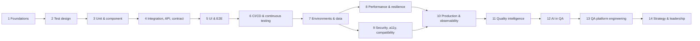

# Learning Path

**Fourteen topics that take you from first principles to running quality across an engineering organisation.**

This isn't interview prep. The goal is to understand how quality engineering actually works inside real software systems: what each practice is for, how it works internally, where it breaks, and what it costs. Every topic is taught on the same small system, the [Quality Books demo app](../reference/demo-app.md). Each one builds on the earlier ones, and every lab runs on your laptop and in this repo's CI.

!!! info "One topic at a time"
    Topics are published one at a time. Finish a topic and its lab before you start the next one. Later topics assume you have done the earlier labs.

## The roadmap

| # | Topic | The question it answers | Status |
|---|---|---|---|
| 1 | [QA Engineering Foundations](01-qa-foundations.md) | What is quality, how do we know we have it, and where does testing fit? | ✅ Available |
| 2 | [Test Design Techniques](02-test-design.md) | Out of infinite possible tests, which few should we write? | ✅ Available |
| 3 | Unit and Component Testing | How do we check one piece fast and in isolation? | Next |
| 4 | Integration, API, and Contract Testing | How do we check that pieces still fit together when teams change them independently? | Planned |
| 5 | UI, Web, and End-to-End Testing | How do we check what the user really sees, without a slow, flaky suite? | Planned |
| 6 | CI/CD and Continuous Testing | How does testing run on every change and turn into a release decision? | Planned |
| 7 | Test Environments and Test Data Management | Where do tests run, and on what data? | Planned |
| 8 | Performance, Load, and Resilience Testing | Is it fast enough, and does it survive when things go wrong? | Planned |
| 9 | Security, Accessibility, and Compatibility Testing | Is it safe, usable by everyone, and does it work everywhere it should? | Planned |
| 10 | Production Quality and Observability | How do we know it works for real users right now? | Planned |
| 11 | Test Management and Quality Intelligence | How do we turn test results into decisions? | Planned |
| 12 | AI in QA Engineering | How do we use AI to test, and how do we test AI? | Planned |
| 13 | QA Platform Engineering and Test Infrastructure | How do we give 50 teams good testing without 50 QA teams? | Planned |
| 14 | Quality Strategy and Engineering Leadership | How do we set direction, invest and measure at org level? | Planned |

## How every topic is structured

Every topic uses the same fifteen sections, so you always know where to find something:

| # | Section | What you get |
|---|---|---|
| 1 | What is it? | A plain definition, with any new terms explained first |
| 2 | Why do we need it? | The problem it solves, and what happens without it |
| 3 | How does it work internally? | The mechanism, step by step |
| 4 | Main components and concepts | The vocabulary, each term explained |
| 5 | Architecture or diagram | A picture of the moving parts |
| 6 | How it connects | Links to the other QA and engineering practices |
| 7 | Real-world examples | Realistic scenarios, including well-known incidents |
| 8 | Scaling | Across applications and engineering teams |
| 9 | Security and data privacy | What can leak, what can be abused |
| 10 | Performance, maintenance, and cost | What it costs to run and to keep alive |
| 11 | Common problems and failure scenarios | How it goes wrong in practice |
| 12 | Trade-offs | What you give up for what you get |
| 13 | Comparisons | Against similar techniques and tools |
| 14 | Hands-on lab | Step by step, on the demo app |
| 15 | Verify and troubleshoot | Expected output, and what to do when it differs |

Then a **wrap-up**: a mental model, ten things to remember, common mistakes, a challenge, and what to learn next.

## How the existing workshop fits

The [AI-era workshop](../modules/index.md) (8 modules, 9 labs) stays as a one- or two-day event format. Its labs become the hands-on parts of later topics:

| Workshop lab | Used in topic |
|---|---|
| [1. E2E with Playwright](../labs/lab-01-playwright-e2e.md) | 5 · UI, Web, and End-to-End |
| [2. API testing](../labs/lab-02-api-testing.md) | 4 · Integration, API, and Contract |
| [3. AI-assisted test generation](../labs/lab-03-ai-test-generation.md) | 12 · AI in QA |
| [4. Flaky tests](../labs/lab-04-flaky-tests.md) | 5 and 6 |
| [5. Performance with k6](../labs/lab-05-performance-k6.md) | 8 · Performance, Load, and Resilience |
| [6. LLM evaluation and red teaming](../labs/lab-06-llm-evaluation.md) | 9 and 12 |
| [7. Quality gates in CI](../labs/lab-07-quality-gate.md) | 6 · CI/CD and Continuous Testing |
| [8. Measuring what matters](../labs/lab-08-metrics.md) | 11 · Quality Intelligence |
| [9. An AI agent tests the shop](../labs/lab-09-ai-agent.md) | 12 · AI in QA |

## Before you start

Do the [Quickstart](../getting-started.md). Topics 1 and 2 need only Node.js and `npm install`; no browser and no API key.
