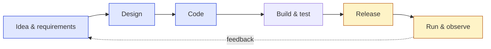

# 1. The Evolving Role

*From test execution to quality enablement*

## Why it matters

For years, "QA" often meant a phase: developers build, testers check, then release. That model can't keep up with teams that deploy many times a day, and it was never good at preventing defects, only at finding them late. AI speeds this up further. When code is cheap to write, the scarce skill is knowing **whether it is right, whether it is safe, and whether it is worth shipping**. That is quality work, and it moves from the end of the pipeline to all of it.

## Key ideas

### Shift left *and* shift right (the whole lifecycle)

- **Shift left:** ask "how will we know this works?" during refinement. Write acceptance criteria as examples. Review testability in design. Run fast checks on every commit.
- **Shift right:** some risks only show up in production: real traffic, real data, model drift. Synthetic monitoring, canaries, feature flags and observability are quality tools too.

In the demo app: the cart's free-shipping rule is a left-shifted unit test (`app/test/cart.test.js`). The assistant's behaviour on real customer questions is a right-shift concern, which is why Lab 6's eval can also run against production traffic samples.

### Quality as a product (developer experience)

If quality is a service the QA team provides, then its users are developers, and its product is **fast, trustworthy feedback**. Judge it like a product:

- How long from push to a red/green signal?
- How often is the signal wrong (flaky)?
- Can a developer run the same checks locally with one command (`npm test`)?

### Partner with developers, product and platform teams

| Partner | What you bring | What you ask for |
|---|---|---|
| Developers | Test strategy, risk analysis, review of their tests | Testable design, ownership of unit/API tests |
| Product | Risks in customer terms, acceptance examples | Clear success criteria, priority calls |
| Platform | Requirements for environments, pipelines, data | Self-service: test environments and quality gates as golden paths |

### Use AI to augment, not replace, QA

AI is very good at **volume**: drafting test cases, generating data, summarising logs, clustering failures. It is unreliable at **judgment**: deciding what matters, knowing the business, noticing what is *missing*. The human role moves towards being an editor and a decision-maker. Module 2 and Lab 3 practise this.

### Focus on risk, impact and customer value

You can't test everything, and you never could. Rank by **likelihood × impact**, in customer terms:

> "A customer is charged shipping on a 60 EUR order" beats "the cart endpoint returns 400 on a malformed body" — both deserve a test, but only one costs money and trust.

## Discuss

1. Where in your lifecycle does quality work happen today? Where *should* it?
2. If your test suite were a product, what would its NPS be among developers? Why?
3. Which QA tasks in your team would you happily hand to AI tomorrow? Which never?

## Exercise (15 min): map your quality activities

On a sticky-note board, draw the six lifecycle stages from the diagram above. Each person adds one note per quality activity their team does, in the stage where it happens. Then:

- Circle the stage with the most notes and the stage with the fewest.
- For the emptiest stage, agree one activity to start next sprint.

## Takeaways by role

=== "QA & SDET"
    Your output is *confidence*, not test cases. Spend less time executing checks and more time designing the system that executes them, and coaching the people who write them.

=== "Developers"
    Quality isn't handed off. You own the fast layers (unit, API, contract); QA helps you choose *what* to test and catches what the fast layers can't.

=== "Managers & leads"
    Fund the enablement work (pipelines, test environments, observability) as product work. A QA team measured on "bugs found" will optimise for finding bugs late.

## Next steps

-   **Module 2 — AI-Powered Testing**

    ---

    Where AI saves real time in testing, and where it quietly makes things worse.

    [→ Module 2](02-ai-powered-testing.md)

-   **Lab 7 — Quality gates**

    ---

    The most direct application: quality as a team agreement, written as code.

    [→ Lab 7](../labs/lab-07-quality-gate.md)

