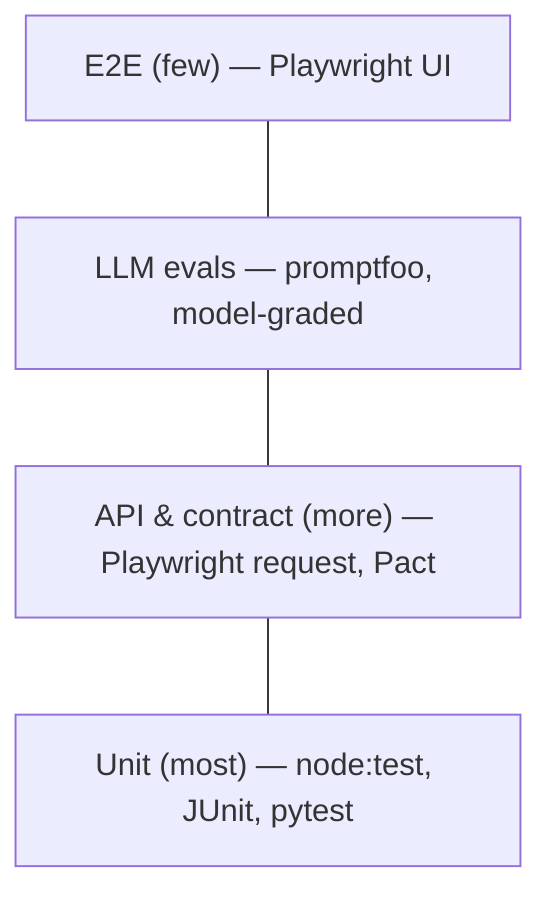

# 3. Tools & Technologies

*The modern QA stack*

## Why it matters

Tools don't make a strategy, but the wrong tools make a good strategy expensive. This module surveys the stack by job to be done, and gives a way to choose that outlasts any particular tool's popularity.

## The stack by job

| Job | Common tools | Used in this workshop |
|---|---|---|
| **UI automation** | Playwright, Cypress, Selenium | Playwright (Lab 1) |
| **API testing** | Postman/Newman, REST Assured, Karate, Playwright `request` | Playwright `request` (Lab 2) |
| **Performance** | k6, Gatling, JMeter | k6 (Lab 5) |
| **Monitoring & observability** | Datadog, New Relic, OpenTelemetry, Prometheus/Grafana | `/metrics` endpoint + request IDs in the demo app |
| **Quality & security analysis** | SonarQube, Snyk, CodeQL | Discussed; CodeQL is free on public GitHub repos |
| **AI / ML** | GitHub Copilot, Claude, other LLMs, custom agents | Claude/Copilot (Lab 3), promptfoo for LLM evals (Lab 6) |

## Key ideas

### Choose by the feedback loop, not the feature list

Ask of any tool:

1. **Speed:** how long from change to signal? Runs locally?
2. **Trust:** how often is it wrong (flaky, false positive)?
3. **Fit:** same language and repo as the code, so developers will touch it?
4. **Evidence:** does it produce machine-readable output (JUnit, SARIF, JSON) a quality gate can consume?
5. **Cost of exit:** if you drop it in two years, what is left behind?

### The test pyramid still holds, with a new layer

LLM evaluation is a layer of its own: slower and costlier than unit tests, faster than E2E, and graded on *properties* (grounded, safe, in scope) rather than exact outputs.

### One runner for UI and API

Playwright's `request` fixture runs API tests with the same runner, reports, traces and CI wiring as the UI tests. One tool to learn, one report to read. (`playwright.config.js` defines `e2e`, `api` and `flaky` projects.)

### Observability is a testing tool

Every response from the demo app carries an `x-request-id`, and `/metrics` exposes counters in Prometheus format. With OpenTelemetry the same request ID links a failing test to the server-side trace, which turns "it failed in CI" into "it failed *here*".

### Static analysis and security in the same pipeline

SonarQube (code quality), Snyk (dependency vulnerabilities) and CodeQL (code-level security) catch whole classes of defects without running anything. Run them on every pull request and gate on *new* issues only. Gating on legacy debt just teaches people to ignore the gate.

### AI tools in the stack

- **Assistants** (Copilot, Claude) in the editor: drafting tests and data, explaining failures.
- **Agents** that run tools: "run the suite, read the failures, propose a fix as a PR". Powerful; review their output like a junior colleague's.
- **Eval frameworks** (promptfoo, DeepEval, Ragas): regression suites for LLM features.

## Discuss

1. Which tool in your stack has the worst feedback loop? What would it cost to replace?
2. Do your developers run the UI tests locally? If not, why not?
3. What does your pipeline do with SARIF/JUnit output today?

## Exercise (10 min): stack audit

List your team's tools against the "stack by job" table. For each, score Speed, Trust and Fit from 1 to 5. Circle the lowest total: that's your next improvement.

## Takeaways by role

=== "QA & SDET"
    Prefer tools in the developers' language and repo. A brilliant framework nobody else touches is a single point of failure.

=== "Developers"
    You'll be the main users of the fast layers. Insist they run locally with one command.

=== "Managers & leads"
    Standardise on *outputs* (JUnit, SARIF, JSON) more than on tools; that is what lets a platform team build one quality gate for everyone.

## Next steps

-   **Lab 1 — E2E with Playwright**

    ---

    Resilient locators, page objects and traces.

    [→ Lab 1](../labs/lab-01-playwright-e2e.md)

-   **Lab 2 — API testing**

    ---

    Business rules below the UI, as data tables.

    [→ Lab 2](../labs/lab-02-api-testing.md)

-   **Lab 5 — Performance with k6**

    ---

    Thresholds that fail the build.

    [→ Lab 5](../labs/lab-05-performance-k6.md)

