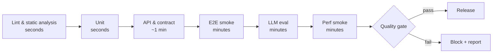

# 4. Process & Practices

*Quality built into the way we work*

## Why it matters

The best test suite fails if nobody runs it, nobody reads its results, or a red build can be overridden by whoever is in a hurry. Process is what turns test assets into outcomes.

## Key ideas

### Shift-left testing and continuous quality

- **Three amigos** (product, dev, QA) before work starts: agree examples, risks and "done".
- **Acceptance criteria as examples**: *"Given a 59.98 EUR cart, shipping is 0"* is testable. *"Shipping is correct"* is not.
- **Tests in the same pull request as the code.** A feature without its tests isn't done.

### CI/CD and automated pipelines

Order checks by speed, so the cheapest failure comes first:

This is exactly the pipeline in `.github/workflows/ci.yml`.

### Test strategy and risk-based testing

A test strategy fits on one page:

1. **What are we protecting?** The top customer risks (Module 1).
2. **Which layer catches each one, most cheaply?**
3. **What do we deliberately not test, and what production signal covers it instead?**
4. **When is it good enough to release?** That is the quality gate.

### Observability and synthetic monitoring

Synthetic monitors run a few critical journeys against production every few minutes: *search → add to cart → price*. They catch what pre-release tests can't, such as expired certificates, bad config and third-party outages. In Lab 8's data, incidents caught by synthetic monitors were detected in about 4 minutes; customer-reported ones took about 97.

### Incident response and RCA

- Blameless post-mortems that ask **"why did our checks not catch this?"**, and produce a new test or monitor as an action item.
- Root-cause analysis looks for the *systemic* cause ("no API test for the shipping rule"), not the person.
- Track which test layer *should* have caught each escaped defect (Lab 8 does this).

### Quality gates and release readiness

A quality gate is a **team agreement written as code**: thresholds everyone accepted in advance, checked automatically, with an audit trail when they're overridden. See Lab 7 and `labs/quality-gate/gate.config.json`.

### Metrics and continuous improvement

Measure the system, review it regularly, change one thing, measure again (Module 7, Lab 8). Without the "change one thing" step, metrics are just reporting.

## Discuss

1. Who can override a red build in your team? How often does it happen, and is it recorded?
2. What was your last escaped defect, and which layer should have caught it?
3. Does your team agree in advance what "ready to release" means?

## Exercise (15 min): one-page test strategy

For the Quality Books **assistant** feature, write the one-page strategy using the four questions above. Compare with a neighbouring pair.

## Takeaways by role

=== "QA & SDET"
    Own the strategy and the gate definition; let everyone own the tests.

=== "Developers"
    Order your pipeline by speed, and keep the inner loop (lint + unit + API) under five minutes.

=== "Managers & leads"
    Make overriding the gate possible but visible. Then review the overrides monthly.

## Next steps

-   **Lab 7 — Quality gates in CI**

    ---

    Turn test, eval and performance evidence into one release decision.

    [→ Lab 7](../labs/lab-07-quality-gate.md)

-   **Module 5 — Quality Focus Areas for AI**

    ---

    The new failure modes an AI feature brings into the process.

    [→ Module 5](05-quality-focus-areas.md)

