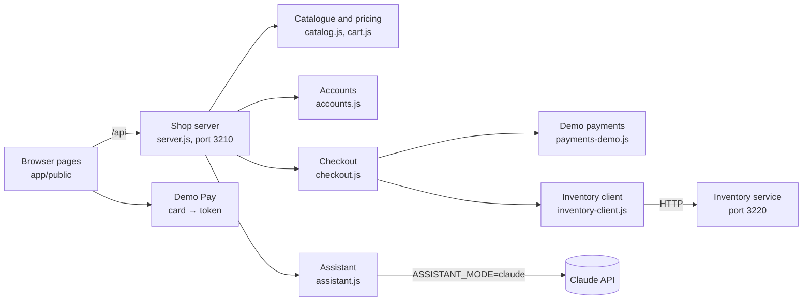

# Demo app: Quality Books

A deliberately small shop, built so every lab has something real to test. It grows with the course: each topic adds only what its lab needs.

| Module | Added in | What it is |
|---|---|---|
| `catalog.js`, `cart.js`, `assistant.js` | Before the course | Catalogue, pricing with free shipping, the AI support assistant |
| `orders.js` | Topic 2 | Order lifecycle (state machine) and the refund decision table |
| `returns.js`, `checkout.js`, `coupons.js` | Topic 3 | Refund claims with an injected clock; checkout with injected collaborators; coupons (built test-first) |
| `inventory-client.js`, `payments-demo.js`, `services/inventory/` | Topic 4 | The inventory service (a separate provider), the shop's HTTP client for it, a demo payment provider |
| `reports.js`, `Dockerfile`, `compose.yaml` | Topic 7 | A back-office sales report; a disposable container environment; the inventory service's opt-in test-data API |
| `accounts.js`, `account-routes.js`, `public/checkout.*`, `public/account.*`, `public/demo-pay.js` | Shop features (no lab yet) | Register and sign in, checkout with a test card, order history with cancel. Tested in `app/test/` |

## Endpoints

| Method | Path | Purpose | Notes |
|---|---|---|---|
| GET | `/health` | Liveness | Used by Playwright's `webServer` |
| GET | `/api/books?q=` | List / search | Matches title, author or tag |
| GET | `/api/books/:id` | One book | 404 for unknown ids |
| POST | `/api/cart/price` | Price a cart | Shipping 4.90 EUR, free from a 50 EUR subtotal; quantity 1-10 and within stock |
| GET | `/api/recommendations` | AI-tagged books | Takes 200-1500 ms on purpose (Topic 5, flaky tests) |
| POST | `/api/assistant` | Support assistant | `{ question }` → `{ answer, mode }` |
| POST | `/api/orders` | Place an order | `{ items, paymentToken, customer: { email } }`; tokens `tok_visa` (approves) and `tok_declined`; needs the inventory service |
| GET | `/api/orders/:id` | One order | In memory; lost on restart |
| POST | `/api/orders/:id/cancel` | Cancel an order | Releases its stock in the inventory service |
| GET | `/metrics` | Prometheus counters | Requests by route/status, errors, assistant calls |
| POST | `/api/auth/register` | Create an account | `{ name, email, password }` → 201 `{ user }` and a session cookie; 400 invalid, 409 email taken |
| POST | `/api/auth/login` | Sign in | `{ email, password }` → 200 `{ user }` and a session cookie; 401 with one message for any wrong email or password |
| POST | `/api/auth/logout` | Sign out | 204, cookie cleared |
| GET | `/api/auth/me` | Who is signed in | `{ user }`, `null` for a guest |
| GET | `/api/account/orders` | Order history | The signed-in customer's orders, newest first; 401 for a guest |

`POST /api/orders` also accepts an optional `shipTo: { name, street, city, postcode, country }`, checked before anything is charged. Orders placed while signed in get the customer's `userId` (and their email when `customer.email` is left out); guest orders work exactly as before.

Full contract: `app/openapi.yaml` (the orders endpoints are a Topic 4 challenge). Every response has an `x-request-id` header (pass your own to correlate).

## Pages and the customer journey

| Page | What it does |
|---|---|
| `/` | Catalogue, cart, recommendations, assistant. The header links to *Sign in* / *My account*; each cart line has a *Remove* button (named just "Remove", with the line as its description, so it never matches a search for a book's own button), and the cart shows *Go to checkout* once it has a book. The cart is kept in `sessionStorage`, so it survives moving between pages (per tab). |
| `/checkout.html` | Review the order (change quantities, remove books), contact email, shipping address, test card, *Pay … EUR*, then a confirmation with the order number |
| `/account.html` | Sign in or create an account; when signed in, the order history with *Cancel order* for paid orders. `?next=checkout` returns to checkout after signing in |

Paying from the UI needs the inventory service: run `npm run start:all`. With only `npm start`, checkout says the inventory service isn't running.

**Test account:** `ada@example.com` / `quality-books-demo`, created at every start. Accounts, sessions (2 hours, `qb_session` cookie: `HttpOnly`, `SameSite=Strict`) and orders are kept in memory and lost on restart.

**Demo Pay test cards** (any future expiry `MM/YY`, any 3-digit security code). `app/public/demo-pay.js` plays a payment provider's browser SDK: it checks the card and turns it into a token in the browser, so the shop's API only ever receives tokens.

| Card number | Token | Result |
|---|---|---|
| 4242 4242 4242 4242 | `tok_visa` | Approved |
| 4000 0000 0000 0002 | `tok_declined` | 402, card declined |
| 4000 0000 0000 9995 | `tok_insufficient_funds` | 402, insufficient funds |
| Any other number | none | Refused in the browser: most typos fail the Luhn checksum; a valid number is an unknown card |

Simplified on purpose, and good places to look for risks: no limit on login attempts, no password reset or email verification, `GET /api/orders/:id` and cancel work for anyone who knows an order id, and a guest can type any email address at checkout.

Tests: `npm run test:unit` (accounts, Demo Pay, the account API) and `npm run test:shop` (the customer journeys in a browser, plus an axe scan of the new pages).

## The inventory service

A separate Express service in `services/inventory/` (port 3220), with its own contract in `services/inventory/openapi.yaml`: `GET /stock/:bookId`, `POST /reservations`, `DELETE /reservations/:id`. Start both services with `npm run start:all`, or the inventory service alone with `npm run start:inventory`.

## Switches

| Variable | Values | Effect |
|---|---|---|
| `PORT` | default `3210` | Listening port. Playwright, k6 and promptfoo follow it via `PORT` / `BASE_URL`. |
| `ASSISTANT_MODE` | `mock` (default), `buggy`, `claude` | How the assistant answers. See Topic 12. |
| `ASSISTANT_MODEL` | default `claude-opus-5-5` | Model for `claude` mode |
| `BUG_MODE` | unset, `cart` | `cart` plants a free-shipping regression (Topics 6 and 12) |
| `RECOMMENDATIONS_DELAY_MS` | number | Fixes the recommendations delay (Topic 5) |
| `LOG_REQUESTS` | `false` | Silences the JSON request log |
| `INVENTORY_URL` | default `http://localhost:3220` | Where the shop finds the inventory service |
| `INVENTORY_PORT` | default `3220` | The inventory service's port |
| `INVENTORY_TEST_DATA` | `on` | Enables `PUT /stock/:bookId` for test data. Test environments only |
| `INVENTORY_TOKEN` | a secret | Service token the inventory service requires and the shop sends (added in the Topic 9 lab) |

## Catalogue

| id | Title | Price (EUR) | Stock | Tags |
|---|---|---|---|---|
| 1 | Testing in Production | 29.99 | 12 | observability, devops |
| 2 | The Pragmatic Tester | 24.50 | **0** | fundamentals |
| 3 | Prompting for QA | 34.00 | 5 | ai, llm |
| 4 | Contract Testing in Practice | 31.25 | 8 | api, microservices |
| 5 | Performance Engineering with k6 | 27.00 | **3** | performance |
| 6 | Responsible AI Testing | 39.90 | 7 | ai, ethics |

## The assistant in `claude` mode

`app/src/assistant.js` calls the Anthropic Messages API with the official `@anthropic-ai/sdk`:

- the system prompt contains the catalogue and policies and tells the model to answer only from them;
- `output_config.effort: "low"`, because a short support answer doesn't need deep reasoning;
- the server-side refusal fallback is on (`fallbacks: "default"`), and a `refusal` stop reason is mapped to the standard "I can only help with…" reply.

The mock mode follows the same rules deterministically, so the eval suite defines the expected behaviour for both.
