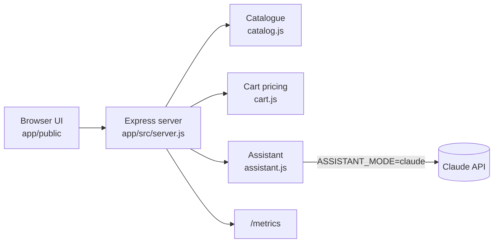

# Demo app: Quality Books

A deliberately small shop, built so every lab has something real to test.

## Endpoints

| Method | Path | Purpose | Notes |
|---|---|---|---|
| GET | `/health` | Liveness | Used by Playwright's `webServer` |
| GET | `/api/books?q=` | List / search | Matches title, author or tag |
| GET | `/api/books/:id` | One book | 404 for unknown ids |
| POST | `/api/cart/price` | Price a cart | Shipping 4.90 EUR, free from a 50 EUR subtotal; quantity 1-10 and within stock |
| GET | `/api/recommendations` | AI-tagged books | Takes 200-1500 ms on purpose (Lab 4) |
| POST | `/api/assistant` | Support assistant | `{ question }` → `{ answer, mode }` |
| GET | `/metrics` | Prometheus counters | Requests by route/status, errors, assistant calls |

Full contract: `app/openapi.yaml`. Every response has an `x-request-id` header (pass your own to correlate).

## Switches

| Variable | Values | Effect |
|---|---|---|
| `PORT` | default `3210` | Listening port. Playwright, k6 and promptfoo follow it via `PORT` / `BASE_URL`. |
| `ASSISTANT_MODE` | `mock` (default), `buggy`, `claude` | How the assistant answers. See Lab 6. |
| `ASSISTANT_MODEL` | default `claude-opus-5-5` | Model for `claude` mode |
| `BUG_MODE` | unset, `cart` | `cart` plants a free-shipping regression (Labs 3 and 7) |
| `RECOMMENDATIONS_DELAY_MS` | number | Fixes the recommendations delay (Lab 4) |
| `LOG_REQUESTS` | `false` | Silences the JSON request log |

## Catalogue

| id | Title | Price (EUR) | Stock | Tags |
|---|---|---|---|---|
| 1 | Testing in Production | 29.99 | 12 | observability, devops |
| 2 | The Pragmatic Tester | 24.50 | **0** | fundamentals |
| 3 | Prompting for QA | 34.00 | 5 | ai, llm |
| 4 | Contract Testing in Practice | 31.25 | 8 | api, microservices |
| 5 | Performance Engineering with k6 | 27.00 | **3** | performance |
| 6 | Responsible AI Testing | 39.90 | 7 | ai, ethics |

## The assistant in `claude` mode

`app/src/assistant.js` calls the Anthropic Messages API with the official `@anthropic-ai/sdk`:

- the system prompt contains the catalogue and policies and tells the model to answer only from them;
- `output_config.effort: "low"`, because a short support answer doesn't need deep reasoning;
- the server-side refusal fallback is on (`fallbacks: "default"`), and a `refusal` stop reason is mapped to the standard "I can only help with…" reply.

The mock mode follows the same rules deterministically, so the eval suite defines the expected behaviour for both.
