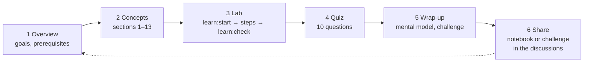

# How this course works

The course is self-paced. There are no deadlines and no sign-up: you need a GitHub account, a fork of the repo, and about 75 hours over as many weeks as suits you.

## The study loop

Every topic follows the same loop:



1. **Overview.** Read what you'll be able to do and check the prerequisites.
2. **Concepts.** Read sections 1–13. They're long, so take breaks between sections. Every new term is defined before it's used.
3. **Lab.** Start a branch with `npm run learn:start <topic>` and work through the steps. Each step gives you the task first. Hints and reference solutions are folded away (▸): try before you open them. Run `npm run learn:check <topic>` as often as you like.
4. **Quiz.** Ten questions about understanding. A wrong answer shows you why, which is often where the learning happens.
5. **Wrap-up.** The mental model, ten things to remember, common mistakes, and a **challenge** with no reference solution: it's open-ended on purpose.
6. **Share.** Post your notebook or your challenge solution in the [discussions](community.md). Reading other people's solutions is one of the best ways to learn this material.

At the bottom of every topic page there's a **Mark as done** button, and the [topics page](../topics/index.md) shows your progress. Progress is stored in this browser only.

## Your tools

| Command | What it does |
|---|---|
| `npm run learn:doctor` | Checks your machine has what the labs need, and tells you how to fix what's missing |
| `npm run learn:start 3` | Creates a branch `topic-03` from the course's starting state (or switches back to it) |
| `npm run learn:check 3` | Checks each lab step: ✔ done, or ✖ with what's missing and a hint |
| `npm run learn:status` | A progress table across every topic's lab |

```text title="Example: npm run learn:check 1, halfway through"
✔ Step 1 — Map the quality attributes
    notebook/01/quality-attributes.md
✔ Step 2 — Explore with a charter and write a defect report
    notebook/01/charter.md
✖ Step 3 — Resolve the free-shipping inconsistency
    the policy test is still a TODO
    → fix the policy text in app/src/catalog.js, then remove the { todo } option from the test
...
2/5 steps done for Topic 1: QA Engineering Foundations
```

## Why every topic starts from the same place

Labs change the app: you fix bugs, tighten contracts, add tests. To keep the topics independent, every lab starts from the course's **starting state** (the `main` branch of the course repo), not from your previous lab. That means:

- You can do topics in any order once you have the foundations.
- You can redo a topic any time: delete its branch and `learn:start` it again.
- One unfinished lab never blocks the next topic.

## Your notebook

Some steps are thinking work: a partition table, a charter, an explanation. Those go in `notebook/<topic>/`, starting from the templates in `notebook/_templates/`. Commit them to your fork. By the end, your notebook is a portfolio that shows how you reason about quality, which is worth more in an interview than any certificate.

## When you're stuck

1. Re-read the step and its **Hint**.
2. Read the **Troubleshooting** table at the end of the lab.
3. Compare with the reference solution: `git diff upstream/solutions -- <path>`. The course's `solutions` branch has every lab solved, and `learn:start` fetches it for you. If git says `unknown revision`, run `git fetch upstream solutions` first.
4. Ask in the [discussions](community.md) under the topic's category. Include the command you ran and its output.

## Your progress in CI

When you push to your fork, the **Learner progress** workflow runs `learn:status` and puts the table in the run's summary. Open the **Actions** tab of your fork to see it. You may need to enable Actions on the fork first.

## Clear your progress

To start over on this device:

<button class="md-button" data-course-reset type="button">Clear my progress and quiz scores</button>
