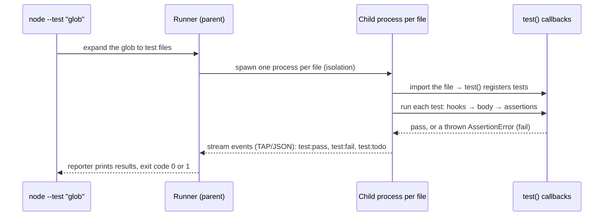
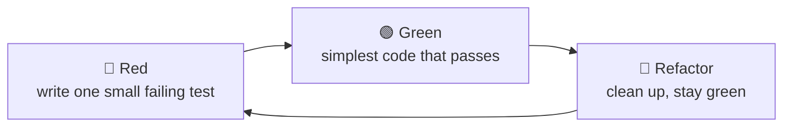
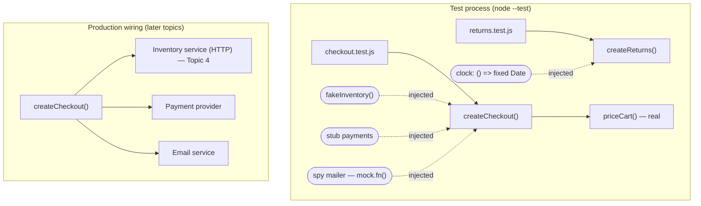

# Topic 3 · Concepts

## 1. What is it?

A **unit test** checks a small piece of behaviour quickly, in isolation from things that are slow or out of your control: networks, databases, clocks, other teams' services. A **component test** checks a larger, cohesive piece, such as a service, a module or a UI component, through its public interface, still without the outside world.

"Unit" is one of the most argued-about words in testing. Two definitions are both in common use:

| School | A "unit" is… | Collaborators | Nickname |
|---|---|---|---|
| **Classical (Detroit, Chicago)** | A unit of *behaviour*, which may span several classes or functions | Real, unless they're slow, non-deterministic or shared (network, clock, DB) | **Sociable** tests |
| **London (mockist)** | A single class or function | Replaced by test doubles, almost always | **Solitary** tests |

Martin Fowler named these *sociable* and *solitary* tests. The checkout tests in this topic are sociable: they use the real `priceCart`, and only replace the payment gateway, the inventory and the mailer.

The definition that matters most in practice comes from Michael Feathers: a test is **not** a unit test if it talks to the network, touches a database or the file system, can't run at the same time as other tests, or needs special environment setup. Those tests aren't bad. They're *integration* tests (Topic 4), and they have a different cost.

## 2. Why do we need it?

Unit and component tests are the cheapest, fastest feedback a team has:

- **Speed.** This topic's 18 lab tests run in about 80 ms. A developer can run them on every save, and get an answer before they've lost their train of thought.
- **Precision.** When a unit test fails, it names the function and the input. An E2E failure says "the checkout page didn't show the total", and you go hunting.
- **Design pressure.** Code that's hard to unit test usually has a design problem: hidden dependencies, too many responsibilities, global state. Writing the test first (TDD) makes you notice before the problem sets.
- **Safe refactoring.** A good unit suite lets you restructure code with confidence, because it checks behaviour, not implementation.
- **Documentation that can't drift.** A well-named test (*"a claim 31 days later is too late"*) states a rule and proves it, every build.

Without them, teams push checks up to slower levels (the "ice-cream cone" from Topic 1). Feedback slows from seconds to tens of minutes, and refactoring becomes risky enough that nobody does it.

## 3. How does it work internally?

A test runner discovers test functions, runs each one, and reports which assertions failed. Node's built-in runner, `node:test`, which this course uses, works like this:



Key mechanics you'll rely on:

- **Isolation by process.** Each test *file* runs in its own process, so global state can't leak between files. Tests *within* a file share module state, which is how `smelly.test.js` manages to make one test depend on another.
- **Assertions are exceptions.** `assert.equal(a, b)` throws an `AssertionError` when they differ; the runner catches it and marks the test failed. A test with no assertion can't fail unless the code throws.
- **Async is awaited.** If a test returns a promise, the runner waits for it. A forgotten `await` makes a test finish before its assertion runs: the classic *"passes but checks nothing"* bug.
- **The exit code is the contract.** CI only looks at it: 0 is green, anything else is red. TODO tests are reported but don't change the exit code (Topic 1 used this to record findings).

### Anatomy of a good test

Every good test has three parts, written as **Arrange–Act–Assert** (or *Given–When–Then*):

```js
test('a claim 31 days later is too late', () => {
  // Arrange: a clock set to 1 June, an order delivered on 1 May
  const returns = createReturns({ clock: () => new Date('2026-06-01T12:00:00+02:00') });
  // Act: one call, the behaviour under test
  const result = returns.assess({ state: 'delivered', deliveredAt: '2026-05-01T12:00:00+02:00' });
  // Assert: the outcome that matters
  assert.equal(result.refund, false);
});
```

One behaviour per test. A name that states the rule. No logic (no `if`, no loops that hide which case failed). Everything the test needs is visible in the test.

## 4. Main components and concepts

### 4.1 FIRST: properties of a good unit test

| | Property | Meaning | Broken by |
|---|---|---|---|
| **F** | Fast | Milliseconds, so you run them constantly | Real network, sleeps, big fixtures |
| **I** | Independent | Any order, any subset, in parallel | Shared mutable state (`smelly.test.js`'s `cart`) |
| **R** | Repeatable | Same result every run, every machine, every time zone | The real clock, randomness, the network |
| **S** | Self-validating | Pass or fail on its own; no human reads a log | `console.log` instead of `assert` |
| **T** | Timely | Written with (or before) the code | Tests bolted on months later |

### 4.2 Test doubles

A **test double** (Gerard Meszaros's term, from stunt doubles) stands in for a real collaborator in a test. There are five kinds, and the differences matter:

| Double | What it does | Use it when | In this lab |
|---|---|---|---|
| **Dummy** | Fills a parameter; never used | A required argument is irrelevant to the test | — |
| **Stub** | Returns canned answers | You need the collaborator to *say* something: approve, decline, time out | `decliningPayments()` |
| **Spy** | A stub that also records how it was called | You need to check an *outgoing* effect after the fact | `spyMailer()` via `mock.fn()` |
| **Mock** | Pre-programmed with *expectations*; fails if called wrongly | Interaction *is* the behaviour (a protocol, an audit call) | `interactions.test.js` (and its weakness) |
| **Fake** | A working, simplified implementation | The collaborator has real behaviour your test depends on | `fakeInventory()` with a real stock map |

Two rules of thumb carry most of the weight:

- **Stub queries, verify commands.** If a collaborator *answers a question* (a price, a stock level), stub the answer and check *your* outcome. If it *does something* in the world (charge a card, send an email), check that it was asked to, with the right arguments.
- **Don't mock what you don't own; don't mock what's cheap.** Mocking a third-party API couples your tests to *your guess* of its behaviour. Topic 4's contract tests check that guess. Mocking your own fast, pure code (like `priceCart`) just removes the code you're trying to test.

### 4.3 Seams and dependency injection

A **seam** is a place where you can change behaviour without editing the code (Michael Feathers, *Working Effectively with Legacy Code*). The most useful seam is **dependency injection**: pass collaborators in instead of creating them inside.

```js
// Hard to test: the clock is hidden inside
function daysSince(deliveredAt) { return diff(deliveredAt, new Date()); }

// Testable: the clock is a parameter with a sensible default
function createReturns({ clock = () => new Date() } = {}) { ... }
```

Common seams: constructor or factory parameters (the lab's `createCheckout({...})`), function parameters with defaults, module-level registries, and, as a last resort, monkey-patching globals (`t.mock.timers` patches `Date`).

### 4.4 Controlling non-determinism: time, randomness, concurrency

A test that depends on something uncontrolled isn't **repeatable**. The usual suspects:

| Source | Symptom | Control it with |
|---|---|---|
| **Time** (`Date.now()`, time zones, DST) | Fails at midnight, on the 31st, in March and October, or in CI's UTC | An injected clock; explicit offsets in test data (`+02:00`); fake timers |
| **Randomness** (`Math.random`, UUIDs) | Different output every run | An injected RNG or id generator (`newId`); fixed seeds (`FC_SEED` in Topic 2) |
| **Concurrency** | Passes alone, fails in parallel | No shared mutable state; await everything |
| **Environment** (locale, env vars, files) | "Works on my machine" | Pass configuration in; isolate temp directories |

Time deserves special respect. *"Within 30 days"* sounds simple, but it hides at least four decisions: calendar days or 24-hour periods? Whose time zone? Is day 30 inclusive? What happens on the days the clocks change? This topic's lab finds a real bug in exactly this.

### 4.5 Test-driven development (TDD)

**TDD** is a design technique that uses tests. Kent Beck's cycle:



- **Red** proves the test can fail. A test you've never seen fail might not test anything.
- **Green** says *simplest*: hard-code if you must. The next test forces generalisation (*triangulation*).
- **Refactor** is not optional. It's where the design emerges, with the tests as a safety net.

TDD's benefits are mostly about **design and focus**: small steps, interfaces shaped by their use, and no untested code. The evidence on defect reduction is mixed and context-dependent; the honest claim is that it changes *how* you think about the code. The lab's coupon step is a small, complete TDD exercise.

### 4.6 Code coverage

**Coverage** tools instrument the code and record what ran during the tests. Node has built-in coverage (`--experimental-test-coverage`), and tools such as c8, Istanbul/nyc and JaCoCo do the same elsewhere.

| Metric | Measures |
|---|---|
| Line / statement | Which lines ran |
| Branch | Which sides of each `if`/`?:`/`&&` ran |
| Function | Which functions were called |

Coverage answers *"what did we not run?"*, which is useful for finding untested code. It can't answer *"would we notice a bug?"*. You saw that in Topic 1, and you'll measure it in this lab.

### 4.7 Mutation testing

**Mutation testing** answers the question coverage can't. A tool makes small changes to your code (**mutants**): it flips `>=` to `>`, replaces a string with `""`, turns `true` into `false`, or empties a function body. Then it runs your tests against each mutant:

- tests fail → the mutant is **killed** (good: your tests noticed)
- tests pass → the mutant **survived** (a blind spot)
- no test ran that code → **no coverage**

**Mutation score** = killed ÷ (killed + survived + no coverage). Some mutants are **equivalent**: the change doesn't alter behaviour (for example, a mutated default that's never used), so no test can kill them. That's why 100% is rarely the goal.

**Stryker** (JavaScript/TypeScript/C#), **PIT** (Java) and **mutmut** (Python) are the standard tools. Topic 2's `mutants.mjs` was a hand-made, ten-mutant version. Stryker generates dozens automatically.

### 4.8 Test smells

Recurring problems in test code, named by Meszaros and others:

| Smell | Looks like | Why it hurts |
|---|---|---|
| **Obscure test** | `test('test1')`, magic numbers | Nobody knows what failed or why it matters |
| **Eager test** | Many behaviours in one test | The first failure hides the rest |
| **Conditional test logic** | `if`/`for` deciding what to assert | Some branches never assert; failures are hard to read |
| **Interacting tests** | One test's leftover state feeds the next | Fails when run alone, in another order, or in parallel |
| **Assertion roulette / weak assertion** | `assert.ok(result)` | Passes for almost any output |
| **Silent catch** | `try { … } catch { assert(…) }` | Passes when nothing throws at all |
| **Testing implementation** | Asserting private details or call counts only | Breaks on refactoring; misses real bugs |
| **Mystery guest** | The test depends on a file, env var or the clock it doesn't show | Fails on another machine or day |

`smelly.test.js` has almost all of them, and every test in it passes.

### 4.9 Component tests

A **component test** treats a larger unit, such as a service, a module or a UI component, as a black box through its public interface, with its *external* dependencies replaced. In this course:

- the **checkout** is tested as a component: real pricing, doubles for payments, inventory and mail
- the **HTTP API** gets component tests in Topic 4: the real Express app in-process, with outside services stubbed
- for **front ends**, component tests render one UI component (React Testing Library, Vue Test Utils, Playwright component testing) and interact with it like a user, without a full browser journey (Topic 5)

### 4.10 Parameterised and snapshot tests

- **Parameterised (data-driven) tests** run one test body over a table of cases. The lab's acceptance checks and Topic 2's partitions use this. Each row should be readable on its own, and the test name should include the row.
- **Snapshot tests** store an output once and fail when it changes. They're useful for large, stable outputs (a rendered email, a CLI help text) and dangerous for everything else: people approve changed snapshots without reading them, and the "oracle" becomes *"whatever it did last time"*.

## 5. Architecture: where unit and component tests sit



The same `createCheckout` runs in both worlds. Only the injected collaborators change. That's the whole trick: **design for injection, and the outside world becomes optional in tests.**

## 6. How it connects with other practices

| Practice | Connection |
|---|---|
| **Test design (Topic 2)** | Decides *which* cases to write; unit tests are the cheapest place to write most of them |
| **Integration and contract testing (Topic 4)** | Doubles encode assumptions about collaborators; contract tests check those assumptions against the real thing |
| **E2E (Topic 5)** | Covers what unit tests can't: the wiring, the browser, the real journey. Fewer, slower, broader |
| **CI (Topic 6)** | Unit tests are the first and fastest pipeline stage; mutation testing usually runs nightly or on changed files |
| **Code review** | Reviewers read the tests first: they say what the change is supposed to do |
| **Refactoring and clean code** | Tests that check behaviour make refactoring safe; tests that check implementation make it painful |
| **Observability (Topic 10)** | An injected clock and logger also make production behaviour reproducible from logs |

## 7. Real-world examples

**1. The midnight refund bug (this repo).** `daysSinceDelivery` counts 24-hour periods. The policy counts calendar days in Berlin. A book delivered on 1 May at 23:30 and claimed on 1 June at 00:10 is on day 31, but only 30 periods and 40 minutes have passed, so the shop grants a refund it shouldn't. No test that uses midday timestamps can see it. Time-zone and DST bugs like this are among the most common bugs in production software; Microsoft's Zune leap-year freeze (Topic 2) was a cousin of this one.

**2. The leaked reservation (this repo).** When a payment is declined, the checkout throws, but never releases the stock it reserved. Each declined card quietly locks books that nobody bought. A spy on `inventory.release` shows it at once. In real shops this class of bug, a missing compensation step in a multi-step operation, shows up as "phantom out-of-stock" items that nobody can explain.

**3. The email that fails a paid order (this repo).** If the mailer throws *after* the card was charged, `placeOrder` rejects. The customer sees an error, tries again, and pays twice. A stub that throws reveals it in one line.

**4. Knight Capital's dead flag (2012), again.** Topic 1's example. A repurposed feature flag reactivated old code on one server. The code paths had no meaningful unit tests, so nobody noticed the old behaviour was still reachable. Mutation-style thinking (*"what if this flag is true?"*) is exactly the question unit tests should ask.

**5. Google's mutation testing at scale.** Google runs mutation testing as part of code review. It only reports a few surviving mutants per change, chosen to be likely to matter, as review comments. Their published experience is that developers act on a large share of those comments. It's evidence that mutation testing works best as *targeted feedback*, not as a single score to maximise.

**6. Mock-heavy suites that miss everything.** A common pattern in large codebases: every class tested with every collaborator mocked, 90%+ coverage, and integration bugs every release. The tests check that A calls B. They never check that A and B together do the right thing. `interactions.test.js` is a one-test version of this, and it stays green when customers are overcharged.

## 8. Scaling across applications and teams

| At scale | What works |
|---|---|
| Thousands of unit tests | Keep them **fast and independent**, so they can run in parallel and in random order. Fail the build on any test over a time budget (for example 100 ms). |
| Many teams, many styles | Agree a short **testing style guide**: AAA structure, naming (*"rule in plain words"*), when to use which double, no sleeps, no real clock. Enforce the mechanical parts with linting (for example `eslint-plugin-jest`, or a custom rule banning `Date.now()` in tests). |
| Flaky unit tests | A flaky *unit* test is almost always shared state, time or randomness. Quarantine it, fix it within days, and track the count (Topic 11). |
| Legacy code without tests | Use **characterisation tests** (Feathers): pin down what the code does today, even if it's wrong, before changing it. Introduce seams one at a time. |
| Mutation testing cost | Run it **incrementally** on changed files in PRs (Stryker's `--incremental`, PIT's history), and in full nightly. Report survivors as review comments, not a gate. |
| Shared test helpers | Publish **fakes for shared services** (a fake inventory, a fake payment provider) from the team that owns the real one, kept honest by contract tests (Topic 4). |

## 9. Security and data privacy

- **No real secrets or personal data in fixtures.** Use obviously fake values (`ada@example.com`, `tok_visa`). Test files end up in public repos, logs and screenshots.
- **Test the security logic at unit level.** Authorisation rules, input validation and refund eligibility are business rules; they deserve the same partition and boundary tests as pricing. Most access-control bugs are logic bugs.
- **Doubles can hide security behaviour.** A stub that always approves payments means no test ever exercises the decline path, which is where the reservation leak was. Make sure doubles can also fail: decline, time out, return garbage.
- **Mocks can leak into production.** A test-only flag or a fake left reachable through configuration is a classic vulnerability. Keep doubles in test code and inject them, rather than building "test modes" into production paths. The repo's `BUG_MODE` is a teaching device; real products shouldn't have one.
- **Time is a security input.** Expiry checks (tokens, coupons, refunds) are where off-by-one-day bugs become exploitable. Test their boundaries with an injected clock.

## 10. Performance, maintenance, and cost

| Concern | Guidance |
|---|---|
| **Speed budget** | A unit test should take milliseconds. The lab's suite runs in about 80 ms; Stryker's full run on two modules takes about 3 seconds. |
| **Maintenance** | Tests coupled to implementation (call counts, private functions, exact log text) break on every refactor. Assert outcomes through public interfaces. |
| **Doubles drift** | Hand-written fakes and stubs encode assumptions that go stale. Keep them small, keep them next to the interface they fake, and check them with contract tests. |
| **Coverage targets** | A hard coverage gate (for example 80%) mostly produces tests without assertions. Use coverage to find untested code, and mutation score to judge test strength. |
| **Mutation testing cost** | Roughly *mutants × test-suite time*. Limit the `mutate` scope to critical modules, use per-test coverage analysis where the runner supports it, and run incrementally. |
| **Deleting tests** | A test that never fails, duplicates another, or tests a framework is a cost with no benefit. Deleting it is maintenance too. |

## 11. Common problems and failure scenarios

| Problem | Symptom | Fix |
|---|---|---|
| **Missing `await`** | Async test passes even when the code is broken | Always `await` (or return) promises; lint for floating promises |
| **Test passes without asserting** | A `catch` block holds the only assertion | Use `assert.throws` / `assert.rejects` |
| **Real clock in tests** | Fails at midnight, at month end, or in CI's time zone | Inject a clock; use explicit offsets |
| **Over-mocking** | All green, integration bugs every release | Use real collaborators that are fast and deterministic; check outcomes |
| **Under-asserting** | `assert.ok(result)`, status-only checks | Assert the specific value that matters |
| **Interacting tests** | Fails only when run in a different order | No shared mutable state; build fixtures inside each test |
| **Brittle snapshots** | Every change updates fifty snapshots; nobody reads them | Snapshot only stable, reviewed outputs |
| **Doubles that never fail** | Error paths untested | Give each double a failure mode and test it |
| **Chasing 100%** | Contorted tests for trivial getters and equivalent mutants | Aim for tests that matter; accept documented survivors |

## 12. Important trade-offs

- **Sociable vs solitary.** Sociable tests catch integration bugs between your own units and survive refactoring; failures are less precise. Solitary tests pinpoint failures but can pass while the pieces don't fit. The usual answer: sociable by default, doubles only at architectural boundaries (I/O, time, other services).
- **Injection vs global mocking.** Injected dependencies are explicit and safe to run in parallel, at the cost of slightly more plumbing. Global fakes (fake timers, module mocking) need no code changes, but are invisible and shared.
- **TDD vs test-after.** TDD gives better design feedback and no untested code, at the cost of discipline and some speed early on. Test-after is fine for spikes and well-understood code, but tends to produce tests shaped by the implementation.
- **Mutation score vs effort.** The last 10% of mutation score is usually equivalent or low-value mutants. Kill the survivors that would hide a real bug; document the rest.
- **Strict vs loose assertions.** Strict (exact objects) catch more and break more often; loose (`match`, partial checks) are robust and can miss changes. Be strict about what matters to the business, loose about the rest.

## 13. Comparisons

### Test runners

| Runner | Ecosystem | Strengths | Notes |
|---|---|---|---|
| **node:test** (used here) | Node.js built-in | No dependencies; mocks, fake timers and coverage built in | Fewer plugins; younger ecosystem |
| **Jest** | JavaScript/TypeScript | Huge ecosystem, snapshots, module mocking | Heavier; its own module system can surprise with ESM |
| **Vitest** | JavaScript/TypeScript (Vite) | Jest-compatible API, fast, native ESM | Best fit for Vite projects |
| **JUnit 5** | Java/Kotlin | The standard; parameterised tests, extensions | Pairs with Mockito and AssertJ |
| **pytest** | Python | Fixtures, parametrisation, plugins | Pairs with `unittest.mock`, Hypothesis |
| **Go `testing`** | Go | Built in; table-driven tests are idiomatic | Doubles via interfaces, rarely frameworks |

### Mocking approaches

| Approach | Example | Trade-off |
|---|---|---|
| Hand-written doubles | `fakeInventory()` in the lab | Explicit and readable; you maintain them |
| Built-in mock functions | `mock.fn()` in node:test, `jest.fn()`, Mockito | Quick spies and stubs; easy to overuse |
| Module mocking | `jest.mock()`, `mock.module()` | No code changes needed; hides dependencies, global |
| Fake timers | `t.mock.timers`, `jest.useFakeTimers()` | Controls code you can't change; shared global state |
| HTTP-level stubs | nock, MSW, WireMock | Realistic for API clients; belongs to Topic 4 |

### Coverage vs mutation testing

| | Coverage | Mutation testing |
|---|---|---|
| Answers | What ran? | Would the tests notice a bug? |
| Cost | Nearly free | Mutants × test time |
| Fooled by | Tests with weak or no assertions | Equivalent mutants (score below 100% with perfect tests) |
| Best use | Finding untested code | Judging test strength; finding weak assertions |
