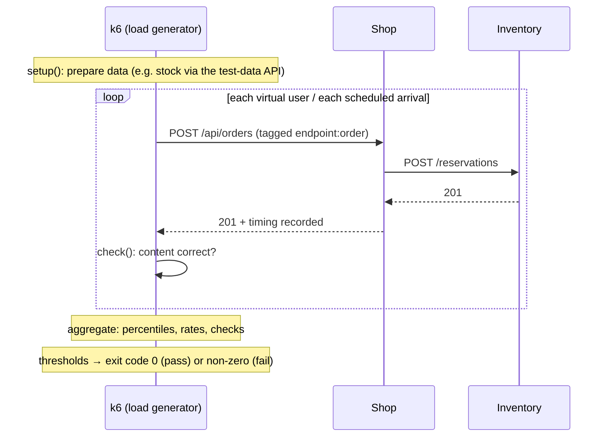
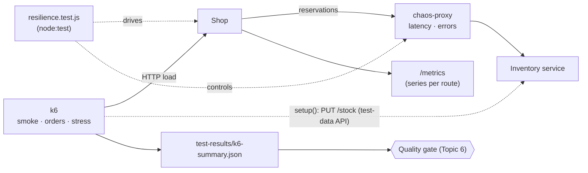

# Topic 8 · Concepts

## 1. What is it?

**Performance testing** measures how fast and how efficiently a system responds under a given workload. **Load testing** checks behaviour at expected (and peak) traffic. **Resilience testing** checks what happens when parts of the system fail or slow down: does it degrade gracefully, recover, and protect itself?

The vocabulary:

- **Latency:** how long one request takes. Reported as **percentiles**: p50 (the median), p95, p99. "p95 = 200 ms" means 95% of requests were faster than 200 ms.
- **Throughput:** how much work per unit of time: requests per second (RPS), orders per minute.
- **Error rate:** the share of requests that fail.
- **Saturation:** how full a resource is: CPU, memory, connection pools, queues.
- **Virtual user (VU):** a simulated client in a load-testing tool such as k6.
- **SLO (service level objective):** a target such as "99% of orders complete in under 1 s, measured over 30 days" (Topic 10 goes deeper).
- **Fault injection / chaos engineering:** deliberately introducing failures (latency, errors, crashes) to verify the system copes.

## 2. Why do we need it?

Functional tests ask *"does it work?"* with one user and a healthy network. Production asks *"does it work for thousands of users at once, while something somewhere is broken?"*

- **Slowness is failure.** Users abandon slow pages, and timeouts turn slow into broken. Amazon and Google have both published findings that small added latency measurably reduces engagement and revenue.
- **Systems fail non-linearly.** A service fine at 100 RPS can collapse at 150, when a queue starts growing faster than it drains. You want to find that **knee** in a test, not on Black Friday.
- **Dependencies fail all the time.** Networks drop, services slow down, deployments restart pods. In this topic's lab, a slow inventory service makes every order hang, with no error and no timeout.
- **Some bugs only appear over time.** Memory leaks, growing caches and unbounded metrics stay invisible in a 30-second test and take a service down after a week. The lab finds one.
- **Capacity costs money.** Knowing what one instance can handle sizes infrastructure and cloud bills.

## 3. How does it work internally?

### How a load generator works

k6 runs JavaScript test scripts in a fast Go engine. Each iteration is one user action; k6 records timings for every request and aggregates them into metrics. **Thresholds** turn those metrics into pass/fail, which is what lets a load test run in CI (Topic 6).

### Closed and open workload models

| Model | How load is generated | k6 executor | What it hides or shows |
|---|---|---|---|
| **Closed** | A fixed number of users; each waits for its response before sending the next | `ramping-vus`, `constant-vus` | When the server slows, users send *less*: the overload hides itself |
| **Open** | Requests arrive at a fixed rate, whatever the server does | `constant-arrival-rate`, `ramping-arrival-rate` | Real traffic keeps arriving; queues grow and the knee becomes visible |

Real public traffic is mostly open: a thousand new visitors don't wait for each other. The lab's order test uses an open model (20 orders per second).

### Why percentiles, not averages

Latency distributions have long tails. Ten requests at 10 ms and one at 2,000 ms average 191 ms, which describes nobody's experience. p95 and p99 show what the slowest users get. With many backend calls per page, the tail is what most users hit: if a page makes 20 calls, the chance that at least one is slower than the p95 is 1 − 0.95²⁰ ≈ 64%.

A second trap, which the lab shows: **errors are fast**. A 409 or 500 often returns in a millisecond, so a load test full of errors can report *excellent* latency. Always read latency for successful requests, and always check error rates and content.

### Little's Law

For any stable system: **concurrency = throughput × latency** (L = λW). At 20 orders per second and 50 ms each, about 1 order is in flight at any moment. If the inventory service slows each order to 3 s, 60 orders are in flight: 60 connections, 60 waiting requests, 60 times the memory. Slowness turns directly into load. That's why a slow dependency can take down the service that calls it, and why **timeouts** matter.

### How resilience patterns work

| Pattern | What it does | Protects against |
|---|---|---|
| **Timeout** | Give up on a call after a deadline | Hanging forever on a slow dependency |
| **Retry with backoff and jitter** | Try again after a growing, randomised delay | Brief, transient failures, without causing synchronised retry storms |
| **Idempotency keys** | Let a retried request be recognised as a repeat | Double charges and double reservations when retrying non-idempotent calls |
| **Circuit breaker** | After repeated failures, fail immediately for a while, then probe | Wasting time and threads on a dependency that's down; letting it recover |
| **Bulkhead** | Separate pools of resources per dependency | One slow dependency exhausting everything |
| **Fallback / graceful degradation** | Serve something useful without the dependency | Total failure: show the catalogue even when recommendations are down |
| **Load shedding / rate limiting** | Refuse excess work early (429/503) | Collapse under overload |

## 4. Main components and concepts

### 4.1 Types of performance test

| Type | Load shape | Question |
|---|---|---|
| **Smoke** | Tiny, short | Does it work at all under concurrency, and are the numbers sane? (Runs per PR) |
| **Load** | Expected peak, sustained | Does it meet its targets at real traffic? |
| **Stress** | Increasing beyond peak | Where's the knee? What breaks first? |
| **Spike** | Sudden jump | Does it survive and recover from a burst? (A newsletter, a TV mention) |
| **Soak / endurance** | Normal load for hours | Leaks, growth, slow degradation |
| **Breakpoint / capacity** | Ramp until failure | Maximum throughput per instance, for capacity planning |

### 4.2 Designing a load test

1. **Model the workload** from production: which journeys, in what mix, at what rates (the shop: mostly browsing, some cart pricing, fewer orders).
2. **Prepare data** that won't run out or collide (Topic 7): the lab's first order test fails because book 1 has only 12 copies.
3. **Set thresholds** from SLOs: per endpoint, on p95/p99, error rate and correctness checks.
4. **Use a production-like environment:** same instance sizes, same data volumes, same configuration. Testing a laptop tells you about the laptop.
5. **Observe the system, not just the client:** CPU, memory, connection pools and dependency latencies show *why* it slowed (Topic 10).
6. **Change one thing at a time**, and repeat runs: performance results are noisy.

### 4.3 What to measure

- **Client side** (k6): latency percentiles per endpoint, error rate, throughput, check pass rate.
- **Server side:** CPU, memory and garbage collection, event-loop lag (Node.js), connection pool usage, queue lengths, dependency call latencies.
- **The four golden signals** (Google SRE): latency, traffic, errors, saturation.
- **Resource growth over time** in soak tests: memory and anything that accumulates (caches, metric series, open handles).

### 4.4 Chaos engineering and fault injection

**Chaos engineering** (Netflix's term) runs controlled experiments to build confidence that a system withstands turbulent conditions:

1. Define the **steady state** in measurable terms (orders succeed, p95 < 300 ms).
2. Form a **hypothesis**: "if the inventory service slows to 3 s, the shop returns 503 within 1 s and stays responsive".
3. **Inject the fault**: latency, errors, a killed instance, a full disk, a network partition.
4. **Observe** whether the steady state holds; **minimise the blast radius**, and have a stop button.

Tools range from in-test proxies (this lab's `chaos-proxy.mjs`, Toxiproxy) and libraries, to platform tools (Chaos Mesh, LitmusChaos, AWS Fault Injection Service, Gremlin) that inject faults into real infrastructure.

### 4.5 Timeouts: choosing the number

A timeout is a decision about *how long a waiting user is worth*:

- **Too long** and slow dependencies pile up requests (Little's Law).
- **Too short** and normal slow calls fail, or calls that actually succeeded get retried.
- Base it on the dependency's real latency distribution: a common starting point is somewhat above its p99.
- **Budgets compose:** if a page must answer in 2 s and calls three services one after another, they share those 2 s.

The lab's acceptance checks hold both sides: a 2-second inventory delay must fail fast, but a 300 ms one must still succeed.

### 4.6 Retries are dangerous

Retries multiply load exactly when a system is struggling. A thousand clients retrying three times turn one outage into four times the traffic. So:

- retry only **idempotent** operations, or make them idempotent with keys
- use **exponential backoff with jitter**
- cap the total attempts and the total time (a **retry budget**)
- never retry 4xx (the request is wrong), and be careful with 5xx (the server may be overloaded)

Reserving stock is *not* idempotent: a retried reservation could hold twice the copies. That's why the lab adds a timeout, not a retry.

### 4.7 Observability makes performance testing useful

A load test tells you *that* it got slow; telemetry tells you *why*. Run load tests with metrics and traces on (Topic 10). And keep telemetry itself bounded: metrics must be **labelled by bounded values** (route patterns, status codes), never by raw URLs, user IDs or request IDs. Each label combination is a separate time series held in memory and billed by monitoring vendors. The lab's soak finding is exactly this: one series per unknown URL, forever.

## 5. Architecture: performance and resilience testing around Quality Books

## 6. How it connects with other practices

| Practice | Connection |
|---|---|
| **Test data (Topic 7)** | Load tests consume data fast; they need generated or API-created data at scale |
| **CI/CD (Topic 6)** | Smoke-level load tests per PR; full load and soak tests nightly or before peaks; the gate reads `k6-summary.json` |
| **Contracts (Topic 4)** | Error statuses (503 vs 500) and timeouts are part of how services agree to fail |
| **Security (Topic 9)** | Rate limiting, body size limits and resource exhaustion are both performance and security concerns |
| **Observability (Topic 10)** | SLOs define the thresholds; telemetry explains results; synthetic monitoring continues the load test in production |
| **Architecture** | Resilience patterns are design decisions; testing proves they work |

## 7. Real-world examples

**1. The order that waited forever (this repo).** The shop's inventory client has no timeout. Inject 3 s of latency with the chaos proxy, and each order takes 3 s. Inject 30 s, and it takes 30 s. Under load, those waiting requests pile up (Little's Law) until the shop is unusable, all because of a dependency. A one-line timeout makes the shop answer 503 within a second and stay healthy.

**2. The test that ran out of books (this repo).** The first order load test reports a p95 under 5 ms, which looks superb, and a 97% error rate. Book 1 has 12 copies, and the test wants about 400. Every error was a fast 409. Without data set-up and an error threshold, that run could have been reported as a success.

**3. The metrics that never stop growing (this repo).** The shop labels its request counter by raw path for unknown routes. A scanner requesting `/wp-admin/1.php`, `/wp-admin/2.php`… creates a new time series per URL, held in memory forever and shipped to monitoring on every scrape. A 30-second load test never notices; a soak test, or a week in production, does. Label cardinality explosions are a well-known cause of monitoring outages and surprise bills.

**4. Amazon's retry storms and the case for jitter.** AWS's architecture guidance describes how synchronised retries amplify outages, and recommends exponential backoff with jitter. Their published analysis shows jitter spreading retries out and dramatically reducing contention.

**5. Netflix and Chaos Monkey.** Netflix built Chaos Monkey to randomly terminate production instances, forcing every service to tolerate instance loss. It grew into the Simian Army and the discipline of chaos engineering, now practised widely with safety controls.

**6. Healthcare.gov (2013).** The US health insurance marketplace launched to traffic far above what it had been tested for, and failed publicly for weeks. Post-mortems cited insufficient end-to-end performance testing before launch, a cautionary tale for any big-bang release.

## 8. Scaling across applications and teams

| Challenge | What works |
|---|---|
| Every team writes load tests differently | Shared k6 libraries (auth, data setup, tagging conventions) and templates from a platform team |
| Load tests are too expensive to run often | Tiers: smoke per PR, load nightly, stress and soak before major events |
| Results aren't comparable over time | Same environment size, same data volume, results stored and trended (Topic 11) |
| Teams don't know their targets | SLOs per service, owned by the team, turned into thresholds |
| Load generation itself becomes the bottleneck | Distributed load generation (k6 Cloud, the k6 operator on Kubernetes, Gatling Enterprise) |
| Chaos is scary | Start in test environments, small blast radius, game days with everyone watching, then gradually production |

## 9. Security and data privacy

- **Load tests look like attacks.** Get permission and notify operations before load testing anything shared; never load test third parties (payment providers, APIs you don't own) without their agreement. Use their sandboxes.
- **Generated users and orders** must be synthetic and clearly tagged (the lab uses `load-…@example.com`), so they never reach real customers, billing or analytics.
- **Test-data APIs** used by load tests must be off in production (Topic 7).
- **Denial of service is a security concern:** body size limits, rate limits, timeouts and bounded resources (like metric labels) protect availability, which is one of the three pillars of security (confidentiality, integrity, availability).
- **Chaos in production** needs authorisation, a stop button and an audit trail.

## 10. Performance, maintenance, and cost

| Concern | Guidance |
|---|---|
| **Environment cost** | Production-like environments are expensive; spin them up for the test and down afterwards (Topic 7) |
| **Noise** | Repeat runs; compare like with like; use percentiles; watch for noisy neighbours on shared CI runners |
| **Maintenance** | Keep scripts close to real user journeys, and update them when the product changes |
| **Thresholds** | Derive from SLOs; too tight and they flap, too loose and they catch nothing |
| **Cost of telemetry** | Bounded labels, sampling for traces, retention policies |
| **Cost of not testing** | Over-provisioning "to be safe", or under-provisioning and outages at peak |

## 11. Common problems and failure scenarios

| Problem | Symptom | Fix |
|---|---|---|
| **Averages instead of percentiles** | "Average 80 ms" while users wait seconds | Report p95/p99 per endpoint |
| **Fast errors** | Great latency, terrible success rate | Error-rate thresholds; latency for successful requests; content checks |
| **Closed-model load only** | Overload hidden as the system slows | Arrival-rate (open) executors |
| **Test data runs out** | Errors climb partway through the test | Data setup sized for the test (Topic 7) |
| **Laptop-sized environment** | Numbers that mean nothing for production | Production-like environment, or relative comparisons only |
| **No timeouts** | Slow dependency → hung requests → outage | Timeouts on every remote call |
| **Blind retries** | Outages amplified, duplicates created | Idempotency, backoff with jitter, retry budgets |
| **Unbounded growth** | Fine in tests, OOM after days | Soak tests; bounded caches and metric labels |
| **Load generator saturated** | Numbers plateau because the client is maxed out | Watch the generator's own CPU; distribute it |

## 12. Important trade-offs

- **Realism vs cost.** Production-sized environments give real numbers and cost real money; smaller ones give relative trends.
- **Fail fast vs complete the work.** A short timeout protects the system and fails some requests that would have succeeded. Choose per operation: a payment may deserve longer than a recommendation.
- **Retries vs load.** Retries hide transient failures and add load during outages.
- **Graceful degradation vs consistency.** Serving stale or partial data keeps users happy, but may show wrong information (a stock level that's out of date).
- **Chaos in production vs in test.** Production has the real failure modes and real risk; test environments are safe but differ.

## 13. Comparisons

### Load testing tools

| Tool | Scripts in | Strengths | Notes |
|---|---|---|---|
| **k6** (used here) | JavaScript | Developer-friendly, thresholds as code, CI-native, open and arrival-rate models | Go engine; browser module available; Grafana Cloud for distributed runs |
| **Gatling** | Scala, Java, Kotlin, JavaScript | High performance, detailed reports | Strong in the JVM world |
| **JMeter** | GUI / XML | Huge protocol support, mature | Heavy; test plans are hard to review in Git |
| **Locust** | Python | Simple, distributed | Python ecosystem |
| **Artillery** | YAML + JavaScript | Quick scenarios, serverless load | Good for HTTP and WebSockets |
| **wrk / hey / autocannon** | CLI flags | Raw throughput benchmarks | No user journeys or rich checks |

### Resilience tooling

| Tool | Level | Notes |
|---|---|---|
| `chaos-proxy.mjs` (this lab), Toxiproxy | Network between services, in tests | Deterministic, cheap, CI-friendly |
| Resilience libraries (opossum for Node, resilience4j, Polly, Hystrix) | In-process patterns | Timeouts, circuit breakers, bulkheads in code |
| Service mesh (Istio, Linkerd) | Infrastructure | Timeouts, retries and fault injection by configuration |
| Chaos Mesh, LitmusChaos | Kubernetes | Pod kills, network faults, stress |
| AWS FIS, Azure Chaos Studio, Gremlin | Cloud / commercial | Managed experiments with guardrails |
