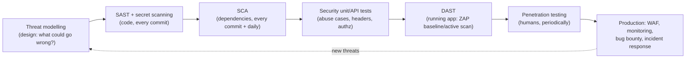
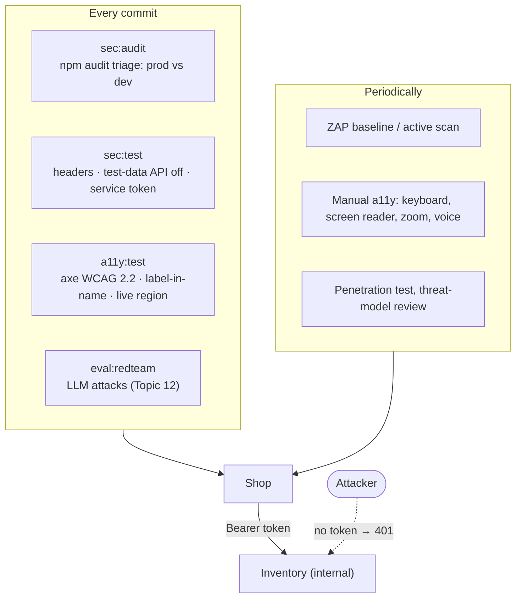

# Topic 9 · Concepts

## 1. What is it?

Three quality attributes that functional tests rarely cover, and that customers, attackers and regulators notice first:

- **Security testing** checks that a system protects **confidentiality** (only the right people see data), **integrity** (only the right changes happen) and **availability** (it keeps working for legitimate users), even against someone actively trying to break it.
- **Accessibility (a11y) testing** checks that people with disabilities can perceive, operate and understand the product: with a screen reader, keyboard only, voice control, magnification or high contrast. The standard is **WCAG** (Web Content Accessibility Guidelines), currently version 2.2, levels A, AA and AAA.
- **Compatibility testing** checks that the product works across the environments it claims to support: browsers and engines, operating systems, devices, screen sizes, locales, and versions of the APIs and data it exchanges.

Terms you'll meet:

- **Vulnerability:** a weakness that can be exploited. **Threat:** someone or something that might exploit it. **Risk:** likelihood × impact (Topic 1).
- **SAST / DAST / SCA:** Static Application Security Testing (analysing source code), Dynamic AST (attacking a running app), Software Composition Analysis (checking third-party dependencies for known vulnerabilities).
- **CVE:** a public identifier for a known vulnerability. **CVSS:** a severity score for it.
- **Abuse case:** a user story written from an attacker's point of view: *"As an attacker, I hold every copy of every book so customers see it sold out."*
- **Accessible name:** what assistive technology announces for an element, computed from its label, text or ARIA attributes.

## 2. Why do we need it?

- **Security failures are expensive and public.** Breaches bring fines, lawsuits, lost customers and executive resignations. Most are not exotic: known-vulnerable dependencies, missing access checks, misconfiguration and leaked secrets top every incident report.
- **Functional tests can't see attacks.** They check what the system does for honest users. Security testing asks what it does for a dishonest one: unexpected inputs, missing checks, abuse of legitimate features.
- **Accessibility is a large share of your users, and the law.** The WHO estimates about 1.3 billion people (around one in six) live with significant disability. Many countries require accessibility: the European Accessibility Act applies to many products and services sold in the EU from June 2025, and the US ADA is the basis of thousands of lawsuits a year.
- **Automated tools find only part of it.** In this topic's lab, the standard axe rules report zero issues, while two real problems remain: buttons whose spoken name doesn't match what they show, and a cart total that changes silently for screen-reader users.
- **"It works on my machine" is a compatibility statement.** Users arrive on browsers, devices and languages you didn't test. Topic 5's matrix found WebKit behaving differently in minutes.

## 3. How does it work internally?

### Security testing: layers of evidence

- **Threat modelling** asks four questions (Adam Shostack): what are we building, what can go wrong, what are we going to do about it, did we do a good job? **STRIDE** is a checklist for the second question: Spoofing, Tampering, Repudiation, Information disclosure, Denial of service, Elevation of privilege.
- **SAST** parses source code and looks for dangerous patterns and data flows: untrusted input reaching a SQL query, `eval`, a shell command, or HTML.
- **SCA** reads your dependency tree (`package-lock.json`) and matches every package and version against vulnerability databases (the GitHub Advisory Database, OSV, NVD).
- **DAST** crawls and attacks a running application from outside: it sends payloads and checks responses, headers and behaviour.
- **Security tests in your own suite** encode specific requirements: *this header is set*, *this endpoint refuses callers without a token*, *this test-only switch is off*.

### Accessibility testing: what tools can and can't see

An accessibility checker such as **axe-core** reads the DOM and the **accessibility tree**: the browser's model of roles, names, states and relationships that assistive technology uses. It checks rules that are machine-decidable: missing labels, insufficient colour contrast, invalid ARIA, duplicate IDs.

Many WCAG success criteria need judgement, though: is the alternative text *meaningful*, is the focus order *logical*, does a change get *announced*, does the visible label match the spoken name in a way a voice user can use? Studies by Deque and others put automated coverage at roughly a third to a half of WCAG issues by count. The rest needs manual testing with a keyboard, a screen reader (NVDA, JAWS, VoiceOver, TalkBack), zoom and voice control, and ideally with disabled users.

### Compatibility testing: a matrix

Compatibility is a combinatorial problem: browsers × versions × operating systems × devices × locales. Topic 2's pairwise technique, Topic 5's Playwright projects and real usage analytics decide which combinations to test, and device clouds supply the hardware.

## 4. Main components and concepts

### 4.1 The OWASP Top 10

The OWASP Top 10 (2021 edition) is the standard awareness list for web application risks:

| # | Risk | Example in a shop like Quality Books |
|---|---|---|
| A01 | Broken access control | Anyone can call the internal inventory API and hold every book |
| A02 | Cryptographic failures | Unkeyed hashes of emails (Topic 7); secrets in plain text |
| A03 | Injection (incl. XSS) | Assistant output rendered as HTML (the shop renders it as text) |
| A04 | Insecure design | Business logic that trusts the client's quantities |
| A05 | Security misconfiguration | Missing security headers; `X-Powered-By`; test-data API on in production |
| A06 | Vulnerable and outdated components | Known CVEs in dependencies |
| A07 | Identification and authentication failures | Weak sessions; no service-to-service authentication |
| A08 | Software and data integrity failures | Unpinned CI actions; unsigned artefacts (Topic 6) |
| A09 | Security logging and monitoring failures | Attacks nobody notices (Topic 10) |
| A10 | Server-side request forgery | The server fetching URLs supplied by users |

OWASP also publishes a **Top 10 for LLM Applications** (prompt injection, sensitive information disclosure, excessive agency…). The workshop's red-team suite covers it, and Topic 12 goes deeper.

### 4.2 Security headers

Response headers tell browsers to enforce protections:

| Header | Protects against |
|---|---|
| `Content-Security-Policy` | XSS and injected scripts (`default-src 'self'`), clickjacking (`frame-ancestors 'none'`) |
| `X-Content-Type-Options: nosniff` | Browsers guessing a file is a script and running it |
| `Referrer-Policy` | Leaking full URLs (and anything in them) to other sites |
| `Strict-Transport-Security` | Downgrade to plain HTTP (set when served over HTTPS) |
| `Cross-Origin-Opener-Policy` | Cross-window attacks |
| *Remove* `X-Powered-By` | Advertising your framework and version to scanners |

### 4.3 Dependencies and supply chain

Modern applications are mostly other people's code: this repo has two production dependencies and hundreds of transitive packages. Managing them well means:

- **Triage, don't panic:** severity, whether the vulnerable code is **reachable** (production dependency? the vulnerable function used?), and what the fix costs. `npm audit`'s suggested "fix" can be a breaking *downgrade*: read before running.
- **Separate production from development:** a vulnerability in a test tool doesn't ship to customers, though it still runs on developer machines and CI.
- **Automate updates** (Dependabot, Renovate) so fixes arrive as small, reviewable pull requests.
- **Lock and verify:** lock files, `npm ci`, pinned actions, signed artefacts, an SBOM (software bill of materials).

### 4.4 Abuse cases and business-logic security

Scanners find known *patterns*. They can't know that holding stock is valuable, or that a coupon shouldn't stack. **Abuse cases** come from thinking like an attacker about *your* domain:

- *"As an attacker, I reserve every book repeatedly, so real customers see everything sold out."*
- *"As a customer, I replay the refund request to be refunded twice."*
- *"As a bot, I ask the AI assistant thousands of questions to run up your model bill."*

Each becomes a test, like any requirement. Internal APIs deserve the same scrutiny: **zero trust** means every service authenticates its callers, because "only our services can reach it" stops being true the day a port is published, a container is compromised or a network rule changes.

### 4.5 WCAG in practice

WCAG 2.2 is organised around four principles, **POUR**:

| Principle | Means | Examples |
|---|---|---|
| **Perceivable** | Users can perceive the content | Text alternatives, captions, contrast, content that reflows at 400% zoom |
| **Operable** | Users can operate the interface | Everything works by keyboard, visible focus, enough time, no seizure triggers |
| **Understandable** | Users can understand it | Clear labels and errors, predictable behaviour, consistent navigation |
| **Robust** | It works with assistive technology | Valid roles, names and states; status messages announced |

Two criteria matter in this lab:

- **2.5.3 Label in Name (A):** an element's accessible name contains the text it shows. A voice-control user says "click Add to cart"; if the button's name is "Add Testing in Production to cart", the command doesn't match.
- **4.1.3 Status Messages (AA):** important changes that don't move focus, such as a new cart total, are announced (a live region or `role="status"`).

The **first rule of ARIA**: don't use ARIA if a native HTML element does the job. A `<button>` is focusable, operable and announced correctly for free.

### 4.6 Compatibility dimensions

| Dimension | What differs | How to cover it |
|---|---|---|
| Browser engine | Rendering, focus, APIs (Chromium, Gecko, WebKit) | Playwright projects; real-browser clouds |
| Device | Viewport, touch, performance, memory | Emulation for layout; real devices for performance and touch |
| Operating system | Fonts, keyboard behaviour, system settings | Cloud runners; visual baselines per OS |
| Locale | Text length, formats, right-to-left | Pseudo-localisation; `ar-EG` and `de-DE` in the matrix |
| Assistive technology | Screen readers and browsers combine differently | Manual testing of key journeys per supported pair |
| API and data versions | Older clients, older data | Contracts (Topic 4); backward-compatibility tests |

## 5. Architecture: security and accessibility checks around Quality Books

## 6. How it connects with other practices

| Practice | Connection |
|---|---|
| **Risk (Topic 1)** | Threat modelling is risk analysis with an adversary; security risks belong in the same register |
| **Test design (Topic 2)** | Invalid partitions and boundaries are where injection and abuse live |
| **Contracts (Topic 4)** | Status codes, error formats and authentication are part of an API's contract |
| **E2E (Topic 5)** | Role-based locators double as accessibility checks; the browser matrix is compatibility testing |
| **CI/CD (Topic 6)** | SAST, SCA, secret scanning and a11y checks as pipeline stages; pinned actions; least privilege |
| **Test data (Topic 7)** | Synthetic data and masking are privacy controls; test-data APIs are attack surfaces |
| **Performance (Topic 8)** | Availability is a security property: timeouts, limits, bounded resources |
| **Observability (Topic 10)** | Security monitoring and audit logs detect what tests missed |
| **AI (Topic 12)** | Prompt injection, data leakage and cost abuse are the new attack surface |

## 7. Real-world examples

**1. An internal API anyone could use (this repo).** The inventory service trusts every caller. `compose.yaml` publishes its port, so anyone who can reach it can reserve every copy of every book every 15 minutes and keep the shop permanently "sold out", without touching the shop. No scanner reports it: it's a business-logic abuse case. A service token, checked in constant time, closes it.

**2. Headers nobody set (this repo).** `curl -I` shows `X-Powered-By: Express` and no `Content-Security-Policy`, `nosniff` or frame protection. Each is a one-line fix. Fixing them also exposed a subtlety: Express's built-in 404 page sets its *own* security policy, so unknown routes need the shop's own handler for the shop's headers to apply.

**3. Zero violations, two barriers (this repo).** axe's standard WCAG rules pass. Its experimental `label-content-name-mismatch` rule flags all six book buttons: they show "Add to cart" or "Out of stock" but are named "Add *title* to cart". So a voice-control user can't say what they see, and a screen-reader user hears "Add The Pragmatic Tester to cart" on a book that's sold out. Separately, the cart total changes without being announced. And one Topic 5 test had quietly depended on the misleading name.

**4. Dependencies in the news.** Equifax's 2017 breach (about 147 million people) came through a known Apache Struts vulnerability that had a patch available months earlier. Log4Shell (2021) showed how one transitive dependency can expose much of the industry overnight. And the 2024 xz-utils backdoor showed attackers targeting the open-source supply chain itself, caught by an engineer who noticed a half-second slowdown in SSH logins.

**5. Accessibility lawsuits.** In *Robles v. Domino's Pizza* (2019), the US Supreme Court declined to review a ruling that the ADA applied to Domino's website and app. Thousands of digital accessibility lawsuits are filed each year in the US, and the European Accessibility Act now brings legal requirements across the EU.

## 8. Scaling across applications and teams

| Challenge | What works |
|---|---|
| Too many security findings to handle | Triage by reachability and production exposure; a policy (fail on production ≥ moderate); exceptions with an owner, a reason and an expiry date |
| Security knowledge concentrated in one team | **Security champions** in each team; shared threat-modelling templates; secure defaults in templates (Topic 13) |
| Every service hardens itself differently | Shared middleware or a gateway that sets headers and authentication; platform defaults |
| Accessibility treated as a final audit | A design system with accessible components; a11y checks in CI; manual audits of key journeys per release |
| Compatibility matrix explodes | Usage analytics decide support tiers; pairwise for the rest; device clouds for real hardware |
| Pen tests find the same issues every year | Turn every finding into an automated regression test |

## 9. Security and data privacy

This whole topic is about security, so a few points about **testing safely**:

- **Only test what you're authorised to test.** Scanning or attacking systems without written permission is illegal in many countries, even "just to check". Third-party services need their owners' agreement and usually a sandbox.
- **Keep tests safe in production.** DAST active scans can create data, send emails and trigger alarms. Run them against test environments, or use passive (baseline) scans in production.
- **Findings are sensitive.** Vulnerability reports, scan outputs and pen-test results are a map for attackers. Restrict access and fix before publishing.
- **Secrets in tests:** use dedicated test credentials with minimal rights; never commit them; scan for them (gitleaks, GitHub secret scanning).
- **Accessibility and privacy meet** in assistive technology: never detect or record that a visitor uses a screen reader. It's sensitive health-related information.

## 10. Performance, maintenance, and cost

| Concern | Guidance |
|---|---|
| **Speed** | Header, auth and abuse-case tests run in milliseconds; axe scans a page in about a second; SCA in seconds; DAST active scans in minutes to hours, so they belong nightly |
| **Noise** | SAST and SCA produce false positives and unreachable findings. Tune rules and record decisions, or people stop reading the reports |
| **Upkeep** | Advisories appear daily, so a dependency check that passed yesterday can fail today. Keep time-dependent checks out of the tests that teach (this course reports them instead of gating on them) |
| **Accessibility cost** | Cheap when built into components from the start; expensive when retrofitted |
| **Compatibility cost** | Each extra browser or device multiplies the run time; choose with data |

## 11. Common problems and failure scenarios

| Problem | Symptom | Fix |
|---|---|---|
| **"Internal, so safe"** | Unauthenticated service APIs | Authenticate every caller; network policies as a second layer |
| **Scanner = security** | Clean scans, exploitable logic | Abuse cases and threat modelling for your domain |
| **Audit panic** | `npm audit fix --force` breaks the build | Triage first; read the fix |
| **Findings ignored forever** | Same CVEs for a year | Policy with expiry dates; automated update PRs |
| **"axe passes, so we're accessible"** | Real users still blocked | Manual testing with a keyboard, screen readers and voice; experimental rules where useful |
| **ARIA overuse** | Worse accessibility than plain HTML | Native elements first |
| **Tests depend on a11y bugs** | Fixing a label breaks the suite | Locate by role and meaningful name parts, not exact strings |
| **Headers only on some responses** | Static files or 404s unprotected | Test every kind of response, including errors |
| **Compatibility by assumption** | Breaks on Safari or in right-to-left languages | A data-driven matrix; pseudo-localisation |

## 12. Important trade-offs

- **Security vs usability.** Stricter policies, shorter sessions and more checks frustrate users. Choose controls that are strong *and* invisible where possible (a CSP that the page never notices).
- **Shift-left vs depth.** Fast checks in every pipeline catch common issues; deep tests (pen tests, manual audits) find what automation can't, but rarely.
- **Fail the build vs report.** Gating on findings forces action and can block releases on noise or on yesterday's new advisory. Gate on high-confidence, high-impact checks; report the rest with owners.
- **Automated vs manual accessibility testing.** Automation is cheap and consistent but covers part of WCAG; manual testing covers the rest and needs skill and time.
- **Breadth vs cost of compatibility.** Every supported platform is a promise. Support tiers make the promise explicit.

## 13. Comparisons

### Security testing tools

| Category | Tools | Notes |
|---|---|---|
| SCA | `npm audit` (this lab), Dependabot, Snyk, OSV-Scanner, Trivy | Trivy also scans container images and IaC |
| SAST | Semgrep, CodeQL, SonarQube, ESLint security plugins | Semgrep rules are readable and easy to customise; CodeQL runs on GitHub |
| Secrets | gitleaks, TruffleHog, GitHub secret scanning | Run before commit and in CI |
| DAST | OWASP ZAP (baseline and active scans), Burp Suite, Nuclei | ZAP's baseline scan is passive and CI-friendly |
| IaC / config | Checkov, tfsec, Trivy | Infrastructure misconfiguration |
| LLM | promptfoo red team (Topic 12), garak | Prompt injection, leakage, jailbreaks |

### Accessibility testing tools

| Tool | What it does | Watch out for |
|---|---|---|
| axe-core / @axe-core/playwright (this lab) | Rule engine in tests and browsers; standard and experimental rules | Covers part of WCAG |
| Lighthouse | Audit including accessibility (uses axe) | A score is not compliance |
| Pa11y | CLI and CI runner | Good for many URLs |
| Screen readers (NVDA, JAWS, VoiceOver, TalkBack) | The real user experience | Needs practice to use well |
| Accessibility Insights, WAVE | Guided manual checks | Manual effort |

### Compatibility approaches

| Approach | Coverage | Cost |
|---|---|---|
| Playwright projects (Topic 5) | Three engines, emulated devices and locales | Low |
| Real-browser and device clouds (BrowserStack, Sauce Labs, LambdaTest) | Real browsers, OS versions, phones | Subscription |
| Appium | Native mobile apps | Setup and maintenance |
| Visual comparison per platform | Rendering differences | Baselines per OS |
