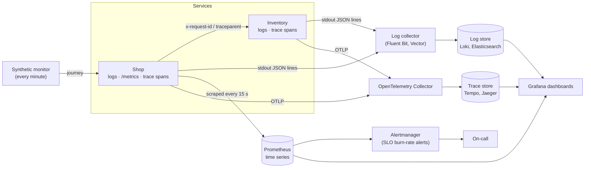
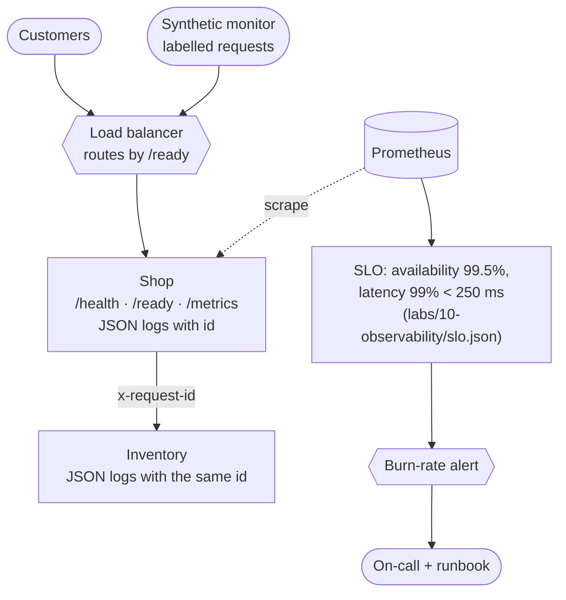

# Topic 10 · Concepts

## 1. What is it?

Every test so far ran *before* release. **Production quality** is about what's true *now*, for real users, after release. **Observability** is the property that makes it knowable: how well you can understand a system's internal state from the outside, from the data it emits, including for problems nobody predicted.

The data comes in three main forms, often called the **three pillars**:

- **Logs:** timestamped records of events (`order placed`, `payment declined`). Best for *what happened, in detail*.
- **Metrics:** numbers aggregated over time (request counts, latency histograms, memory use). Best for *how much, how often, trends and alerts*.
- **Traces:** the path of one request through many services, as a tree of timed **spans**. Best for *where the time went, and which service failed*.

Plus the practices built on them:

- **SLI / SLO / SLA:** a Service Level *Indicator* is a measurement (share of requests under 250 ms). An *Objective* is a target for it (99% over 30 days). An *Agreement* is a contract with consequences (credits if missed).
- **Error budget:** the amount of failure an SLO allows (1 − target). It's spent by incidents and risky releases.
- **Synthetic monitoring:** scripted journeys run against production on a schedule, to find failures before users do.
- **Real user monitoring (RUM):** measurements collected from real users' browsers and devices.

## 2. Why do we need it?

- **Tests can't cover production.** Real traffic, real data, real infrastructure and real third parties produce failures no test environment reproduces (Topic 7).
- **Detection time is customer pain.** **MTTD** (mean time to detect) and **MTTR** (mean time to restore) decide how long customers suffer. Without monitoring, MTTD is "when someone complains on social media".
- **"Green" can lie.** In this topic's lab the shop's health check stays green while every order fails. A dashboard of green checks that don't measure what users experience is worse than none: it creates false confidence.
- **Distributed systems need correlation.** When an order fails across two services, you need to find both services' log lines for *that* order. Without a shared request id, you can't.
- **Decisions need numbers.** "Is the shop reliable enough?" "Can we ship this risky change?" SLOs and error budgets turn those questions into data.

## 3. How does it work internally?

### From code to dashboards

- **Logs** are written as structured JSON lines to stdout; a collector ships them to a store, where they can be searched by fields (`id`, `status`).
- **Metrics** are counters, gauges and histograms kept in memory and exposed at `/metrics` in the Prometheus text format; Prometheus **scrapes** them on a schedule and stores time series.
- **Traces** are created by instrumentation (OpenTelemetry). Each service creates spans and **propagates context** to the next service in a header (W3C `traceparent`), so spans join into one trace.

### Counters, gauges and histograms

| Type | Value | Example | Query idea |
|---|---|---|---|
| **Counter** | Only goes up | `http_requests_total` | Rate per second; error ratio |
| **Gauge** | Goes up and down | Memory in use, items in a queue | Current value, max over time |
| **Histogram** | Counts per bucket of values | `http_request_duration_seconds_bucket{le="0.25"}` | Share of requests under 250 ms; approximate percentiles |

A histogram is **cumulative**: the `le="0.25"` bucket counts every request that took *at most* 0.25 s, and `le="+Inf"` counts all of them. Dividing one by the other gives a latency SLI directly. That's why the lab adds one: counters alone say how *many* requests there were, never how *long* they took.

### Liveness, readiness and the load balancer

| Check | Question | Used by | Should fail when |
|---|---|---|---|
| **Liveness** (`/health`) | Is the process alive, or stuck? | The orchestrator, to *restart* it | The process is wedged |
| **Readiness** (`/ready`) | Can it do its job right now? | The load balancer, to *route traffic* | A dependency it can't work without is down |
| **Startup** | Has it finished starting? | The orchestrator, to wait before checking liveness | It's still loading |

Mixing them up causes outages. If liveness checks a dependency, every instance restarts when the dependency blips, which can make things worse (restart storms). If there's no readiness check, traffic keeps flowing to instances that can't serve it.

### SLOs and burn rates

An SLO of 99.5% availability over 30 days allows 0.5% of requests to fail: that's the **error budget**. The **burn rate** is how fast it's being spent: a burn rate of 1 uses exactly the budget over the window; 14.4 uses a 30-day budget in about two days. Google's SRE workbook recommends alerting on **multi-window burn rates** (for example a high burn over 1 hour *and* 5 minutes) instead of raw thresholds, so alerts mean "users are being hurt at a rate that matters".

## 4. Main components and concepts

### 4.1 Good logs

- **Structured** (JSON), so fields can be queried rather than parsed.
- **Correlated:** every line for a request carries the same request or trace id, across services.
- **Levelled** (`debug`, `info`, `warn`, `error`) and **meaningful:** *what* happened, to *which* entity, with *what* outcome.
- **Safe:** no passwords, tokens, card numbers or unnecessary personal data. Logs are copied widely and kept a long time.
- **Bounded:** don't log every byte of every request; sample at high volume.

### 4.2 Good metrics

- **RED** for services: **R**ate, **E**rrors, **D**uration, per route.
- **USE** for resources: **U**tilisation, **S**aturation, **E**rrors.
- The **four golden signals** (Google SRE): latency, traffic, errors, saturation.
- **Bounded labels** (Topic 8): route patterns, not raw paths; never user ids or request ids as labels.

### 4.3 Distributed tracing

A **trace** is the full journey of one request; a **span** is one timed operation inside it (an HTTP call, a database query), with a parent. **Context propagation** passes the trace id and parent span id from service to service (the W3C `traceparent` header). **OpenTelemetry (OTel)** is the vendor-neutral standard for producing traces, metrics and logs; its SDKs and auto-instrumentation cover most languages and frameworks. **Sampling** keeps costs down: keep all errors and slow traces, a fraction of the rest.

The lab implements the simplest version of propagation, forwarding the request id, so you can see what the instrumentation automates.

### 4.4 SLI, SLO, SLA

| | SLI | SLO | SLA |
|---|---|---|---|
| What | A measurement | A target for a measurement | A contract with consequences |
| Example | Share of API requests answered in < 250 ms | 99% over 30 days | 99.9% monthly availability, or service credits |
| Owner | Engineering | The product team | Business and legal |

Good SLIs measure what users experience, as close to them as possible: successful checkouts, not CPU. Good SLOs are **just reliable enough**: 100% is impossible, and every extra nine costs much more.

### 4.5 Error budget policy

The error budget turns reliability into a shared decision:

- budget left → ship features, take measured risks, run experiments
- budget exhausted → freeze risky releases, prioritise reliability work until it recovers

It ends the endless "speed versus stability" argument between product and operations, because both agreed on the number in advance.

### 4.6 Monitoring in production: synthetic and real

| | Synthetic monitoring | Real user monitoring (RUM) |
|---|---|---|
| Traffic | Scripted journeys from known locations | Every real user's browser or app |
| Finds | Outages and broken journeys, even at 3 a.m. with no users | Real experience: slow devices, slow networks, regions |
| Weakness | Only the journeys you scripted | Needs users; noisy; privacy rules apply |

Synthetic journeys are the same as E2E tests (Topic 5), pointed at production. They must be **labelled** (here: `x-synthetic: true` and an `@synthetic.example` email), **clean up** after themselves, and be **kept out of business metrics** (the Topic 7 sales report would otherwise count them as revenue).

### 4.7 Alerting

- Alert on **symptoms users feel** (SLO burn, a failing synthetic journey), not on every cause (a CPU spike nobody noticed).
- Every page needs an **action** and a **runbook**.
- **Alert fatigue** is a reliability risk: when everything alerts, nothing gets attention.

### 4.8 Testing in production

Observability makes it safe to test with real traffic: **canary releases** compare new and old versions' SLIs (Topic 6), **feature flags** let you enable code for a few users, **dark launches** run new code paths without showing the result, and **chaos experiments** (Topic 8) run with a measured steady state. All need good telemetry, or they're just risk.

## 5. Architecture: Quality Books in production

## 6. How it connects with other practices

| Practice | Connection |
|---|---|
| **Foundations (Topic 1)** | Production is the final oracle; escaped defects feed the risk register |
| **E2E (Topic 5)** | Synthetic monitors are E2E journeys pointed at production |
| **CI/CD (Topic 6)** | Canary analysis and post-deployment checks continue the pipeline; DORA's time to restore comes from incidents |
| **Test data (Topic 7)** | Synthetic traffic must stay out of business data and reports |
| **Performance (Topic 8)** | SLOs supply load-test thresholds; telemetry explains load-test results; bounded labels |
| **Security (Topic 9)** | Security monitoring and audit logs; no secrets or personal data in logs |
| **Quality intelligence (Topic 11)** | Incidents, MTTD and MTTR, and SLO history are quality data |
| **AI (Topic 12)** | LLM features need production monitoring for drift, cost and unsafe outputs |

## 7. Real-world examples

**1. The green health check (this repo).** Stop the inventory service and the shop's `/health` still says `{"status":"ok"}`, so a load balancer keeps routing customers to an instance that can't take a single order. The synthetic journey fails at *"an order can be placed and cancelled"* within seconds. A readiness check that asks the inventory service (with a short timeout) makes the platform route around the problem.

**2. Two logs, no link (this repo).** The shop logs every API request with an id; the inventory service logs nothing, and wouldn't know the id anyway. Debugging a failed order across both means guessing by timestamps. Forwarding the id (the simplest form of context propagation) makes it a single search.

**3. An SLO you couldn't measure (this repo).** The team wants "99% of API requests under 250 ms". The shop's metrics count requests but don't time them, so the latency SLI can't be computed. A histogram with a 0.25 s bucket makes it a division. The lab's `slo.mjs` reports both SLIs and the remaining error budget.

**4. Google's error budgets.** Google's SRE practice introduced SLOs with error budgets as the contract between product and reliability teams: when a service exhausts its budget, launches pause until reliability recovers. The approach is described in the freely available *Site Reliability Engineering* books and is now widely adopted.

**5. Monitoring that couldn't see the outage.** Several major cloud incidents have been made worse because the status page or monitoring depended on the same failing infrastructure, so the provider couldn't see or report the outage. In AWS's 2017 S3 outage in us-east-1, the AWS Service Health Dashboard itself relied on S3 and couldn't be updated for a time. External synthetic monitoring, from outside your own infrastructure, exists for exactly this.

## 8. Scaling across applications and teams

| Challenge | What works |
|---|---|
| Every service logs differently | A shared logging library or OpenTelemetry setup with standard fields (service, id, level, event) |
| Traces stop at team boundaries | Context propagation as a platform default; the same header format everywhere |
| Alert fatigue | SLO-based alerting; ownership per service; runbooks; regular alert reviews |
| Telemetry costs explode | Bounded labels, sampling, retention tiers, and dropping what nobody queries |
| Nobody owns reliability | SLOs per service, owned by the team that builds it ("you build it, you run it") |
| Incidents repeat | Blameless postmortems with tracked actions; incident data feeding the risk register (Topic 11) |

## 9. Security and data privacy

- **Logs are a data store.** They're copied to collectors, vendors and laptops, and kept for months. Don't log passwords, tokens, card data, or personal data you don't need; mask what you must keep (Topic 7). The shop's mailer logs the subject, not the address.
- **Request ids aren't secrets,** but don't put personal data into them or into URLs (URLs end up in logs).
- **Telemetry endpoints leak information.** `/metrics` reveals routes, volumes and errors. Restrict it to the monitoring network in production.
- **Health and readiness endpoints** should say *whether* something is wrong, not *what* (no stack traces, versions or internal hostnames).
- **Synthetic accounts** need minimal permissions, clear labelling, and no access to real customer data.
- **RUM and session replay** collect data from real users: consent, minimisation and masking rules apply.

## 10. Performance, maintenance, and cost

| Concern | Guidance |
|---|---|
| **Overhead** | Counters and histograms cost microseconds per request; tracing every span costs more, so sample |
| **Cardinality** | Each label combination is a series; keep labels bounded (Topic 8) |
| **Storage** | Logs are usually the biggest telemetry bill: log less, structure better, keep for less time |
| **Maintenance** | Dashboards rot; prefer few SLO dashboards over hundreds of panels nobody reads |
| **Synthetic cost** | Each run costs a little traffic and maybe data; schedule by value (critical journeys every minute, others hourly) |
| **The cost of blindness** | Long MTTD, long MTTR, and customers finding problems first |

## 11. Common problems and failure scenarios

| Problem | Symptom | Fix |
|---|---|---|
| **Health checks that lie** | Green dashboard, failing users | Readiness that checks critical dependencies; synthetic journeys |
| **Liveness that checks dependencies** | Restart storms when a dependency blips | Liveness checks only the process |
| **Readiness that hangs** | Health checks time out, instances flap | Short timeouts in readiness checks |
| **No correlation id** | Can't follow a request across services | Propagate an id or trace context everywhere |
| **Averages on dashboards** | "Latency is fine" while some users wait seconds | Histograms and percentiles |
| **Alerting on causes** | Hundreds of alerts, few incidents | Alert on SLO burn and journeys |
| **Synthetic data in business metrics** | Revenue and conversion skewed | Label and filter synthetic traffic |
| **Personal data in logs** | Compliance risk, breach exposure | Log reviews; scrubbing; minimal fields |
| **Monitoring inside the blast radius** | Can't see the outage you're in | External synthetic checks; independent status page |

## 12. Important trade-offs

- **Detail vs cost.** More logs and traces explain more and cost more. Sample, aggregate, and keep detail for errors.
- **Sensitive vs noisy alerts.** Alerting early catches problems sooner and wakes people for nothing. Burn-rate windows balance it.
- **Strict vs lenient readiness.** Including more dependencies in readiness gives truer routing and risks flapping or cascading. Include only what the service truly can't work without.
- **Higher SLO vs speed.** Every extra nine costs engineering time and slows change. Choose the SLO users actually need.
- **Synthetic frequency vs side effects.** Frequent journeys detect faster and create more test data and load.

## 13. Comparisons

### Observability tooling

| Area | Open source | Commercial |
|---|---|---|
| Instrumentation | **OpenTelemetry** (the standard), Prometheus client libraries | Vendor agents (Datadog, New Relic, Dynatrace) |
| Metrics | Prometheus, VictoriaMetrics, Mimir | Datadog, New Relic, Grafana Cloud |
| Logs | Loki, Elasticsearch/OpenSearch, Vector, Fluent Bit | Splunk, Datadog, Elastic Cloud |
| Traces | Jaeger, Tempo, Zipkin | Honeycomb, Datadog APM, Lightstep |
| Dashboards and alerts | Grafana, Alertmanager | Built into most vendors |
| Synthetic monitoring | `synthetic.mjs`-style scripts in CI, Grafana k6 | Checkly, Datadog Synthetics, Pingdom |
| SLOs | Sloth, Pyrra (generate rules from SLO specs) | Nobl9, built into vendors |

### Ways to know production is healthy

| Approach | Detects | Misses |
|---|---|---|
| Liveness checks | Crashed or wedged processes | Broken dependencies, wrong answers |
| Readiness checks | Instances that can't serve right now | Logic bugs, slowness |
| Metrics and SLO alerts | Error and latency trends at scale | Problems with no traffic yet; rare paths |
| Synthetic journeys | Broken journeys, even with no users | Unscripted paths; real-device issues |
| RUM | Real users' experience | Nothing when there are no users |
| Logs and traces | Why something happened | Need someone to look, or alerts built on them |
