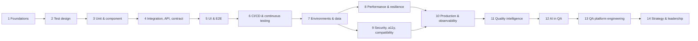

# Topics

**Fourteen topics that take you from first principles to running quality across an engineering organisation.**

Every topic is taught on the same small system, the [Quality Books demo app](../reference/demo-app.md), and every lab runs on your laptop or in Codespaces. Each topic has the same four pages: **Overview → Concepts → Lab → Quiz & wrap-up**. See [How this course works](../start/how-it-works.md).

## The roadmap

| # | Topic | The question it answers | Time | Your progress |
|---|---|---|---|---|
| 1 | [QA Engineering Foundations](01-foundations/index.md) | What is quality, how do we know we have it, and where does testing fit? | ~5 h |  |
| 2 | [Test Design Techniques](02-test-design/index.md) | Out of infinitely many possible tests, which few should we write? | ~6 h |  |
| 3 | [Unit and Component Testing](03-unit-component/index.md) | How do we check one piece fast and in isolation? | ~5 h |  |
| 4 | Integration, API, and Contract Testing | How do we check that pieces still fit when teams change them independently? | ~6 h | — |
| 5 | UI, Web, and End-to-End Testing | How do we check what the user really sees, without a slow, flaky suite? | ~6 h | — |
| 6 | CI/CD and Continuous Testing | How does testing run on every change and become a release decision? | ~5 h | — |
| 7 | Test Environments and Test Data Management | Where do tests run, and on what data? | ~5 h | — |
| 8 | Performance, Load, and Resilience Testing | Is it fast enough, and does it survive when things go wrong? | ~6 h | — |
| 9 | Security, Accessibility, and Compatibility Testing | Is it safe, usable by everyone, and does it work everywhere it should? | ~6 h | — |
| 10 | Production Quality and Observability | How do we know it works for real users right now? | ~5 h | — |
| 11 | Test Management and Quality Intelligence | How do we turn test results into decisions? | ~4 h | — |
| 12 | AI in QA Engineering | How do we use AI to test, and how do we test AI? | ~7 h | — |
| 13 | QA Platform Engineering and Test Infrastructure | How do we give 50 teams good testing without 50 QA teams? | ~5 h | — |
| 14 | Quality Strategy and Engineering Leadership | How do we set direction, invest and measure at org level? | ~4 h | — |

Times include reading, the lab and the quiz; the wrap-up challenge is extra. The column on the right fills in as you mark pages done (it's stored in this browser).

## Inside every topic

The **Concepts** page always has the same thirteen sections, so you know where to find things:

| # | Section | # | Section |
|---|---|---|---|
| 1 | What is it? | 8 | Scaling across applications and teams |
| 2 | Why do we need it? | 9 | Security and data privacy |
| 3 | How does it work internally? | 10 | Performance, maintenance, and cost |
| 4 | Main components and concepts | 11 | Common problems and failure scenarios |
| 5 | Architecture or diagram | 12 | Important trade-offs |
| 6 | How it connects with other practices | 13 | Comparisons with similar techniques and tools |
| 7 | Real-world examples | | |

The **Lab** page holds section 14 (a hands-on lab, step by step) and section 15 (how to verify it and troubleshoot). The **Quiz & wrap-up** page ends with a mental model, ten things to remember, common mistakes, a challenge, and what to learn next.
